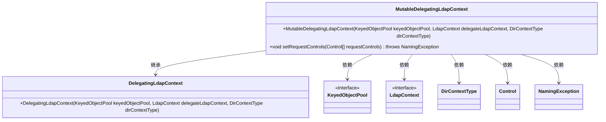
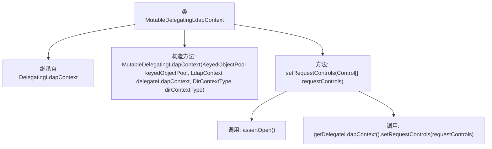

# 基础信息

|      |      |
|------|------|
| 名称 | MutableDelegatingLdapContext |
| 编码语言 | .java |
| 代码路径 | spring-ldap/core/src/main/java/org/springframework/ldap/pool/MutableDelegatingLdapContext.java |
| 包名 | org.springframework.ldap.pool |
| 依赖项 | ['javax.naming.NamingException', 'javax.naming.ldap.Control', 'javax.naming.ldap.LdapContext', 'org.apache.commons.pool.KeyedObjectPool', 'org.springframework.ldap.pool.factory.MutablePoolingContextSource'] |
| 概述说明 | MutableDelegatingLdapContext继承DelegatingLdapContext，支持管理LDAP上下文和设置请求控件。 |

# 说明

MutableDelegatingLdapContext是DelegatingLdapContext的子类，专门用于管理LDAP上下文。其主要功能包括支持设置请求控件，以便在LDAP操作中灵活配置和调整请求参数。通过继承DelegatingLdapContext，它保留了父类的核心功能，并在此基础上扩展了请求控件的管理能力，从而增强了LDAP上下文的管理和控制灵活性。

# 类列表 Class Summary

| 名称   | 类型  | 说明 |
|-------|------|-------------|
| MutableDelegatingLdapContext | class | MutableDelegatingLdapContext继承DelegatingLdapContext，用于管理LDAP上下文，支持设置请求控件。 |

## 类 MutableDelegatingLdapContext

|      |      |
|------|------|
| 访问范围 | public |
| 类型 | class |
| 名称 | MutableDelegatingLdapContext |
| 说明 | MutableDelegatingLdapContext继承DelegatingLdapContext，用于管理LDAP上下文，支持设置请求控件。 |

### UML类图

类图描述：`MutableDelegatingLdapContext`类继承自`DelegatingLdapContext`，并依赖于`KeyedObjectPool`、`LdapContext`、`DirContextType`、`Control`和`NamingException`等类或接口。该类的主要功能是通过构造函数初始化，并提供`setRequestControls`方法来设置请求控制。该类的设计体现了对LDAP上下文操作的封装和扩展。

### 内部方法调用关系图

这段代码定义了一个名为 `MutableDelegatingLdapContext` 的类，该类继承自 `DelegatingLdapContext`。类中包含一个构造方法，用于初始化对象，并接受三个参数：`KeyedObjectPool`、`LdapContext` 和 `DirContextType`。此外，类中还有一个 `setRequestControls` 方法，用于设置请求控制。该方法首先调用 `assertOpen()` 确保上下文处于打开状态，然后通过 `getDelegateLdapContext()` 获取委托的 `LdapContext` 并调用其 `setRequestControls` 方法。

### 字段列表 Field List

| 名称  | 类型  | 说明 |
|-------|-------|------|

### 方法列表 Method List

| 名称  | 类型  | 说明 |
|-------|-------|------|
| setRequestControls | void | 设置LDAP请求控制，需确保连接已打开。 |

