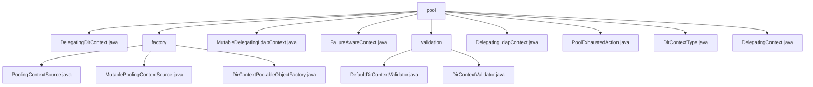

# 基础信息

|      |      |
|------|------|
| 名称 | pool |
| 编码语言 | .java |
| 代码路径 | spring-ldap/core/src/main/java/org/springframework/ldap/pool |
| 包名 | spring-ldap.core.src.main.java.org.springframework.ldap.pool |
| 概述说明 | DelegatingDirContext类实现DirContext接口，通过委托对象扩展功能，支持多层委托访问最终上下文。 |

# 说明

## 概述
该代码模块主要围绕LDAP（轻量级目录访问协议）的上下文管理进行设计，通过对象池机制优化资源利用和性能表现。模块中的核心类实现了对`DirContext`对象的高效管理，包括对象的创建、验证、销毁以及异常处理。通过统一的上下文管理接口和对象池机制，该模块确保了LDAP操作的高效性和可靠性。

## 主要业务场景
1. **上下文对象池管理**：`PoolingContextSource`类实现了`ContextSource`接口，负责管理`DirContext`对象池。它支持配置和获取池的相关属性，确保对`DirContext`对象的高效管理和使用。
2. **资源获取与异常处理**：`MutablePoolingContextSource`类负责从资源池中获取`DirContext`对象，并处理可能出现的异常情况。该过程确保资源的高效利用和异常处理的可靠性。
3. **对象生命周期管理**：`DirContextPoolableObjectFactory`类负责管理`DirContext`对象的创建、验证和销毁。它支持读写和只读两种类型的`DirContext`对象，并能够处理非瞬态异常，确保对象的有效性和可靠性。
4. **LDAP连接池管理**：在LDAP连接池中，确保每个`DirContext`实例的有效性，避免使用无效或过期的连接。
5. **配置驱动的验证**：通过默认配置（如搜索范围、时间限制和过滤器）对`DirContext`进行验证，确保其符合预期的功能要求。
6. **扩展性**：通过`DirContextValidator`接口，允许开发者自定义验证逻辑，以适应不同的业务需求。

该模块适用于需要高效管理LDAP上下文的场景，特别是在频繁进行LDAP操作时，通过对象池机制减少资源创建和销毁的开销，提升系统性能。

### 包内部结构视图

该流程图展示了`spring-ldap/core/src/main/java/org/springframework/ldap/pool`目录下的文件结构。`pool`作为根节点，包含多个子节点，如`factory`和`validation`，以及多个文件节点。`factory`节点下进一步细分为`PoolingContextSource.java`、`MutablePoolingContextSource.java`和`DirContextPoolableObjectFactory.java`，而`validation`节点下包含`DefaultDirContextValidator.java`和`DirContextValidator.java`。其他文件节点直接挂载在`pool`节点下。

# 文件列表 File List

| 名称   | 类型  | 说明 |
|-------|------|-------------|
| [DelegatingDirContext.java](DelegatingDirContext.md) | file | DelegatingDirContext类实现DirContext接口，委托操作至delegateDirContext，并提供获取最内层委托上下文的方法。 |
| [DelegatingContext.java](DelegatingContext.md) | file | DelegatingContext实现Context接口，代理操作，支持池化管理和类型区分。 |
| [PoolExhaustedAction.java](PoolExhaustedAction.md) | file | 无内容可总结。 |
| [FailureAwareContext.java](FailureAwareContext.md) | file | 信息为空，无法生成概要描述。 |
| [DelegatingLdapContext.java](DelegatingLdapContext.md) | file | DelegatingLdapContext代理LdapContext，支持递归查找，确保连接有效。 |
| [MutableDelegatingLdapContext.java](MutableDelegatingLdapContext.md) | file | MutableDelegatingLdapContext继承DelegatingLdapContext，支持管理LDAP上下文和设置请求控件。 |
| [DirContextType.java](DirContextType.md) | file | DirContextType类定义了READ_ONLY和READ_WRITE两种上下文类型。 |
| [validation](validation/_module.md) | package | DefaultDirContextValidator类验证DirContext，确保其有效性和功能性。 |
| [factory](factory/_module.md) | package | PoolingContextSource管理DirContext对象池，优化资源利用和性能。MutablePoolingContextSource处理异常，确保资源高效利用。DirContextPoolableObjectFactory管理对象创建、验证和销毁，确保对象有效性。 |

