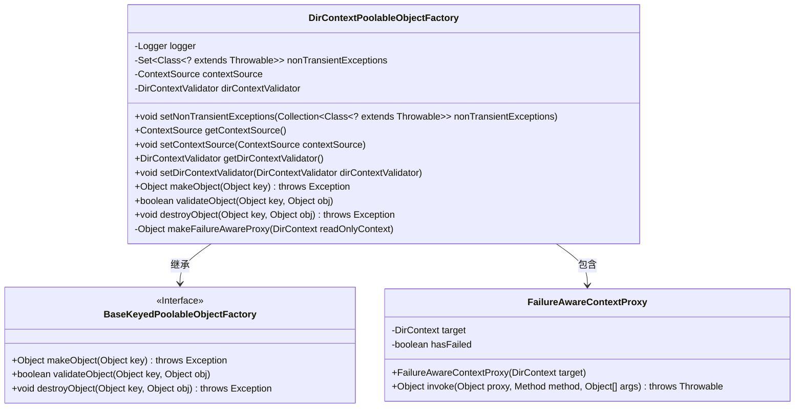

# 基础信息

|      |      |
|------|------|
| 名称 | DirContextPoolableObjectFactory |
| 编码语言 | .java |
| 代码路径 | spring-ldap/core/src/main/java/org/springframework/ldap/pool/factory/DirContextPoolableObjectFactory.java |
| 包名 | org.springframework.ldap.pool.factory |
| 依赖项 | ['java.lang.reflect.InvocationHandler', 'java.lang.reflect.InvocationTargetException', 'java.lang.reflect.Method', 'java.lang.reflect.Proxy', 'java.util.Collection', 'java.util.HashSet', 'java.util.Set', 'javax.naming.CommunicationException', 'javax.naming.directory.DirContext', 'org.apache.commons.pool.BaseKeyedPoolableObjectFactory', 'org.slf4j.Logger', 'org.slf4j.LoggerFactory', 'org.springframework.ldap.core.ContextSource', 'org.springframework.ldap.core.DirContextProxy', 'org.springframework.ldap.pool.DirContextType', 'org.springframework.ldap.pool.FailureAwareContext', 'org.springframework.ldap.pool.validation.DirContextValidator', 'org.springframework.ldap.support.LdapUtils', 'org.springframework.util.Assert'] |
| 概述说明 | DirContextPoolableObjectFactory管理DirContext对象，支持读写和只读，处理非瞬态异常。 |

# 说明

DirContextPoolableObjectFactory类负责管理DirContext对象的创建、验证和销毁。它支持读写和只读两种类型的DirContext对象，并能够处理非瞬态异常，确保对象的有效性和可靠性。

# 类列表 Class Summary

| 名称   | 类型  | 说明 |
|-------|------|-------------|
| DirContextPoolableObjectFactory | class | DirContextPoolableObjectFactory类管理DirContext对象的创建、验证和销毁，支持读写和只读类型，并处理非瞬态异常。 |

## 类 DirContextPoolableObjectFactory

|      |      |
|------|------|
| 访问范围 | None |
| 类型 | class |
| 名称 | DirContextPoolableObjectFactory |
| 说明 | DirContextPoolableObjectFactory类管理DirContext对象的创建、验证和销毁，支持读写和只读类型，并处理非瞬态异常。 |

### UML类图

### 描述：
`DirContextPoolableObjectFactory` 是一个继承自 `BaseKeyedPoolableObjectFactory` 的类，用于创建、验证和销毁 `DirContext` 对象。它包含一个内部类 `FailureAwareContextProxy`，用于处理 `DirContext` 的代理调用，并在遇到非瞬态异常时标记上下文为无效。类中通过 `ContextSource` 和 `DirContextValidator` 来获取和验证上下文对象，并通过 `nonTransientExceptions` 集合来管理非瞬态异常。

### 内部方法调用关系图

```mermaid
graph TD
    A["类DirContextPoolableObjectFactory"]
    B["属性: Logger logger"]
    C["属性: Set<Class<? extends Throwable>> nonTransientExceptions"]
    D["属性: ContextSource contextSource"]
    E["属性: DirContextValidator dirContextValidator"]
    F["方法: setNonTransientExceptions(Collection<Class<? extends Throwable>>)"]
    G["方法: getContextSource()"]
    H["方法: setContextSource(ContextSource)"]
    I["方法: getDirContextValidator()"]
    J["方法: setDirContextValidator(DirContextValidator)"]
    K["方法: makeObject(Object key)"]
    L["方法: makeFailureAwareProxy(DirContext readOnlyContext)"]
    M["方法: validateObject(Object key, Object obj)"]
    N["方法: destroyObject(Object key, Object obj)"]
    O["内部类: FailureAwareContextProxy"]
    P["方法: invoke(Object proxy, Method method, Object[] args)"]

    A --> B
    A --> C
    A --> D
    A --> E
    A --> F
    A --> G
    A --> H
    A --> I
    A --> J
    A --> K
    K --> L
    A --> M
    A --> N
    A --> O
    O --> P
```

这段代码定义了一个名为 `DirContextPoolableObjectFactory` 的类，它继承自 `BaseKeyedPoolableObjectFactory`。该类主要用于管理 `DirContext` 对象的创建、验证和销毁。它包含多个属性和方法，用于设置和获取上下文源、验证器以及处理非瞬态异常。内部类 `FailureAwareContextProxy` 实现了 `InvocationHandler` 接口，用于处理代理对象的调用，并在遇到非瞬态异常时标记上下文为无效。整体设计旨在确保 `DirContext` 对象的生命周期管理更加健壮和可靠。

### 字段列表 Field List

| 名称  | 类型  | 说明 |
|-------|-------|------|
| DEFAULT_NONTRANSIENT_EXCEPTIONS = new HashSet<>() {		{			add(CommunicationException.class);		}	} | Set<Class<? extends Throwable>> | 定义默认不可恢复异常集合，包含通信异常。 |
| logger = LoggerFactory.getLogger(this.getClass()) | Logger | 定义受保护的日志记录器实例。 |
| contextSource | ContextSource | 声明了一个私有的上下文源变量。 |
| dirContextValidator | DirContextValidator | 私有变量dirContextValidator用于DirContext验证。 |
| nonTransientExceptions = DEFAULT_NONTRANSIENT_EXCEPTIONS | Set<Class<? extends Throwable>> | 私有变量nonTransientExceptions初始化为默认非瞬态异常集合。 |

### 方法列表 Method List

| 名称  | 类型  | 说明 |
|-------|-------|------|
| getContextSource | ContextSource | 获取当前上下文源的方法。 |
| getDirContextValidator | DirContextValidator | 获取目录上下文验证器的方法。 |
| setNonTransientExceptions | void | 设置非瞬态异常集合，使用HashSet存储。 |
| makeObject | Object | 根据上下文类型创建并返回对应的DirContext对象。 |
| setDirContextValidator | void | 设置目录上下文验证器，若为空则抛出异常。 |
| setContextSource | void | 设置上下文源，若为空则抛出异常。 |
| destroyObject | void | 销毁DirContext对象，记录关闭日志，捕获并记录异常。 |
| validateObject | boolean | 验证对象类型并调用验证器，异常时记录日志并返回false。 |
| makeFailureAwareProxy | Object | 创建失败感知代理，返回包含目标类和接口的代理实例。 |

