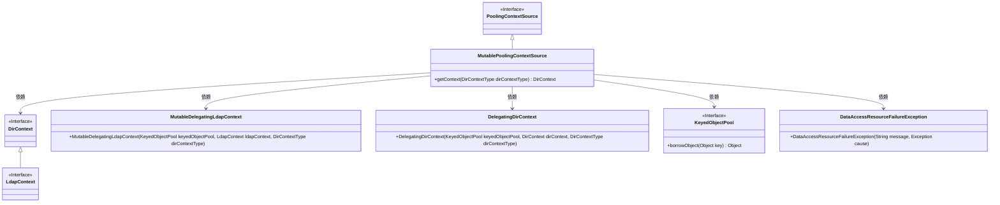
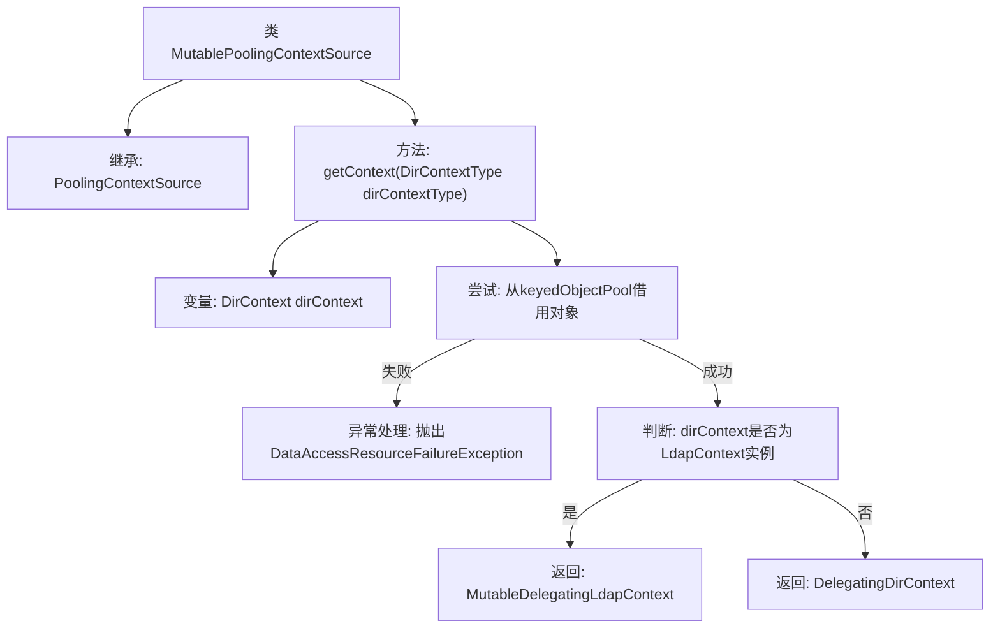

# 基础信息

|      |      |
|------|------|
| 名称 | MutablePoolingContextSource |
| 编码语言 | .java |
| 代码路径 | spring-ldap/core/src/main/java/org/springframework/ldap/pool/factory/MutablePoolingContextSource.java |
| 包名 | org.springframework.ldap.pool.factory |
| 依赖项 | ['javax.naming.directory.DirContext', 'javax.naming.ldap.LdapContext', 'org.springframework.dao.DataAccessResourceFailureException', 'org.springframework.ldap.pool.DelegatingDirContext', 'org.springframework.ldap.pool.DirContextType', 'org.springframework.ldap.pool.MutableDelegatingLdapContext'] |
| 概述说明 | MutablePoolingContextSource从池获取DirContext，处理异常后返回上下文对象。 |

# 说明

MutablePoolingContextSource负责从资源池中获取DirContext对象，处理可能出现的异常情况，并最终返回相应的上下文对象。该过程确保资源的高效利用和异常处理的可靠性。

# 类列表 Class Summary

| 名称   | 类型  | 说明 |
|-------|------|-------------|
| MutablePoolingContextSource | class | MutablePoolingContextSource从池中获取DirContext，处理异常并返回相应上下文对象。 |

## 类 MutablePoolingContextSource

|      |      |
|------|------|
| 访问范围 | public |
| 类型 | class |
| 名称 | MutablePoolingContextSource |
| 说明 | MutablePoolingContextSource从池中获取DirContext，处理异常并返回相应上下文对象。 |

### UML类图

### 描述
`MutablePoolingContextSource` 是一个继承自 `PoolingContextSource` 的类，负责从 `KeyedObjectPool` 中获取 `DirContext` 对象。根据获取的 `DirContext` 类型，它可能会返回 `MutableDelegatingLdapContext` 或 `DelegatingDirContext` 对象。如果从池中获取对象时发生异常，则会抛出 `DataAccessResourceFailureException`。该类依赖于 `KeyedObjectPool` 接口来管理对象池，并通过 `DirContext` 和 `LdapContext` 接口来处理不同类型的上下文对象。

### 内部方法调用关系图

这段代码定义了一个名为`MutablePoolingContextSource`的类，继承自`PoolingContextSource`。该类的主要方法是`getContext`，用于从对象池中借用`DirContext`对象。如果借用过程中发生异常，则抛出`DataAccessResourceFailureException`。如果借用的对象是`LdapContext`的实例，则返回`MutableDelegatingLdapContext`，否则返回`DelegatingDirContext`。该流程图展示了方法的执行流程，包括异常处理和对象类型的判断。

### 字段列表 Field List

| 名称  | 类型  | 说明 |
|-------|-------|------|

### 方法列表 Method List

| 名称  | 类型  | 说明 |
|-------|-------|------|
| getContext | DirContext | 从对象池获取DirContext，失败抛出异常，返回包装后的上下文对象。 |

