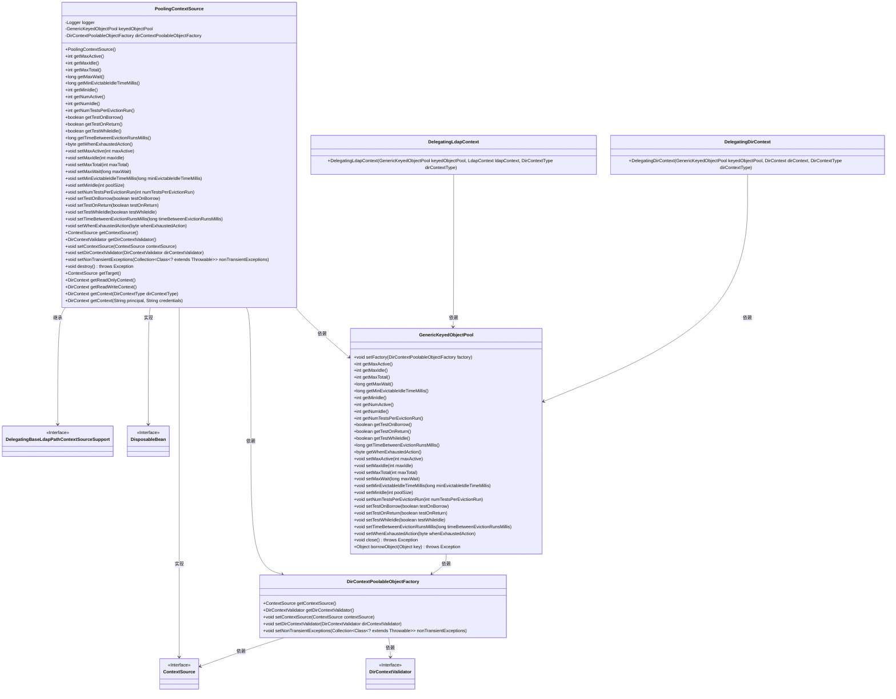

# 基础信息

|      |      |
|------|------|
| 名称 | PoolingContextSource |
| 编码语言 | .java |
| 代码路径 | spring-ldap/core/src/main/java/org/springframework/ldap/pool/factory/PoolingContextSource.java |
| 包名 | org.springframework.ldap.pool.factory |
| 依赖项 | ['java.util.Collection', 'javax.naming.directory.DirContext', 'javax.naming.ldap.LdapContext', 'org.apache.commons.pool.impl.GenericKeyedObjectPool', 'org.slf4j.Logger', 'org.slf4j.LoggerFactory', 'org.springframework.beans.factory.DisposableBean', 'org.springframework.dao.DataAccessResourceFailureException', 'org.springframework.ldap.core.ContextSource', 'org.springframework.ldap.core.support.DelegatingBaseLdapPathContextSourceSupport', 'org.springframework.ldap.pool.DelegatingDirContext', 'org.springframework.ldap.pool.DelegatingLdapContext', 'org.springframework.ldap.pool.DirContextType', 'org.springframework.ldap.pool.validation.DirContextValidator'] |
| 概述说明 | PoolingContextSource类实现ContextSource接口，管理DirContext对象池，支持配置和获取池属性。 |

# 说明

PoolingContextSource类实现了ContextSource接口，主要用于管理DirContext对象池。该类支持配置和获取池的相关属性，确保对DirContext对象的高效管理和使用。通过实现ContextSource接口，PoolingContextSource类能够提供统一的上下文管理功能，同时通过对象池机制优化资源利用和性能表现。

# 类列表 Class Summary

| 名称   | 类型  | 说明 |
|-------|------|-------------|
| PoolingContextSource | class | PoolingContextSource类实现ContextSource接口，管理DirContext对象池，支持配置和获取池属性。 |

## 类 PoolingContextSource

|      |      |
|------|------|
| 访问范围 | public |
| 类型 | class |
| 名称 | PoolingContextSource |
| 说明 | PoolingContextSource类实现ContextSource接口，管理DirContext对象池，支持配置和获取池属性。 |

### UML类图

**描述**：`PoolingContextSource`类是一个用于管理LDAP连接池的类，它继承自`DelegatingBaseLdapPathContextSourceSupport`并实现了`ContextSource`和`DisposableBean`接口。该类通过`GenericKeyedObjectPool`来管理连接池，并使用`DirContextPoolableObjectFactory`来创建和验证LDAP连接。它还提供了多种方法来配置连接池的行为，如最大活动连接数、最大空闲连接数等。`PoolingContextSource`类还负责在销毁时关闭连接池，并提供了获取只读和读写LDAP上下文的方法。

### 内部方法调用关系图

这段代码定义了一个名为 `PoolingContextSource` 的类，该类继承了 `DelegatingBaseLdapPathContextSourceSupport` 并实现了 `ContextSource` 和 `DisposableBean` 接口。该类主要用于管理 `DirContext` 对象的池化，通过 `GenericKeyedObjectPool` 来管理这些对象的生命周期。代码中包含了多个方法，用于配置和获取池的属性，以及处理 `DirContext` 对象的创建和销毁。该类还提供了对 `DirContext` 对象的读写操作，并通过 `DisposableBean` 接口确保在销毁时正确关闭池。

### 字段列表 Field List

| 名称  | 类型  | 说明 |
|-------|-------|------|
| keyedObjectPool | GenericKeyedObjectPool | 受保护的最终泛型键控对象池。 |
| logger = LoggerFactory.getLogger(this.getClass()) | Logger | 声明并初始化受保护的日志记录器实例。 |
| dirContextPoolableObjectFactory | DirContextPoolableObjectFactory | 私有DirContextPoolableObjectFactory对象实例。 |

### 方法列表 Method List

| 名称  | 类型  | 说明 |
|-------|-------|------|
| getWhenExhaustedAction | byte | 该方法返回对象池在资源耗尽时的处理动作。 |
| setTestWhileIdle | void | 设置空闲时测试标志。 |
| getNumActive | int | 获取当前活跃对象数量。 |
| setMaxWait | void | 设置对象池最大等待时间。 |
| getMinIdle | int | 获取对象池的最小空闲对象数量。 |
| getMaxTotal | int | 获取对象池的最大总数。 |
| getMaxActive | int | 获取对象池最大活跃数的方法。 |
| setMaxActive | void | 设置对象池最大活跃数为指定值。 |
| setMaxTotal | void | 设置对象池的最大容量为maxTotal。 |
| getDirContextValidator | DirContextValidator | 获取DirContext验证器的方法。 |
| setWhenExhaustedAction | void | 设置对象池耗尽时的操作。 |
| getTimeBetweenEvictionRunsMillis | long | 获取对象池中清理任务运行间隔时间。 |
| getMaxWait | long | 获取对象池中最大等待时间的方法。 |
| setTestOnBorrow | void | 设置对象池借出时是否进行测试。 |
| getMinEvictableIdleTimeMillis | long | 获取对象池中空闲对象的最小可回收时间。 |
| setDirContextValidator | void | 设置目录上下文验证器到对象工厂。 |
| getTestWhileIdle | boolean | 方法返回对象池中空闲时是否进行测试的布尔值。 |
| setContextSource | void | 方法设置上下文源，并将其传递给目录上下文池对象工厂。 |
| setMaxIdle | void | 设置对象池最大空闲数为指定值。 |
| getTestOnBorrow | boolean | 获取对象池在借出时是否进行测试的状态。 |
| getContext | DirContext | 获取DirContext对象，处理异常并返回代理上下文。 |
| getReadWriteContext | DirContext | 重写方法，获取读写上下文。 |
| setNonTransientExceptions | void | 设置非瞬态异常集合到目录上下文池对象工厂。 |
| getReadOnlyContext | DirContext | 重写方法，返回只读目录上下文。 |
| getTarget | ContextSource | 重写方法，返回上下文源对象。 |
| destroy | void | 销毁对象池，捕获并记录关闭时的异常。 |
| getContext | DirContext | 该方法抛出不支持操作异常，表示不实现获取上下文功能。 |
| setTestOnReturn | void | 设置对象池返回时是否进行测试。 |
| setTimeBetweenEvictionRunsMillis | void | 设置对象池中对象回收运行的时间间隔。 |
| getTestOnReturn | boolean | 方法返回键控对象池的返回测试状态。 |
| getNumTestsPerEvictionRun | int | 该方法返回键控对象池中每次驱逐运行时的测试数量。 |
| setNumTestsPerEvictionRun | void | 设置对象池每次清理时的测试数量。 |
| setMinEvictableIdleTimeMillis | void | 设置对象池中空闲对象的最小可驱逐时间。 |
| getContextSource | ContextSource | 获取上下文源的方法，返回工厂提供的上下文源。 |
| setMinIdle | void | 设置对象池最小空闲大小为指定值。 |
| getNumIdle | int | 获取空闲对象数量的方法。 |
| getMaxIdle | int | 获取对象池最大空闲数量。 |

