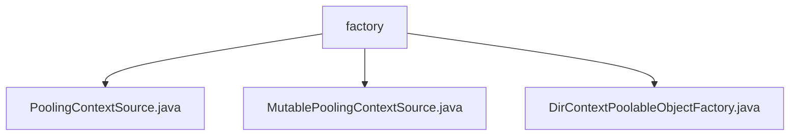

# 基础信息

|      |      |
|------|------|
| 名称 | factory |
| 编码语言 | .java |
| 代码路径 | spring-ldap/core/src/main/java/org/springframework/ldap/pool/factory |
| 包名 | spring-ldap.core.src.main.java.org.springframework.ldap.pool.factory |
| 概述说明 | PoolingContextSource管理DirContext对象池，优化资源利用和性能。MutablePoolingContextSource处理异常，确保资源高效利用。DirContextPoolableObjectFactory管理对象创建、验证和销毁，确保对象有效性。 |

# 说明

## 概述
该代码模块主要围绕LDAP（轻量级目录访问协议）的上下文管理进行设计，通过对象池机制优化资源利用和性能表现。模块中的核心类实现了对`DirContext`对象的高效管理，包括对象的创建、验证、销毁以及异常处理。通过统一的上下文管理接口和对象池机制，该模块确保了LDAP操作的高效性和可靠性。

## 主要业务场景
1. **上下文对象池管理**：`PoolingContextSource`类实现了`ContextSource`接口，负责管理`DirContext`对象池。它支持配置和获取池的相关属性，确保对`DirContext`对象的高效管理和使用。
2. **资源获取与异常处理**：`MutablePoolingContextSource`类负责从资源池中获取`DirContext`对象，并处理可能出现的异常情况。该过程确保资源的高效利用和异常处理的可靠性。
3. **对象生命周期管理**：`DirContextPoolableObjectFactory`类负责管理`DirContext`对象的创建、验证和销毁。它支持读写和只读两种类型的`DirContext`对象，并能够处理非瞬态异常，确保对象的有效性和可靠性。

该模块适用于需要高效管理LDAP上下文的场景，特别是在频繁进行LDAP操作时，通过对象池机制减少资源创建和销毁的开销，提升系统性能。

### 包内部结构视图

该流程图展示了`factory`文件夹下的三个Java文件之间的层级关系。`factory`作为根节点，包含了`PoolingContextSource.java`、`MutablePoolingContextSource.java`和`DirContextPoolableObjectFactory.java`三个子节点，清晰地反映了文件在项目中的组织结构。

# 文件列表 File List

| 名称   | 类型  | 说明 |
|-------|------|-------------|
| [MutablePoolingContextSource.java](MutablePoolingContextSource.md) | file | MutablePoolingContextSource从池获取DirContext，处理异常后返回上下文对象。 |
| [PoolingContextSource.java](PoolingContextSource.md) | file | PoolingContextSource类实现ContextSource接口，管理DirContext对象池，支持配置和获取池属性。 |
| [DirContextPoolableObjectFactory.java](DirContextPoolableObjectFactory.md) | file | DirContextPoolableObjectFactory管理DirContext对象，支持读写和只读，处理非瞬态异常。 |

