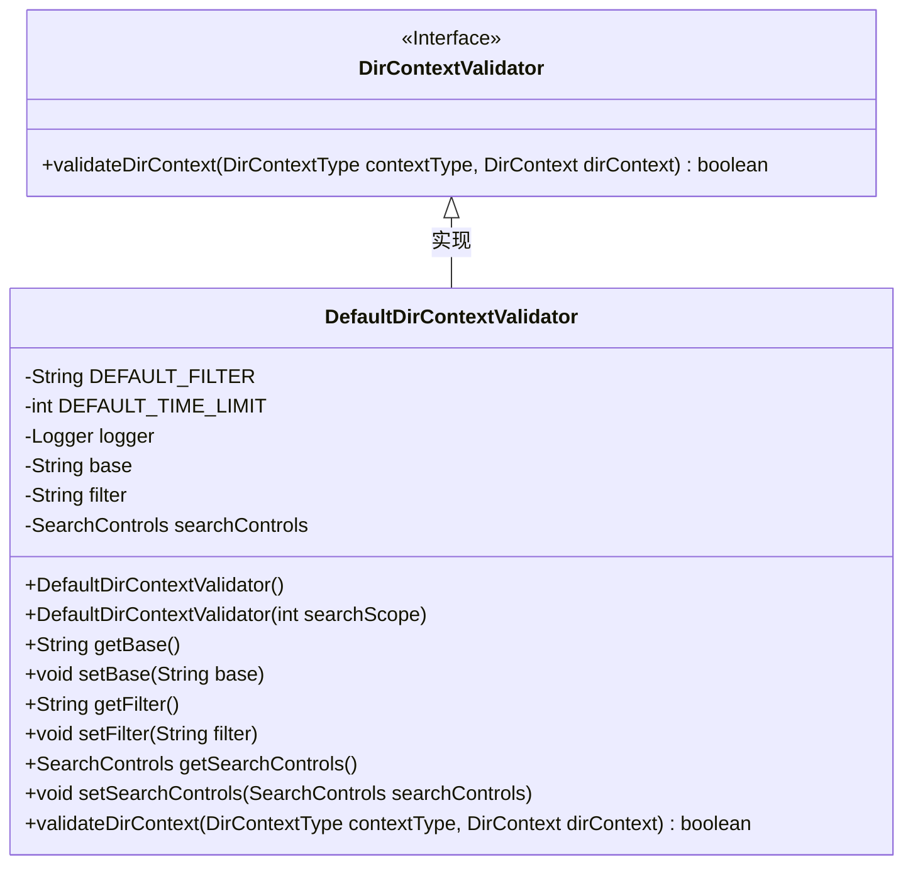

# 基础信息

|      |      |
|------|------|
| 名称 | DefaultDirContextValidator |
| 编码语言 | .java |
| 代码路径 | spring-ldap/core/src/main/java/org/springframework/ldap/pool/validation/DefaultDirContextValidator.java |
| 包名 | org.springframework.ldap.pool.validation |
| 依赖项 | ['javax.naming.NamingEnumeration', 'javax.naming.NamingException', 'javax.naming.directory.DirContext', 'javax.naming.directory.SearchControls', 'javax.naming.directory.SearchResult', 'org.slf4j.Logger', 'org.slf4j.LoggerFactory', 'org.springframework.ldap.pool.DirContextType', 'org.springframework.util.Assert'] |
| 概述说明 | DefaultDirContextValidator类验证DirContext，含搜索范围、时间限制和过滤器。 |

# 说明

DefaultDirContextValidator类用于验证DirContext，其默认配置包括搜索范围、时间限制和过滤器。该类通过这些配置确保DirContext的有效性和功能性，提供全面的验证机制。

# 类列表 Class Summary

| 名称   | 类型  | 说明 |
|-------|------|-------------|
| DefaultDirContextValidator | class | DefaultDirContextValidator类用于验证DirContext，默认配置包括搜索范围、时间限制和过滤器。 |

## 类 DefaultDirContextValidator

|      |      |
|------|------|
| 访问范围 | public |
| 类型 | class |
| 名称 | DefaultDirContextValidator |
| 说明 | DefaultDirContextValidator类用于验证DirContext，默认配置包括搜索范围、时间限制和过滤器。 |

### UML类图

**类图描述：**  
`DefaultDirContextValidator` 类实现了 `DirContextValidator` 接口，用于验证 `DirContext` 的有效性。该类包含默认的过滤器和时间限制，并通过 `SearchControls` 对象配置搜索范围、返回属性和时间限制。`validateDirContext` 方法通过执行搜索操作来验证 `DirContext`，并记录日志以指示验证结果。该类还提供了对 `base`、`filter` 和 `searchControls` 的获取和设置方法，允许在运行时进行配置。

### 内部方法调用关系图

```mermaid
graph TD
    A["类DefaultDirContextValidator"]
    B["常量: String DEFAULT_FILTER"]
    C["常量: int DEFAULT_TIME_LIMIT"]
    D["属性: Logger logger"]
    E["属性: String base"]
    F["属性: String filter"]
    G["属性: SearchControls searchControls"]
    H["构造方法: DefaultDirContextValidator()"]
    I["构造方法: DefaultDirContextValidator(int searchScope)"]
    J["方法: String getBase()"]
    K["方法: void setBase(String base)"]
    L["方法: String getFilter()"]
    M["方法: void setFilter(String filter)"]
    N["方法: SearchControls getSearchControls()"]
    O["方法: void setSearchControls(SearchControls searchControls)"]
    P["方法: boolean validateDirContext(DirContextType contextType, DirContext dirContext)"]
    Q["异常处理: Exception ex"]
    R["关闭资源: searchResults.close()"]

    A --> B
    A --> C
    A --> D
    A --> E
    A --> F
    A --> G
    A --> H
    A --> I
    A --> J
    A --> K
    A --> L
    A --> M
    A --> N
    A --> O
    A --> P
    P --> Q
    P --> R
```

**描述：**  
`DefaultDirContextValidator` 类用于验证 `DirContext` 对象。它包含两个构造方法，分别用于初始化默认的搜索控制和自定义搜索范围。类中提供了获取和设置 `base`、`filter` 和 `searchControls` 的方法。`validateDirContext` 方法用于验证 `DirContext` 对象，并在验证过程中处理异常和关闭资源。整个流程展示了类的初始化、属性设置、验证过程以及异常处理。

### 字段列表 Field List

| 名称  | 类型  | 说明 |
|-------|-------|------|
| base | String | 定义了一个私有字符串变量base。 |
| logger = LoggerFactory.getLogger(this.getClass()) | Logger | 保护性日志记录器初始化。 |
| filter | String | 定义了一个私有字符串变量filter。 |
| DEFAULT_TIME_LIMIT = 500 | int | 默认时间限制为500毫秒。 |
| searchControls | SearchControls | 私有成员变量searchControls，类型为SearchControls。 |
| DEFAULT_FILTER = "objectclass=*" | String | DEFAULT_FILTER定义为"objectclass=*"的静态常量字符串。 |

### 方法列表 Method List

| 名称  | 类型  | 说明 |
|-------|-------|------|
| getFilter | String | 获取过滤器字符串的方法。 |
| setBase | void | 设置类的基址字符串变量。 |
| setSearchControls | void | 设置搜索控制对象，若为空则抛出异常。 |
| setFilter | void | 该方法设置过滤器，若为空则抛出异常。 |
| getSearchControls | SearchControls | 获取当前搜索控制对象的方法。 |
| getBase | String | 方法getBase返回对象属性base的值。 |
| validateDirContext | boolean | 验证DirContext方法，检查非空并搜索，成功返回true，失败或异常返回false。 |

