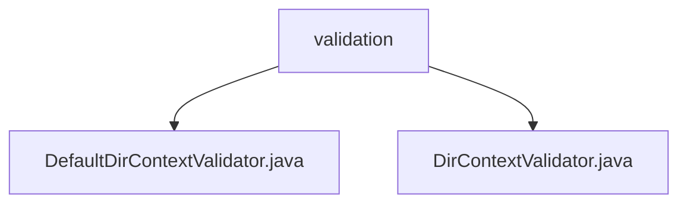

# 基础信息

|      |      |
|------|------|
| 名称 | validation |
| 编码语言 | .java |
| 代码路径 | spring-ldap/core/src/main/java/org/springframework/ldap/pool/validation |
| 包名 | spring-ldap.core.src.main.java.org.springframework.ldap.pool.validation |
| 概述说明 | DefaultDirContextValidator类验证DirContext，确保其有效性和功能性。 |

# 说明

## 概述
该代码模块主要涉及对LDAP（轻量级目录访问协议）中的`DirContext`进行验证的机制。模块中的核心类包括`DefaultDirContextValidator`和`DirContextValidator`，它们负责确保`DirContext`的有效性和功能性。`DefaultDirContextValidator`通过配置搜索范围、时间限制和过滤器等参数，提供了一套全面的验证机制。

## 主要业务场景
该模块的主要业务场景包括：
1. **LDAP连接池管理**：在LDAP连接池中，确保每个`DirContext`实例的有效性，避免使用无效或过期的连接。
2. **配置驱动的验证**：通过默认配置（如搜索范围、时间限制和过滤器）对`DirContext`进行验证，确保其符合预期的功能要求。
3. **扩展性**：通过`DirContextValidator`接口，允许开发者自定义验证逻辑，以适应不同的业务需求。

该模块为LDAP连接的管理和验证提供了坚实的基础，确保了系统的稳定性和可靠性。

### 包内部结构视图

该流程图展示了`spring-ldap/core/src/main/java/org/springframework/ldap/pool/validation`目录下的层级关系。`validation`文件夹包含两个文件：`DefaultDirContextValidator.java`和`DirContextValidator.java`。这两个文件都直接位于`validation`目录下，没有更深层次的子目录结构。

# 文件列表 File List

| 名称   | 类型  | 说明 |
|-------|------|-------------|
| [DirContextValidator.java](DirContextValidator.md) | file | 无内容可总结。 |
| [DefaultDirContextValidator.java](DefaultDirContextValidator.md) | file | DefaultDirContextValidator类验证DirContext，含搜索范围、时间限制和过滤器。 |

