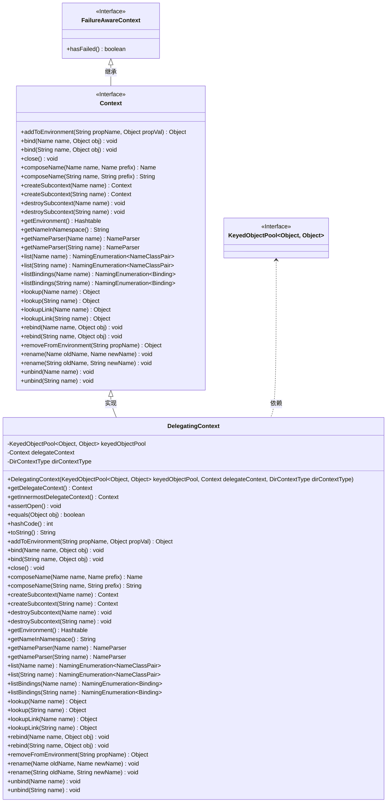

# 基础信息

|      |      |
|------|------|
| 名称 | DelegatingContext |
| 编码语言 | .java |
| 代码路径 | spring-ldap/core/src/main/java/org/springframework/ldap/pool2/DelegatingContext.java |
| 包名 | org.springframework.ldap.pool2 |
| 依赖项 | ['java.util.Hashtable', 'javax.naming.Binding', 'javax.naming.Context', 'javax.naming.Name', 'javax.naming.NameClassPair', 'javax.naming.NameParser', 'javax.naming.NamingEnumeration', 'javax.naming.NamingException', 'org.apache.commons.pool2.KeyedObjectPool', 'org.springframework.ldap.pool2.factory.PooledContextSource', 'org.springframework.util.Assert'] |
| 概述说明 | DelegatingContext实现Context接口，代理操作并支持对象池管理，关闭时返池。 |

# 说明

DelegatingContext类实现了Context接口，其主要功能是将所有操作代理给内部的delegateContext对象。该类还支持对象池管理机制，当对象不再使用时，会将其返回到对象池中以便复用。这种设计提高了资源利用率，减少了频繁创建和销毁对象的开销。

# 类列表 Class Summary

| 名称   | 类型  | 说明 |
|-------|------|-------------|
| DelegatingContext | class | DelegatingContext实现Context接口，代理操作至delegateContext，支持对象池管理，关闭时返回对象至池。 |

## 类 DelegatingContext

|      |      |
|------|------|
| 访问范围 | public |
| 类型 | class |
| 名称 | DelegatingContext |
| 说明 | DelegatingContext实现Context接口，代理操作至delegateContext，支持对象池管理，关闭时返回对象至池。 |

### UML类图

这段代码定义了一个 `DelegatingContext` 类，它实现了 `Context` 接口，并通过 `KeyedObjectPool` 管理对象的生命周期。`DelegatingContext` 的主要作用是代理 `Context` 的操作，并在必要时将对象返回到池中。它通过 `getInnermostDelegateContext` 方法递归获取最内层的 `Context`，并在 `close` 方法中将对象返回到池中或标记为无效。此外，它还处理了 `equals`、`hashCode` 和 `toString` 方法，确保它们基于最内层的 `Context` 进行操作。

### 内部方法调用关系图

这段代码定义了一个名为 `DelegatingContext` 的类，该类实现了 `Context` 接口，并用于代理上下文操作。它包含多个方法，用于处理上下文的绑定、查找、关闭等操作。类的主要功能是通过 `delegateContext` 对象将操作委托给实际的上下文对象，并确保在操作前检查上下文是否已关闭。此外，类还提供了递归获取最内层上下文的方法，并处理了上下文的相等性、哈希码和字符串表示。

### 字段列表 Field List

| 名称  | 类型  | 说明 |
|-------|-------|------|
| keyedObjectPool | KeyedObjectPool<Object, Object> | 私有键控对象池存储键值对对象。 |
| delegateContext | Context | 私有上下文委托变量声明。 |
| dirContextType | DirContextType | 私有最终类型DirContextType的dirContextType变量。 |

### 方法列表 Method List

| 名称  | 类型  | 说明 |
|-------|-------|------|
| assertOpen | void | 检查上下文是否关闭，若关闭则抛出命名异常。 |
| destroySubcontext | void | 销毁子上下文操作在池化上下文中不支持。 |
| close | void | 关闭方法，释放上下文并处理异常。 |
| createSubcontext | Context | 抛出异常，不支持在池化上下文上创建子上下文。 |
| removeFromEnvironment | Object | 池化上下文不支持调用removeFromEnvironment方法。 |
| listBindings | NamingEnumeration<Binding> | 列出指定名称绑定的枚举，需确保上下文已打开。 |
| getNameParser | NameParser | 获取指定名称的解析器，确保上下文已打开。 |
| hashCode | int | hashCode方法返回当前上下文哈希值，若为空则返回0。 |
| lookup | Object | 方法查找指定名称对象，确保上下文打开后调用委托上下文查找。 |
| getDelegateContext | Context | 获取当前对象的委托上下文实例。 |
| rename | void | 方法重命名，检查状态后调用委托上下文执行。 |
| toString | String | toString方法返回内部上下文字符串，若上下文为空则返回"Context is closed"。 |
| composeName | String | 方法composeName将name和prefix组合，返回结果并确保上下文已打开。 |
| list | NamingEnumeration<NameClassPair> | 列出指定名称的命名枚举对象，需确保上下文已打开。 |
| bind | void | bind方法用于将对象与名称绑定，检查状态后调用委托上下文执行。 |
| destroySubcontext | void | 该方法抛出异常，表示不支持在池化上下文中调用destroySubcontext操作。 |
| equals | boolean | equals方法比较对象相等性，检查类型和内部上下文是否一致。 |
| createSubcontext | Context | 抛出异常，不支持在池化上下文上创建子上下文。 |
| bind | void | bind方法将对象绑定到指定名称，确保上下文已打开并调用委托上下文执行绑定。 |
| composeName | Name | 方法composeName用于组合名称，需确保上下文开放并调用委托上下文执行。 |
| lookupLink | Object | 查找指定名称的链接对象，确保上下文已打开。 |
| listBindings | NamingEnumeration<Binding> | 方法`listBindings`返回指定名称的绑定枚举，需确保上下文已打开。 |
| addToEnvironment | Object | 方法`addToEnvironment`不支持在池化上下文中调用，抛出`UnsupportedOperationException`。 |
| getNameParser | NameParser | `getNameParser`方法返回指定名称的解析器，需确保上下文已打开。 |
| list | NamingEnumeration<NameClassPair> | 列出指定名称下的子项，返回名称-类对枚举。 |
| getInnermostDelegateContext | Context | 获取最内层委托上下文，若为委托上下文则递归获取，否则返回当前上下文。 |
| unbind | void | 该方法用于解绑指定名称的对象，确保上下文打开后调用。 |
| rebind | void | 方法`rebind`将对象绑定到指定名称，要求上下文已打开。 |
| lookupLink | Object | 查找指定名称的链接对象，确保上下文已打开。 |
| unbind | void | `unbind`方法用于解绑指定名称，确保上下文打开并调用委托上下文解绑操作。 |
| getEnvironment | Hashtable<?, ?> | 获取当前上下文环境，确保已打开并返回委托上下文的环境信息。 |
| getNameInNamespace | String | 方法获取命名空间中的名称，确保上下文已打开并调用委托上下文。 |
| rename | void | 重命名方法，检查状态并调用委托上下文进行重命名。 |
| rebind | void | rebind方法用于重新绑定对象，确保上下文开放并调用委托上下文。 |
| lookup | Object | 查找指定名称的对象，确保上下文已打开并委托查找。 |

