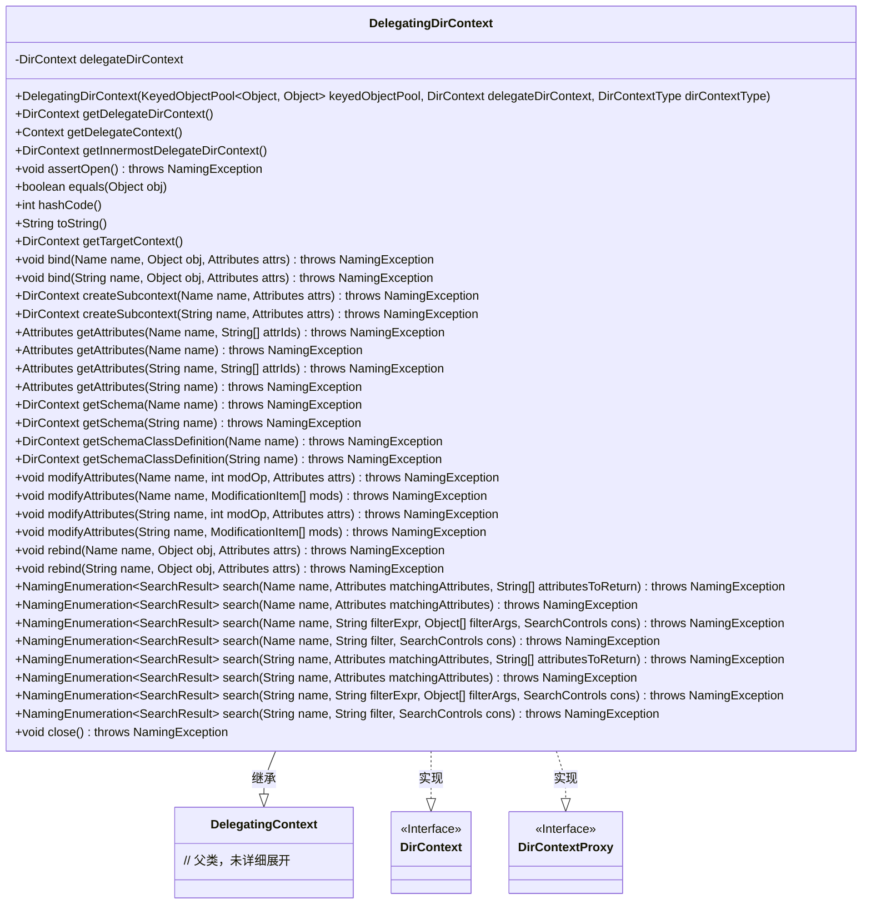

# 基础信息

|      |      |
|------|------|
| 名称 | DelegatingDirContext |
| 编码语言 | .java |
| 代码路径 | spring-ldap/core/src/main/java/org/springframework/ldap/pool2/DelegatingDirContext.java |
| 包名 | org.springframework.ldap.pool2 |
| 依赖项 | ['javax.naming.Context', 'javax.naming.Name', 'javax.naming.NamingEnumeration', 'javax.naming.NamingException', 'javax.naming.directory.Attributes', 'javax.naming.directory.DirContext', 'javax.naming.directory.ModificationItem', 'javax.naming.directory.SearchControls', 'javax.naming.directory.SearchResult', 'org.apache.commons.pool2.KeyedObjectPool', 'org.springframework.ldap.core.DirContextProxy', 'org.springframework.ldap.pool2.factory.PooledContextSource', 'org.springframework.util.Assert'] |
| 概述说明 | DelegatingDirContext类代理DirContext操作，确保上下文非空并支持递归查找。 |

# 说明

DelegatingDirContext类用于代理DirContext的操作，其主要功能是确保委托的上下文对象非空，并且支持递归查找内部上下文。该类通过委托机制，将DirContext的操作传递给内部的上下文对象，同时进行必要的验证和处理，以确保操作的正常执行和上下文的完整性。

# 类列表 Class Summary

| 名称   | 类型  | 说明 |
|-------|------|-------------|
| DelegatingDirContext | class | DelegatingDirContext类代理DirContext操作，确保委托上下文非空并支持递归查找内部上下文。 |

## 类 DelegatingDirContext

|      |      |
|------|------|
| 访问范围 | public |
| 类型 | class |
| 名称 | DelegatingDirContext |
| 说明 | DelegatingDirContext类代理DirContext操作，确保委托上下文非空并支持递归查找内部上下文。 |

### UML类图

这段代码定义了一个 `DelegatingDirContext` 类，该类继承自 `DelegatingContext` 并实现了 `DirContext` 和 `DirContextProxy` 接口。`DelegatingDirContext` 主要用于代理 `DirContext` 的操作，提供了对 `DirContext` 的封装和扩展，支持对 `DirContext` 的委托操作，并确保在操作前检查上下文是否打开。该类还提供了递归查找最内层 `DirContext` 的方法，以及一些基本的对象方法（如 `equals`、`hashCode` 和 `toString`）。

### 内部方法调用关系图

**描述：**  
`DelegatingDirContext` 类是一个用于委托操作的上下文类，它继承自 `DelegatingContext` 并实现了 `DirContext` 和 `DirContextProxy` 接口。该类通过 `delegateDirContext` 属性来委托具体的操作，提供了多种方法来处理目录上下文的相关操作，如绑定、搜索、修改属性等。类中的方法通过调用 `delegateDirContext` 来实现具体功能，并且通过 `assertOpen` 方法确保上下文处于打开状态。此外，类还重写了 `equals`、`hashCode` 和 `toString` 方法，以便正确比较和表示对象。

### 字段列表 Field List

| 名称  | 类型  | 说明 |
|-------|-------|------|
| delegateDirContext | DirContext | 私有DirContext委托对象。 |

### 方法列表 Method List

| 名称  | 类型  | 说明 |
|-------|-------|------|
| hashCode | int | 方法hashCode返回DirContext的哈希值，若为空则返回0。 |
| getTargetContext | DirContext | 获取最内层委托目录上下文对象。 |
| getInnermostDelegateDirContext | DirContext | 获取最内层委托目录上下文。 |
| equals | boolean | equals方法检查对象是否相同或DirContext实例是否相等。 |
| createSubcontext | DirContext | 池化上下文不支持创建子上下文操作。 |
| getDelegateContext | Context | 获取委托上下文的方法，返回委托目录上下文。 |
| close | void | 关闭委托目录上下文并释放资源。 |
| modifyAttributes | void | 方法修改指定名称的属性，需确保上下文已打开。 |
| bind | void | 绑定对象到命名上下文，确保上下文已打开。 |
| createSubcontext | DirContext | 方法createSubcontext不支持在池化上下文中调用。 |
| getAttributes | Attributes | 方法获取指定名称和属性ID的属性对象。 |
| search | NamingEnumeration<SearchResult> | 该方法搜索指定名称和匹配属性的目录条目。 |
| assertOpen | void | 检查DirContext是否关闭，若关闭则抛出NamingException异常。 |
| search | NamingEnumeration<SearchResult> | 搜索方法通过名称和属性匹配返回指定属性结果。 |
| search | NamingEnumeration<SearchResult> | 方法搜索指定名称和过滤条件的目录项，返回枚举结果。 |
| search | NamingEnumeration<SearchResult> | 搜索方法通过名称和过滤器查找结果，抛出命名异常。 |
| getDelegateDirContext | DirContext | 获取委托目录上下文的方法。 |
| getSchemaClassDefinition | DirContext | 该方法抛出异常，不支持在池化上下文调用getSchemaClassDefinition。 |
| search | NamingEnumeration<SearchResult> | 搜索方法，验证状态后调用委托目录上下文执行搜索。 |
| modifyAttributes | void | 方法modifyAttributes用于修改指定名称的属性，需确保上下文已打开。 |
| getSchema | DirContext | 池化上下文不支持调用getSchema方法。 |
| modifyAttributes | void | 修改目录属性，需先确认开放状态并委托上下文执行。 |
| bind | void | bind方法将对象与名称绑定，并处理属性，确保上下文已打开。 |
| search | NamingEnumeration<SearchResult> | 搜索方法根据名称、匹配属性和返回属性数组执行查询。 |
| toString | String | toString方法返回当前DirContext的字符串表示，若关闭则返回DirContext is closed。 |
| getSchemaClassDefinition | DirContext | 该方法抛出异常，不支持在池化上下文中调用getSchemaClassDefinition。 |
| modifyAttributes | void | 修改目录对象属性，需先确认打开状态，再通过代理上下文执行操作。 |
| search | NamingEnumeration<SearchResult> | 该方法用于搜索目录对象，接受名称、过滤表达式、参数和控制对象，返回搜索结果枚举。 |
| search | NamingEnumeration<SearchResult> | 搜索方法检查状态并调用委托上下文进行查询。 |
| getAttributes | Attributes | 方法`getAttributes`获取指定名称的属性，需确保上下文已打开。 |
| getAttributes | Attributes | 获取指定名称的属性，需确保上下文已打开并调用委托目录上下文。 |
| rebind | void | 方法rebind用于重新绑定对象，检查状态后调用委托上下文执行。 |
| getAttributes | Attributes | 方法获取指定名称的属性，需传入名称和属性ID数组，可能抛出NamingException。 |
| rebind | void | 方法rebind用于重新绑定对象，检查状态并委托操作。 |
| getSchema | DirContext | 该方法抛出异常，表示不支持在池化上下文中调用getSchema操作。 |

