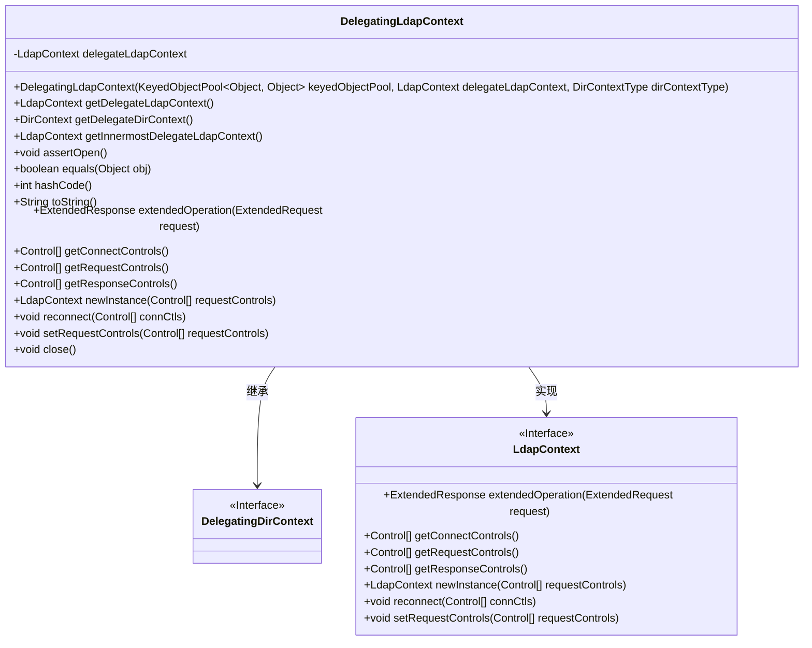

# 基础信息

|      |      |
|------|------|
| 名称 | DelegatingLdapContext |
| 编码语言 | .java |
| 代码路径 | spring-ldap/core/src/main/java/org/springframework/ldap/pool2/DelegatingLdapContext.java |
| 包名 | org.springframework.ldap.pool2 |
| 依赖项 | ['javax.naming.NamingException', 'javax.naming.directory.DirContext', 'javax.naming.ldap.Control', 'javax.naming.ldap.ExtendedRequest', 'javax.naming.ldap.ExtendedResponse', 'javax.naming.ldap.LdapContext', 'org.apache.commons.pool2.KeyedObjectPool', 'org.springframework.ldap.pool2.factory.PooledContextSource', 'org.springframework.util.Assert'] |
| 概述说明 | DelegatingLdapContext继承DelegatingDirContext，实现LdapContext接口，代理LDAP操作。 |

# 说明

DelegatingLdapContext类继承自DelegatingDirContext，并实现了LdapContext接口。其主要功能是代理LDAP操作，并支持递归查找真实上下文。通过这种方式，该类能够有效地管理和处理LDAP上下文，确保操作的准确性和一致性。

# 类列表 Class Summary

| 名称   | 类型  | 说明 |
|-------|------|-------------|
| DelegatingLdapContext | class | DelegatingLdapContext类继承DelegatingDirContext，实现LdapContext接口，代理LDAP操作并支持递归查找真实上下文。 |

## 类 DelegatingLdapContext

|      |      |
|------|------|
| 访问范围 | public |
| 类型 | class |
| 名称 | DelegatingLdapContext |
| 说明 | DelegatingLdapContext类继承DelegatingDirContext，实现LdapContext接口，代理LDAP操作并支持递归查找真实上下文。 |

### UML类图

这段代码定义了一个`DelegatingLdapContext`类，它继承了`DelegatingDirContext`并实现了`LdapContext`接口。`DelegatingLdapContext`类的主要作用是代理`LdapContext`的操作，并提供了对`LdapContext`的访问和操作的方法。通过`getDelegateLdapContext`和`getInnermostDelegateLdapContext`方法，可以获取代理的`LdapContext`实例。此外，`DelegatingLdapContext`还重写了`equals`、`hashCode`和`toString`方法，并实现了`LdapContext`接口中的方法，如`extendedOperation`、`getConnectControls`等。

### 内部方法调用关系图

```mermaid
graph TD
    A["类DelegatingLdapContext"]
    B["属性: LdapContext delegateLdapContext"]
    C["构造方法: DelegatingLdapContext(KeyedObjectPool<Object, Object> keyedObjectPool, LdapContext delegateLdapContext, DirContextType dirContextType)"]
    D["方法: LdapContext getDelegateLdapContext()"]
    E["方法: DirContext getDelegateDirContext()"]
    F["方法: LdapContext getInnermostDelegateLdapContext()"]
    G["方法: void assertOpen()"]
    H["方法: boolean equals(Object obj)"]
    I["方法: int hashCode()"]
    J["方法: String toString()"]
    K["方法: ExtendedResponse extendedOperation(ExtendedRequest request)"]
    L["方法: Control[] getConnectControls()"]
    M["方法: Control[] getRequestControls()"]
    N["方法: Control[] getResponseControls()"]
    O["方法: LdapContext newInstance(Control[] requestControls)"]
    P["方法: void reconnect(Control[] connCtls)"]
    Q["方法: void setRequestControls(Control[] requestControls)"]
    R["方法: void close()"]

    A --> B
    A --> C
    A --> D
    A --> E
    A --> F
    A --> G
    A --> H
    A --> I
    A --> J
    A --> K
    A --> L
    A --> M
    A --> N
    A --> O
    A --> P
    A --> Q
    A --> R
```

这段代码定义了一个名为 `DelegatingLdapContext` 的类，它继承自 `DelegatingDirContext` 并实现了 `LdapContext` 接口。该类的主要功能是代理 `LdapContext` 的操作，并提供了对委托对象的访问和控制。通过构造方法初始化委托对象，并通过多个方法实现对委托对象的操作和状态检查。代码中还包含了递归获取最内层委托对象的方法，以及一些对象方法的重写和接口方法的实现。

### 字段列表 Field List

| 名称  | 类型  | 说明 |
|-------|-------|------|
| delegateLdapContext | LdapContext | 私有LDAP上下文委托对象。 |

### 方法列表 Method List

| 名称  | 类型  | 说明 |
|-------|-------|------|
| toString | String | toString方法返回内部LdapContext的字符串表示，若关闭则返回“LdapContext is closed”。 |
| getResponseControls | Control[] | 获取LDAP响应控制信息，确保连接有效。 |
| getDelegateDirContext | DirContext | 方法返回委托的LDAP上下文对象。 |
| newInstance | LdapContext | LDAP上下文的newInstance方法抛出不支持操作异常。 |
| getDelegateLdapContext | LdapContext | 获取委托的LDAP上下文对象。 |
| getConnectControls | Control[] | 获取连接控制信息，需确保上下文已打开。 |
| close | void | 关闭LDAP上下文，释放资源并置空委托对象。 |
| assertOpen | void | 检查LdapContext是否关闭，若关闭则抛出NamingException异常。 |
| getRequestControls | Control[] | 获取LDAP请求控制项，需确保上下文已打开。 |
| extendedOperation | ExtendedResponse | 方法执行扩展操作，需先确认状态，再调用委托上下文处理请求。 |
| setRequestControls | void | 抛出异常，不支持在池化上下文调用setRequestControls。 |
| getInnermostDelegateLdapContext | LdapContext | 获取最内层LdapContext，若为代理则递归获取。 |
| hashCode | int | 该方法返回LDAP上下文对象的哈希码，若上下文为空则返回0。 |
| equals | boolean | equals方法比较LdapContext对象，确保类型一致且最内层代理相等。 |
| reconnect | void | 该方法抛出异常，不支持在池化上下文中调用重连操作。 |

