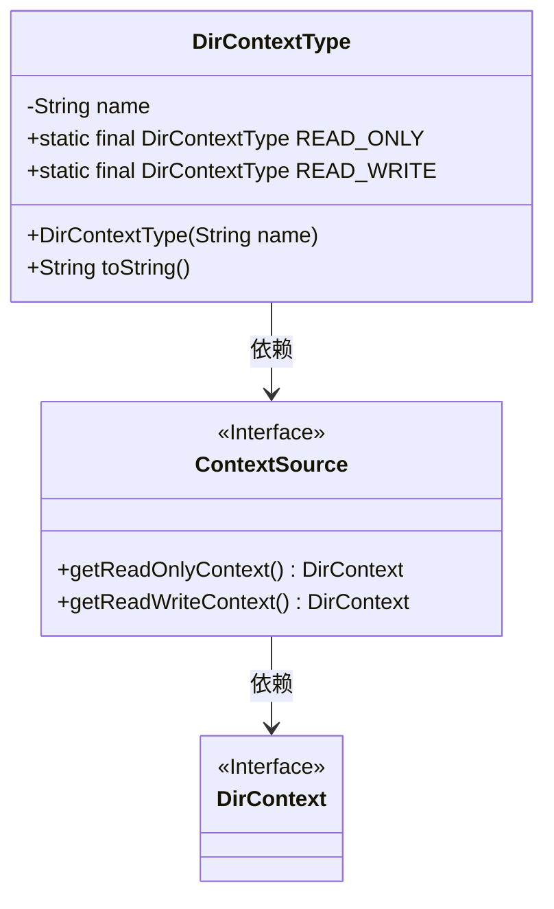
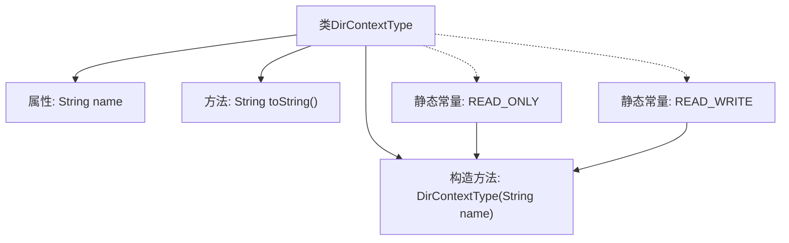

# 基础信息

|      |      |
|------|------|
| 名称 | DirContextType |
| 编码语言 | .java |
| 代码路径 | spring-ldap/core/src/main/java/org/springframework/ldap/pool2/DirContextType.java |
| 包名 | org.springframework.ldap.pool2 |
| 依赖项 | ['javax.naming.directory.DirContext', 'org.springframework.ldap.core.ContextSource'] |
| 概述说明 | DirContextType类定义只读和读写上下文类型，使用静态实例表示。 |

# 说明

DirContextType类用于定义只读和读写上下文类型，这些类型通过静态实例来表示。该类的主要功能是区分和标识不同的上下文访问模式，确保在特定场景下正确使用只读或读写操作。通过静态实例的方式，可以方便地在程序中引用这些上下文类型，提高代码的可读性和维护性。

# 类列表 Class Summary

| 名称   | 类型  | 说明 |
|-------|------|-------------|
| DirContextType | class | DirContextType类定义只读和读写上下文类型，通过静态实例表示。 |

## 类 DirContextType

|      |      |
|------|------|
| 访问范围 | public final |
| 类型 | class |
| 名称 | DirContextType |
| 说明 | DirContextType类定义只读和读写上下文类型，通过静态实例表示。 |

### UML类图

类图描述：`DirContextType` 是一个不可变类，包含两个静态常量 `READ_ONLY` 和 `READ_WRITE`，分别表示只读和读写上下文类型。`ContextSource` 是一个接口，定义了获取只读和读写上下文的方法。`DirContext` 是上下文接口，`ContextSource` 依赖于 `DirContext` 来返回具体的上下文实例。

### 内部方法调用关系图

这段代码定义了一个名为 `DirContextType` 的不可变类，用于表示目录上下文的类型。类中包含一个私有属性 `name`，一个私有构造方法用于初始化该属性，以及一个 `toString` 方法返回 `name` 的值。类中还定义了两个静态常量 `READ_ONLY` 和 `READ_WRITE`，分别表示只读和读写上下文的类型。这两个常量通过调用私有构造方法进行初始化。流程图展示了类的结构及其内部方法调用关系。

### 字段列表 Field List

| 名称  | 类型  | 说明 |
|-------|-------|------|
| name | String | 定义了一个私有字符串类型变量name。 |
| READ_ONLY = new DirContextType("READ_ONLY") | DirContextType | 定义了一个名为READ_ONLY的静态常量DirContextType实例。 |
| READ_WRITE = new DirContextType("READ_WRITE") | DirContextType | 定义了一个公共静态常量READ_WRITE，类型为DirContextType，值为"READ_WRITE"。 |

### 方法列表 Method List

| 名称  | 类型  | 说明 |
|-------|-------|------|
| toString | String | toString方法返回对象的name属性。 |

