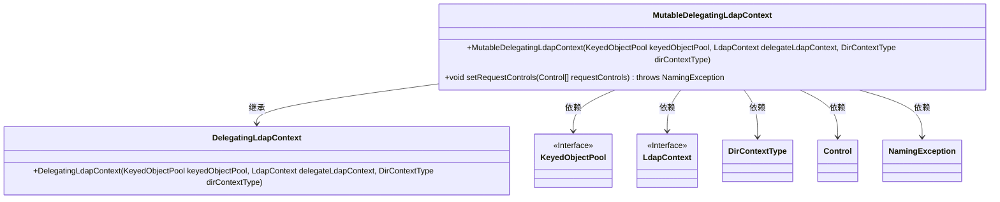
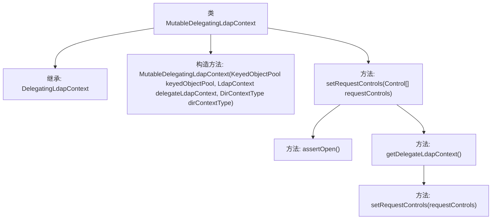

# 基础信息

|      |      |
|------|------|
| 名称 | MutableDelegatingLdapContext |
| 编码语言 | .java |
| 代码路径 | spring-ldap/core/src/main/java/org/springframework/ldap/pool2/MutableDelegatingLdapContext.java |
| 包名 | org.springframework.ldap.pool2 |
| 依赖项 | ['javax.naming.NamingException', 'javax.naming.ldap.Control', 'javax.naming.ldap.LdapContext', 'org.apache.commons.pool2.KeyedObjectPool', 'org.springframework.ldap.pool2.factory.MutablePooledContextSource'] |
| 概述说明 | MutableDelegatingLdapContext继承DelegatingLdapContext，管理LDAP上下文并支持请求控制。 |

# 说明

MutableDelegatingLdapContext继承自DelegatingLdapContext，主要用于管理LDAP上下文。它具备设置请求控制的功能，能够灵活地处理LDAP操作中的控制参数，增强了对LDAP上下文的管理能力。

# 类列表 Class Summary

| 名称   | 类型  | 说明 |
|-------|------|-------------|
| MutableDelegatingLdapContext | class | MutableDelegatingLdapContext继承DelegatingLdapContext，用于管理LDAP上下文，支持设置请求控制。 |

## 类 MutableDelegatingLdapContext

|      |      |
|------|------|
| 访问范围 | public |
| 类型 | class |
| 名称 | MutableDelegatingLdapContext |
| 说明 | MutableDelegatingLdapContext继承DelegatingLdapContext，用于管理LDAP上下文，支持设置请求控制。 |

### UML类图

这段代码定义了一个 `MutableDelegatingLdapContext` 类，它继承自 `DelegatingLdapContext`。该类的主要功能是通过构造函数初始化一个可变的委托 LDAP 上下文，并提供 `setRequestControls` 方法来设置请求控制。`MutableDelegatingLdapContext` 依赖于 `KeyedObjectPool`、`LdapContext`、`DirContextType`、`Control` 和 `NamingException` 等类或接口。

### 内部方法调用关系图

这段代码定义了一个名为 `MutableDelegatingLdapContext` 的类，该类继承自 `DelegatingLdapContext`。类中包含一个构造方法，用于初始化对象，并接受三个参数：`KeyedObjectPool`、`LdapContext` 和 `DirContextType`。此外，类中还定义了一个 `setRequestControls` 方法，用于设置请求控制。该方法首先调用 `assertOpen` 方法确保上下文处于打开状态，然后通过 `getDelegateLdapContext` 方法获取委托的 `LdapContext` 对象，并调用其 `setRequestControls` 方法来设置请求控制。

### 字段列表 Field List

| 名称  | 类型  | 说明 |
|-------|-------|------|

### 方法列表 Method List

| 名称  | 类型  | 说明 |
|-------|-------|------|
| setRequestControls | void | 设置LDAP请求控制，确保上下文已打开并委托执行。 |

