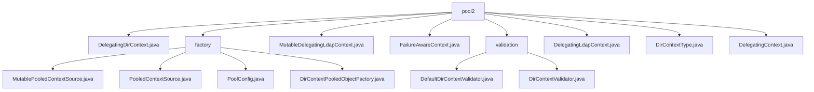

# 基础信息

|      |      |
|------|------|
| 名称 | pool2 |
| 编码语言 | .java |
| 代码路径 | spring-ldap/core/src/main/java/org/springframework/ldap/pool2 |
| 包名 | spring-ldap.core.src.main.java.org.springframework.ldap.pool2 |
| 概述说明 | DelegatingDirContext代理DirContext操作，确保上下文非空，支持递归查找。LDAP对象池管理提升性能，支持读写和只读上下文。 |

# 说明

## 概述

该代码模块主要围绕LDAP（轻量级目录访问协议）的上下文对象池化管理展开，旨在通过对象池机制高效管理和复用`DirContext`对象，提升系统性能和资源利用率。模块的核心功能包括上下文对象的创建、验证、销毁以及对象池的配置和管理。通过实现`ContextSource`接口，模块支持对`DirContext`对象的读写操作，并提供了灵活的配置选项以适应不同的业务需求。模块中的类如`DelegatingDirContext`、`DelegatingLdapContext`、`DelegatingContext`等，通过代理机制将操作传递给内部的上下文对象，确保操作的正常执行和上下文的完整性。

## 主要业务场景

1. **LDAP连接管理**：在需要频繁访问LDAP目录服务的场景中，通过对象池机制复用`DirContext`对象，减少频繁创建和销毁连接的开销，提升系统性能。
2. **资源高效利用**：通过配置对象池的最大空闲数、最大总数、阻塞策略等参数，确保系统资源的高效管理和使用，避免资源浪费。
3. **上下文对象生命周期管理**：通过`DirContextPooledObjectFactory`管理`DirContext`对象的生命周期，包括创建、验证和销毁，确保对象在使用过程中的有效性和可靠性。
4. **灵活配置**：通过`PoolConfig`类，用户可以灵活配置对象池的行为和性能，包括JMX设置和回收策略，以适应不同的业务场景和性能需求。
5. **读写与只读上下文支持**：模块支持处理读写和只读类型的`DirContext`对象，确保在不同操作模式下对象池的高效管理。
6. **目录上下文验证**：`DefaultDirContextValidator`类用于验证LDAP目录上下文，确保其符合预设的过滤器和搜索控制参数。
7. **自定义配置**：用户可以通过设置基础路径和过滤器来定制验证逻辑，以适应不同的业务需求。
8. **合法性检查**：通过验证方法，确保目录上下文的合法性和有效性，防止无效或不安全的目录上下文被使用。
9. **请求控制管理**：`MutableDelegatingLdapContext`类具备设置请求控制的功能，能够灵活地处理LDAP操作中的控制参数，增强了对LDAP上下文的管理能力。

### 包内部结构视图

该流程图展示了`spring-ldap/core/src/main/java/org/springframework/ldap/pool2`目录下的文件与子目录的层级关系。`pool2`作为根节点，包含多个文件和子目录，如`factory`和`validation`。`factory`子目录下包含多个与上下文池相关的文件，而`validation`子目录下则包含验证相关的文件。整体结构清晰，展示了各个文件与目录之间的从属关系。

# 文件列表 File List

| 名称   | 类型  | 说明 |
|-------|------|-------------|
| [DelegatingLdapContext.java](DelegatingLdapContext.md) | file | DelegatingLdapContext继承DelegatingDirContext，实现LdapContext接口，代理LDAP操作。 |
| [FailureAwareContext.java](FailureAwareContext.md) | file | 信息为空，无法生成概要描述。 |
| [MutableDelegatingLdapContext.java](MutableDelegatingLdapContext.md) | file | MutableDelegatingLdapContext继承DelegatingLdapContext，管理LDAP上下文并支持请求控制。 |
| [DelegatingDirContext.java](DelegatingDirContext.md) | file | DelegatingDirContext类代理DirContext操作，确保上下文非空并支持递归查找。 |
| [DelegatingContext.java](DelegatingContext.md) | file | DelegatingContext实现Context接口，代理操作并支持对象池管理，关闭时返池。 |
| [DirContextType.java](DirContextType.md) | file | DirContextType类定义只读和读写上下文类型，使用静态实例表示。 |
| [validation](validation/_module.md) | package | DefaultDirContextValidator类验证目录上下文，支持设置路径和过滤器，确保合法有效。 |
| [factory](factory/_module.md) | package | 可变池化上下文源管理DirContext对象池，提升性能和资源利用率。 |

