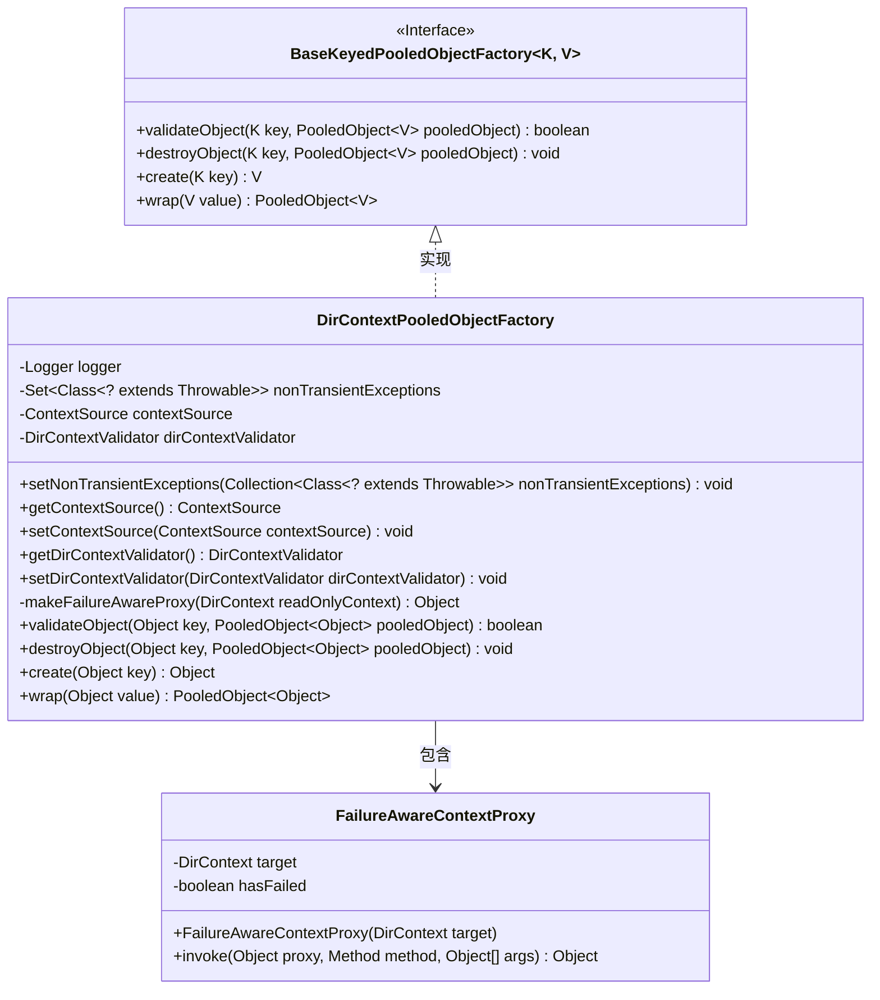

# 基础信息

|      |      |
|------|------|
| 名称 | DirContextPooledObjectFactory |
| 编码语言 | .java |
| 代码路径 | spring-ldap/core/src/main/java/org/springframework/ldap/pool2/factory/DirContextPooledObjectFactory.java |
| 包名 | org.springframework.ldap.pool2.factory |
| 依赖项 | ['java.lang.reflect.InvocationHandler', 'java.lang.reflect.InvocationTargetException', 'java.lang.reflect.Method', 'java.lang.reflect.Proxy', 'java.util.Collection', 'java.util.HashSet', 'java.util.Set', 'javax.naming.CommunicationException', 'javax.naming.directory.DirContext', 'org.apache.commons.pool2.BaseKeyedPooledObjectFactory', 'org.apache.commons.pool2.PooledObject', 'org.apache.commons.pool2.impl.DefaultPooledObject', 'org.slf4j.Logger', 'org.slf4j.LoggerFactory', 'org.springframework.ldap.core.ContextSource', 'org.springframework.ldap.core.DirContextProxy', 'org.springframework.ldap.pool2.DirContextType', 'org.springframework.ldap.pool2.FailureAwareContext', 'org.springframework.ldap.pool2.validation.DirContextValidator', 'org.springframework.ldap.support.LdapUtils', 'org.springframework.util.Assert'] |
| 概述说明 | DirContextPooledObjectFactory管理DirContext的创建、验证和销毁，支持读写和只读类型。 |

# 说明

DirContextPooledObjectFactory负责管理DirContext对象的生命周期，包括创建、验证和销毁。它支持处理读写和只读类型的DirContext对象，确保对象在使用过程中的有效性和高效管理。

# 类列表 Class Summary

| 名称   | 类型  | 说明 |
|-------|------|-------------|
| DirContextPooledObjectFactory | class | DirContextPooledObjectFactory管理DirContext对象的创建、验证和销毁，支持读写和只读类型。 |

## 类 DirContextPooledObjectFactory

|      |      |
|------|------|
| 访问范围 | None |
| 类型 | class |
| 名称 | DirContextPooledObjectFactory |
| 说明 | DirContextPooledObjectFactory管理DirContext对象的创建、验证和销毁，支持读写和只读类型。 |

### UML类图

### 描述
`DirContextPooledObjectFactory` 是一个实现了 `BaseKeyedPooledObjectFactory` 接口的类，用于管理和验证 `DirContext` 对象池中的对象。它包含一个内部类 `FailureAwareContextProxy`，用于处理代理对象的调用并检测不可恢复的异常。该类通过 `ContextSource` 和 `DirContextValidator` 来创建和验证 `DirContext` 对象，并通过 `nonTransientExceptions` 配置哪些异常会导致对象失效。

### 内部方法调用关系图

```mermaid
graph TD
    A["类DirContextPooledObjectFactory"]
    B["属性: Logger logger"]
    C["属性: Set<Class<? extends Throwable>> DEFAULT_NONTRANSIENT_EXCEPTIONS"]
    D["属性: ContextSource contextSource"]
    E["属性: DirContextValidator dirContextValidator"]
    F["属性: Set<Class<? extends Throwable>> nonTransientExceptions"]
    G["方法: void setNonTransientExceptions(Collection<Class<? extends Throwable>>)"]
    H["方法: ContextSource getContextSource()"]
    I["方法: void setContextSource(ContextSource)"]
    J["方法: DirContextValidator getDirContextValidator()"]
    K["方法: void setDirContextValidator(DirContextValidator)"]
    L["方法: Object makeFailureAwareProxy(DirContext)"]
    M["方法: boolean validateObject(Object, PooledObject<Object>)"]
    N["方法: void destroyObject(Object, PooledObject<Object>)"]
    O["方法: Object create(Object)"]
    P["方法: PooledObject<Object> wrap(Object)"]
    Q["内部类: FailureAwareContextProxy"]
    R["属性: DirContext target"]
    S["属性: boolean hasFailed"]
    T["方法: Object invoke(Object, Method, Object[])"]

    A --> B
    A --> C
    A --> D
    A --> E
    A --> F
    A --> G
    A --> H
    A --> I
    A --> J
    A --> K
    A --> L
    A --> M
    A --> N
    A --> O
    A --> P
    A --> Q
    Q --> R
    Q --> S
    Q --> T
```

该流程图展示了`DirContextPooledObjectFactory`类的结构及其内部类`FailureAwareContextProxy`的关系。`DirContextPooledObjectFactory`类包含多个属性和方法，用于管理`DirContext`对象的创建、验证、销毁和包装。`FailureAwareContextProxy`内部类负责处理代理对象的调用，并在遇到非瞬态异常时标记上下文为无效。该图清晰地展示了类的方法和属性之间的调用关系，便于理解类的整体功能。

### 字段列表 Field List

| 名称  | 类型  | 说明 |
|-------|-------|------|
| logger = LoggerFactory.getLogger(this.getClass()) | Logger | 声明一个受保护的日志记录器实例。 |
| contextSource | ContextSource | 私有成员变量contextSource，类型为ContextSource。 |
| DEFAULT_NONTRANSIENT_EXCEPTIONS = new HashSet<>() | Set<Class<? extends Throwable>> | 定义默认不可恢复异常集合。 |
| dirContextValidator | DirContextValidator | 私有变量dirContextValidator用于DirContext验证。 |
| nonTransientExceptions = DEFAULT_NONTRANSIENT_EXCEPTIONS | Set<Class<? extends Throwable>> | 定义非瞬态异常集合，默认值为DEFAULT_NONTRANSIENT_EXCEPTIONS。 |

### 方法列表 Method List

| 名称  | 类型  | 说明 |
|-------|-------|------|
| setContextSource | void | 设置上下文源，若为空则抛出异常。 |
| getContextSource | ContextSource | 获取上下文源方法返回当前上下文源对象。 |
| wrap | PooledObject<Object> | 重写wrap方法，返回包含对象的DefaultPooledObject实例。 |
| create | Object | 根据上下文类型创建并返回相应的DirContext对象。 |
| setDirContextValidator | void | 设置目录上下文验证器，若为空则抛出异常。 |
| destroyObject | void | 销毁对象时检查类型并关闭DirContext，记录日志。 |
| getDirContextValidator | DirContextValidator | 获取目录上下文验证器的方法。 |
| validateObject | boolean | 验证对象类型为DirContext，确保非空并调用验证器处理。 |
| setNonTransientExceptions | void | 设置非瞬态异常集合，用于存储不可恢复的异常类型。 |
| makeFailureAwareProxy | Object | 创建失败感知代理对象，封装只读上下文。 |

