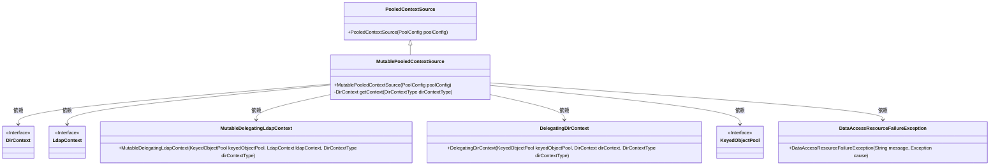

# 基础信息

|      |      |
|------|------|
| 名称 | MutablePooledContextSource |
| 编码语言 | .java |
| 代码路径 | spring-ldap/core/src/main/java/org/springframework/ldap/pool2/factory/MutablePooledContextSource.java |
| 包名 | org.springframework.ldap.pool2.factory |
| 依赖项 | ['javax.naming.directory.DirContext', 'javax.naming.ldap.LdapContext', 'org.springframework.dao.DataAccessResourceFailureException', 'org.springframework.ldap.pool2.DelegatingDirContext', 'org.springframework.ldap.pool2.DirContextType', 'org.springframework.ldap.pool2.MutableDelegatingLdapContext'] |
| 概述说明 | 创建可变池化上下文源，管理DirContext对象池，支持LdapContext和DirContext类型。 |

# 说明

该描述涉及创建一个可变池化上下文源，用于管理DirContext对象池。该池化上下文源支持LdapContext和DirContext两种类型的对象，旨在高效地管理和复用这些上下文对象，以提升系统性能和资源利用率。

# 类列表 Class Summary

| 名称   | 类型  | 说明 |
|-------|------|-------------|
| MutablePooledContextSource | class | 创建可变池化上下文源，管理DirContext对象池，支持LdapContext和DirContext类型。 |

## 类 MutablePooledContextSource

|      |      |
|------|------|
| 访问范围 | public |
| 类型 | class |
| 名称 | MutablePooledContextSource |
| 说明 | 创建可变池化上下文源，管理DirContext对象池，支持LdapContext和DirContext类型。 |

### UML类图

这段代码定义了一个`MutablePooledContextSource`类，它继承自`PooledContextSource`，并实现了从对象池中获取`DirContext`对象的功能。该类通过`getContext`方法从`KeyedObjectPool`中借出`DirContext`对象，并根据其类型返回`MutableDelegatingLdapContext`或`DelegatingDirContext`。代码中使用了异常处理来捕获借出对象时可能发生的异常，并抛出`DataAccessResourceFailureException`。类图中的依赖关系清晰地展示了各个类之间的交互。

### 内部方法调用关系图

这段代码描述了一个名为`MutablePooledContextSource`的类，它继承自`PooledContextSource`。该类的主要功能是从对象池中获取`DirContext`对象，并根据其类型返回不同的上下文对象。如果获取过程中发生异常，会抛出`DataAccessResourceFailureException`。如果获取的`DirContext`是`LdapContext`类型，则返回`MutableDelegatingLdapContext`，否则返回`DelegatingDirContext`。

### 字段列表 Field List

| 名称  | 类型  | 说明 |
|-------|-------|------|

### 方法列表 Method List

| 名称  | 类型  | 说明 |
|-------|-------|------|
| getContext | DirContext | 从对象池获取DirContext，失败抛出异常，返回相应上下文对象。 |

