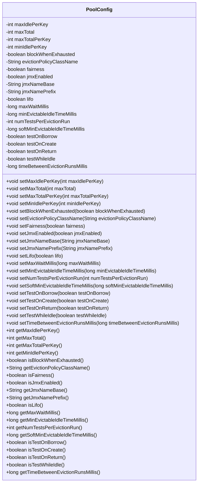

# 基础信息

|      |      |
|------|------|
| 名称 | PoolConfig |
| 编码语言 | .java |
| 代码路径 | spring-ldap/core/src/main/java/org/springframework/ldap/pool2/factory/PoolConfig.java |
| 包名 | org.springframework.ldap.pool2.factory |
| 依赖项 | ['org.apache.commons.pool2.impl.GenericKeyedObjectPoolConfig'] |
| 概述说明 | PoolConfig类管理对象池参数，涵盖空闲数、总数、阻塞策略、JMX及回收策略。 |

# 说明

PoolConfig类用于配置对象池的参数，主要包括最大空闲数、最大总数、阻塞策略、JMX设置以及回收策略等。这些参数共同决定了对象池的行为和性能，确保资源的高效管理和使用。

# 类列表 Class Summary

| 名称   | 类型  | 说明 |
|-------|------|-------------|
| PoolConfig | class | PoolConfig类配置对象池参数，包括最大空闲数、最大总数、阻塞策略、JMX设置、回收策略等。 |

## 类 PoolConfig

|      |      |
|------|------|
| 访问范围 | public |
| 类型 | class |
| 名称 | PoolConfig |
| 说明 | PoolConfig类配置对象池参数，包括最大空闲数、最大总数、阻塞策略、JMX设置、回收策略等。 |

### UML类图

**描述：**
`PoolConfig` 类用于配置对象池的行为，包含多个属性用于控制池的大小、空闲对象的处理、JMX 监控、对象借用和归还时的测试策略等。该类提供了对这些属性的设置和获取方法，使得开发者可以根据具体需求灵活配置对象池的行为。

### 内部方法调用关系图

这段代码定义了一个名为 `PoolConfig` 的类，该类包含多个属性，用于配置对象池的行为。每个属性都有对应的 `setter` 和 `getter` 方法，用于设置和获取属性的值。这些属性包括最大空闲对象数、最大总对象数、最小空闲对象数、是否在资源耗尽时阻塞、驱逐策略类名、是否启用公平性、是否启用JMX监控等。通过调用这些方法，可以灵活地配置对象池的行为，以满足不同的应用需求。

### 字段列表 Field List

| 名称  | 类型  | 说明 |
|-------|-------|------|
| maxIdlePerKey = 8 | int | 最大空闲连接数设为8。 |
| maxTotal = -1 | int | 私有整型变量maxTotal初始值为-1。 |
| jmxEnabled = true | boolean | JMX功能已启用。 |
| lifo = true | boolean | 私有布尔变量lifo默认值为true。 |
| testOnCreate = false | boolean | 变量testOnCreate初始值为false。 |
| jmxNamePrefix = "ldap-pool" | String | JMX名称前缀设置为"ldap-pool"。 |
| testOnReturn = false | boolean | 私有布尔变量testOnReturn默认值为false。 |
| minIdlePerKey = 0 | int | 最小空闲连接数默认为0。 |
| testOnBorrow = false | boolean | 设置借出时测试标志为假。 |
| jmxNameBase = null | String | jmxNameBase 是私有字符串变量，初始值为 null。 |
| minEvictableIdleTimeMillis = 1000L * 60L * 30L | long | 最小可回收空闲时间设置为30分钟。 |
| numTestsPerEvictionRun = 3 | int | 每个驱逐运行执行的测试次数为3。 |
| maxWaitMillis = -1L | long | 最大等待时间设为负一毫秒。 |
| evictionPolicyClassName = "org.apache.commons.pool2.impl.DefaultEvictionPolicy" | String | Apache Commons Pool默认驱逐策略类名为DefaultEvictionPolicy。 |
| blockWhenExhausted = true | boolean | 私有布尔变量blockWhenExhausted默认值为true。 |
| fairness = false | boolean | 私有布尔变量fairness初始值为false。 |
| maxTotalPerKey = 8 | int | 单个键的最大总数为8。 |
| softMinEvictableIdleTimeMillis = -1L | long | 软最小可回收空闲时间毫秒数默认为-1。 |
| testWhileIdle = false | boolean | 空闲时测试功能未启用。 |
| timeBetweenEvictionRunsMillis = -1L | long | 私有长整型变量timeBetweenEvictionRunsMillis初始值为-1L。 |

### 方法列表 Method List

| 名称  | 类型  | 说明 |
|-------|-------|------|
| setMaxTotal | void | 设置最大总数方法，参数为maxTotal。 |
| getJmxNameBase | String | 方法getJmxNameBase返回jmxNameBase属性值。 |
| getMaxTotal | int | 该方法返回maxTotal的值。 |
| getMinEvictableIdleTimeMillis | long | 获取最小可回收空闲时间毫秒数的方法。 |
| setBlockWhenExhausted | void | 设置资源耗尽时是否阻塞。 |
| getMaxTotalPerKey | int | 该方法返回键的最大总值。 |
| setMaxIdlePerKey | void | 设置每个键的最大空闲数。 |
| setJmxNamePrefix | void | 设置JMX名称前缀的方法。 |
| setMinIdlePerKey | void | 设置每个键的最小空闲实例数。 |
| getMinIdlePerKey | int | 获取每个键的最小空闲数。 |
| setNumTestsPerEvictionRun | void | 设置每次驱逐测试的数量。 |
| getJmxNamePrefix | String | 获取JMX名称前缀的方法。 |
| getEvictionPolicyClassName | String | 获取驱逐策略类名的方法。 |
| getMaxIdlePerKey | int | 获取每个键的最大空闲数。 |
| setMinEvictableIdleTimeMillis | void | 设置最小可回收空闲时间毫秒数。 |
| setFairness | void | 设置公平性参数的方法。 |
| setTestOnBorrow | void | 设置对象借用时是否进行测试。 |
| setSoftMinEvictableIdleTimeMillis | void | 设置对象最小可回收空闲时间。 |
| setJmxNameBase | void | 该方法用于设置JMX名称基础值。 |
| getNumTestsPerEvictionRun | int | 获取每次驱逐操作执行的测试数量。 |
| setTestOnReturn | void | 设置返回时测试属性的方法。 |
| setTestOnCreate | void | 设置创建时是否测试的属性方法。 |
| getTimeBetweenEvictionRunsMillis | long | 该方法返回对象中的时间间隔属性值。 |
| isTestOnBorrow | boolean | 方法返回是否在借用时进行测试的布尔值。 |
| getSoftMinEvictableIdleTimeMillis | long | 获取软性最小可回收空闲时间毫秒数。 |
| setTimeBetweenEvictionRunsMillis | void | 设置对象驱逐运行间隔时间的方法。 |
| isJmxEnabled | boolean | 该方法返回JMX启用状态。 |
| isFairness | boolean | 该方法返回公平性布尔值。 |
| isTestOnCreate | boolean | 该方法返回布尔值，表示是否在创建时进行测试。 |
| setTestWhileIdle | void | 设置空闲时是否进行测试的布尔值。 |
| setJmxEnabled | void | 设置JMX启用状态的Java方法。 |
| isTestOnReturn | boolean | 该方法返回testOnReturn的布尔值。 |
| isTestWhileIdle | boolean | 方法isTestWhileIdle返回testWhileIdle布尔值。 |
| setEvictionPolicyClassName | void | 设置驱逐策略类名的方法。 |
| setMaxWaitMillis | void | 设置最大等待时间的方法，参数为毫秒数。 |
| setLifo | void | 设置LIFO属性以控制元素处理顺序。 |
| isBlockWhenExhausted | boolean | 方法isBlockWhenExhausted返回blockWhenExhausted的值。 |
| getMaxWaitMillis | long | 获取最大等待毫秒数的方法。 |
| setMaxTotalPerKey | void | 设置每个键的最大总数。 |
| isLifo | boolean | 该方法返回布尔值，表示是否为后进先出。 |

