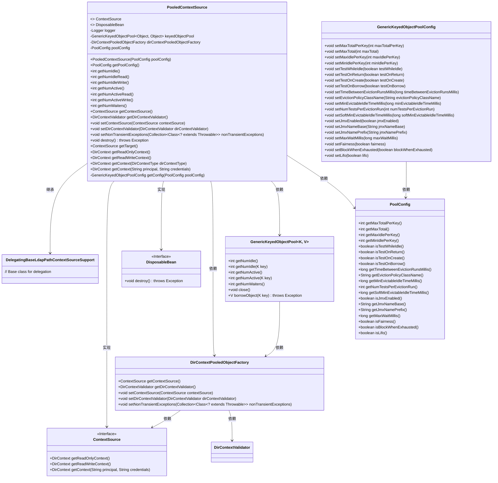

# 基础信息

|      |      |
|------|------|
| 名称 | PooledContextSource |
| 编码语言 | .java |
| 代码路径 | spring-ldap/core/src/main/java/org/springframework/ldap/pool2/factory/PooledContextSource.java |
| 包名 | org.springframework.ldap.pool2.factory |
| 依赖项 | ['java.util.Collection', 'javax.naming.directory.DirContext', 'javax.naming.ldap.LdapContext', 'org.apache.commons.pool2.impl.GenericKeyedObjectPool', 'org.apache.commons.pool2.impl.GenericKeyedObjectPoolConfig', 'org.slf4j.Logger', 'org.slf4j.LoggerFactory', 'org.springframework.beans.factory.DisposableBean', 'org.springframework.dao.DataAccessResourceFailureException', 'org.springframework.ldap.core.ContextSource', 'org.springframework.ldap.core.support.DelegatingBaseLdapPathContextSourceSupport', 'org.springframework.ldap.pool2.DelegatingDirContext', 'org.springframework.ldap.pool2.DelegatingLdapContext', 'org.springframework.ldap.pool2.DirContextType', 'org.springframework.ldap.pool2.validation.DirContextValidator'] |
| 概述说明 | PooledContextSource实现ContextSource接口，管理DirContext对象池，支持读写操作。 |

# 说明

PooledContextSource实现了ContextSource接口，主要用于管理DirContext对象池，支持对DirContext对象的读写操作。该实现通过对象池机制提高了资源利用率和操作效率，适用于需要频繁访问DirContext的场景。

# 类列表 Class Summary

| 名称   | 类型  | 说明 |
|-------|------|-------------|
| PooledContextSource | class | PooledContextSource实现ContextSource接口，管理DirContext对象池，支持读写操作。 |

## 类 PooledContextSource

|      |      |
|------|------|
| 访问范围 | public |
| 类型 | class |
| 名称 | PooledContextSource |
| 说明 | PooledContextSource实现ContextSource接口，管理DirContext对象池，支持读写操作。 |

### UML类图

### 描述
`PooledContextSource` 是一个实现了 `ContextSource` 和 `DisposableBean` 接口的类，用于管理 `DirContext` 对象的池化。它依赖于 `DirContextPooledObjectFactory` 来创建和验证 `DirContext` 对象，并使用 `GenericKeyedObjectPool` 来管理这些对象的池。`PoolConfig` 用于配置池的行为，而 `GenericKeyedObjectPoolConfig` 则用于将 `PoolConfig` 转换为具体的池配置。该类提供了多种方法来获取池的状态，并允许在池不再需要时进行销毁。

### 内部方法调用关系图

```mermaid
graph TD
    A["类PooledContextSource"]
    B["属性: Logger logger"]
    C["属性: GenericKeyedObjectPool<Object, Object> keyedObjectPool"]
    D["属性: DirContextPooledObjectFactory dirContextPooledObjectFactory"]
    E["属性: PoolConfig poolConfig"]
    F["构造方法: PooledContextSource(PoolConfig poolConfig)"]
    G["方法: PoolConfig getPoolConfig()"]
    H["方法: int getNumIdle()"]
    I["方法: int getNumIdleRead()"]
    J["方法: int getNumIdleWrite()"]
    K["方法: int getNumActive()"]
    L["方法: int getNumActiveRead()"]
    M["方法: int getNumActiveWrite()"]
    N["方法: int getNumWaiters()"]
    O["方法: ContextSource getContextSource()"]
    P["方法: DirContextValidator getDirContextValidator()"]
    Q["方法: void setContextSource(ContextSource contextSource)"]
    R["方法: void setDirContextValidator(DirContextValidator dirContextValidator)"]
    S["方法: void setNonTransientExceptions(Collection<Class<? extends Throwable>> nonTransientExceptions)"]
    T["方法: void destroy()"]
    U["方法: ContextSource getTarget()"]
    V["方法: DirContext getReadOnlyContext()"]
    W["方法: DirContext getReadWriteContext()"]
    X["方法: DirContext getContext(DirContextType dirContextType)"]
    Y["方法: DirContext getContext(String principal, String credentials)"]
    Z["方法: GenericKeyedObjectPoolConfig getConfig(PoolConfig poolConfig)"]

    A --> B
    A --> C
    A --> D
    A --> E
    A --> F
    A --> G
    A --> H
    A --> I
    A --> J
    A --> K
    A --> L
    A --> M
    A --> N
    A --> O
    A --> P
    A --> Q
    A --> R
    A --> S
    A --> T
    A --> U
    A --> V
    A --> W
    A --> X
    A --> Y
    A --> Z
```

这段代码定义了一个名为`PooledContextSource`的类，它继承自`DelegatingBaseLdapPathContextSourceSupport`并实现了`ContextSource`和`DisposableBean`接口。该类主要用于管理LDAP连接的池化操作，通过`GenericKeyedObjectPool`来管理不同类型的`DirContext`对象。代码中包含了多个方法，用于配置和获取连接池的状态、设置上下文源、验证器以及处理异常等。构造方法中会根据传入的`PoolConfig`配置初始化连接池，并在销毁时关闭连接池。

### 字段列表 Field List

| 名称  | 类型  | 说明 |
|-------|-------|------|
| logger = LoggerFactory.getLogger(this.getClass()) | Logger | 声明一个受保护的final日志记录器实例。 |
| poolConfig | PoolConfig | 定义了一个私有PoolConfig类型的poolConfig变量。 |
| keyedObjectPool | GenericKeyedObjectPool<Object, Object> | 受保护的对象池，用于管理键值对对象的复用。 |
| dirContextPooledObjectFactory | DirContextPooledObjectFactory | 私有最终DirContextPooledObjectFactory对象。 |

### 方法列表 Method List

| 名称  | 类型  | 说明 |
|-------|-------|------|
| getNumIdle | int | 该方法返回空闲对象数量。 |
| getNumIdleWrite | int | 获取空闲写操作数量。 |
| getNumActive | int | 获取当前活跃对象数量的方法。 |
| getPoolConfig | PoolConfig | 获取当前池配置对象的方法。 |
| setContextSource | void | 设置上下文源至目录上下文池对象工厂。 |
| getNumIdleRead | int | 获取空闲只读连接池数量。 |
| getNumActiveRead | int | 获取只读模式下活动对象数量的方法。 |
| getReadOnlyContext | DirContext | 重写方法返回只读上下文。 |
| getNumWaiters | int | 该方法返回等待对象的数量。 |
| getReadWriteContext | DirContext | 重写方法返回读写上下文。 |
| getTarget | ContextSource | 重写方法getTarget，返回getContextSource结果。 |
| setNonTransientExceptions | void | 设置非瞬态异常集合以配置上下文池工厂。 |
| getNumActiveWrite | int | 获取当前活动写入操作数量。 |
| getContextSource | ContextSource | 获取上下文源的方法，返回工厂提供的上下文源。 |
| getConfig | GenericKeyedObjectPoolConfig | 根据PoolConfig配置生成GenericKeyedObjectPoolConfig对象。 |
| getDirContextValidator | DirContextValidator | 获取目录上下文验证器的方法。 |
| setDirContextValidator | void | 设置目录上下文验证器到目录上下文池对象工厂。 |
| getContext | DirContext | 该方法抛出未支持操作异常，不实现获取上下文功能。 |
| destroy | void | 销毁方法关闭键控对象池，捕获并记录异常。 |
| getContext | DirContext | 从对象池获取DirContext，失败抛出异常，返回代理上下文。 |

