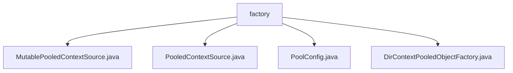

# 基础信息

|      |      |
|------|------|
| 名称 | factory |
| 编码语言 | .java |
| 代码路径 | spring-ldap/core/src/main/java/org/springframework/ldap/pool2/factory |
| 包名 | spring-ldap.core.src.main.java.org.springframework.ldap.pool2.factory |
| 概述说明 | 可变池化上下文源管理DirContext对象池，提升性能和资源利用率。 |

# 说明

## 概述

该代码模块主要围绕LDAP（轻量级目录访问协议）的上下文对象池化管理展开，旨在通过对象池机制高效管理和复用`DirContext`对象，提升系统性能和资源利用率。模块的核心功能包括上下文对象的创建、验证、销毁以及对象池的配置和管理。通过实现`ContextSource`接口，模块支持对`DirContext`对象的读写操作，并提供了灵活的配置选项以适应不同的业务需求。

## 主要业务场景

1. **LDAP连接管理**：在需要频繁访问LDAP目录服务的场景中，通过对象池机制复用`DirContext`对象，减少频繁创建和销毁连接的开销，提升系统性能。
2. **资源高效利用**：通过配置对象池的最大空闲数、最大总数、阻塞策略等参数，确保系统资源的高效管理和使用，避免资源浪费。
3. **上下文对象生命周期管理**：通过`DirContextPooledObjectFactory`管理`DirContext`对象的生命周期，包括创建、验证和销毁，确保对象在使用过程中的有效性和可靠性。
4. **灵活配置**：通过`PoolConfig`类，用户可以灵活配置对象池的行为和性能，包括JMX设置和回收策略，以适应不同的业务场景和性能需求。
5. **读写与只读上下文支持**：模块支持处理读写和只读类型的`DirContext`对象，确保在不同操作模式下对象池的高效管理。

### 包内部结构视图

该流程图展示了 `factory` 文件夹下的四个文件：`MutablePooledContextSource.java`、`PooledContextSource.java`、`PoolConfig.java` 和 `DirContextPooledObjectFactory.java`。所有文件都直接隶属于 `factory` 文件夹，没有进一步的子文件夹层级。这种结构表明这些文件在项目中可能是用于管理 LDAP 连接池的相关类或配置。

# 文件列表 File List

| 名称   | 类型  | 说明 |
|-------|------|-------------|
| [PooledContextSource.java](PooledContextSource.md) | file | PooledContextSource实现ContextSource接口，管理DirContext对象池，支持读写操作。 |
| [DirContextPooledObjectFactory.java](DirContextPooledObjectFactory.md) | file | DirContextPooledObjectFactory管理DirContext的创建、验证和销毁，支持读写和只读类型。 |
| [PoolConfig.java](PoolConfig.md) | file | PoolConfig类管理对象池参数，涵盖空闲数、总数、阻塞策略、JMX及回收策略。 |
| [MutablePooledContextSource.java](MutablePooledContextSource.md) | file | 创建可变池化上下文源，管理DirContext对象池，支持LdapContext和DirContext类型。 |

