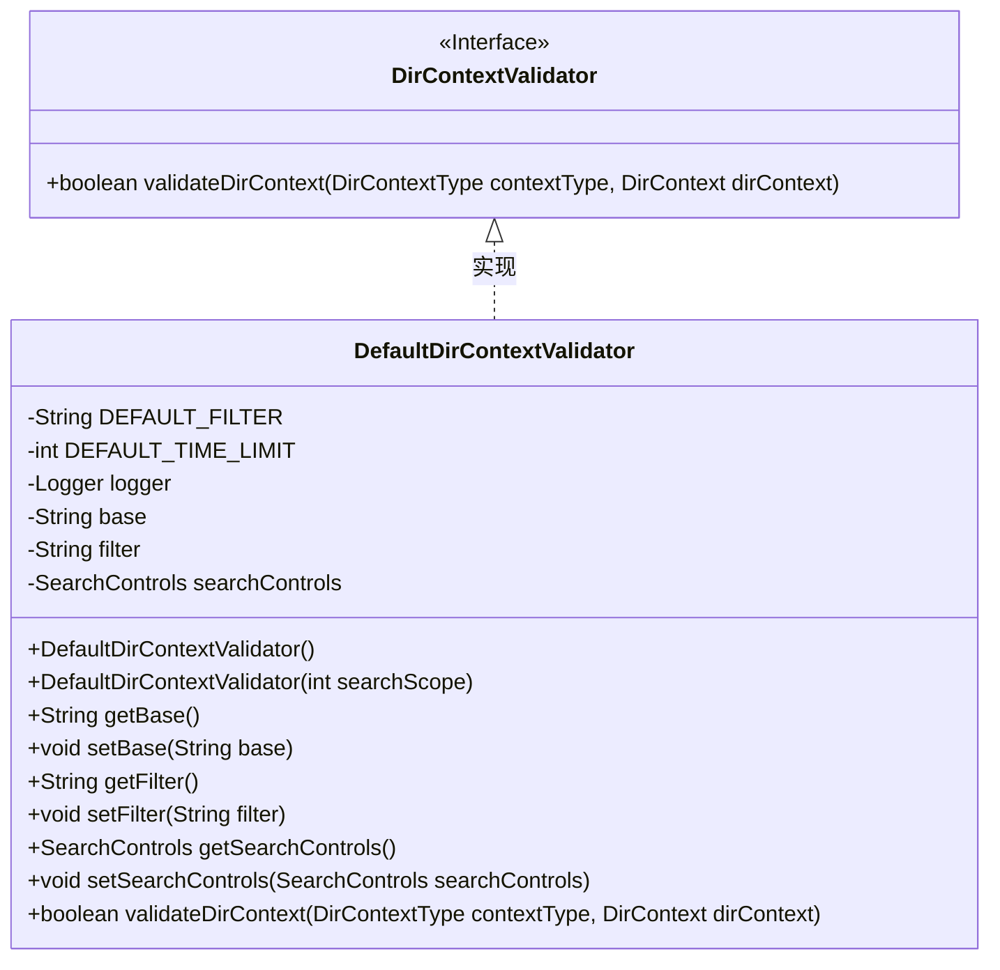

# 基础信息

|      |      |
|------|------|
| 名称 | DefaultDirContextValidator |
| 编码语言 | .java |
| 代码路径 | spring-ldap/core/src/main/java/org/springframework/ldap/pool2/validation/DefaultDirContextValidator.java |
| 包名 | org.springframework.ldap.pool2.validation |
| 依赖项 | ['javax.naming.NamingEnumeration', 'javax.naming.NamingException', 'javax.naming.directory.DirContext', 'javax.naming.directory.SearchControls', 'javax.naming.directory.SearchResult', 'org.slf4j.Logger', 'org.slf4j.LoggerFactory', 'org.springframework.ldap.pool2.DirContextType', 'org.springframework.util.Assert'] |
| 概述说明 | DefaultDirContextValidator类验证目录上下文，支持设置路径和过滤器，检查条件。 |

# 说明

DefaultDirContextValidator类实现了DirContextValidator接口，主要用于验证目录上下文。该类包含默认的过滤器和搜索控制参数，支持用户设置基础路径和过滤器。其验证方法用于检查目录上下文是否符合预设条件，确保目录上下文的合法性和有效性。

# 类列表 Class Summary

| 名称   | 类型  | 说明 |
|-------|------|-------------|
| DefaultDirContextValidator | class | DefaultDirContextValidator类实现DirContextValidator接口，用于验证目录上下文。包含默认过滤器和搜索控制参数，支持设置基础路径和过滤器，验证方法检查目录上下文是否符合条件。 |

## 类 DefaultDirContextValidator

|      |      |
|------|------|
| 访问范围 | public |
| 类型 | class |
| 名称 | DefaultDirContextValidator |
| 说明 | DefaultDirContextValidator类实现DirContextValidator接口，用于验证目录上下文。包含默认过滤器和搜索控制参数，支持设置基础路径和过滤器，验证方法检查目录上下文是否符合条件。 |

### UML类图

类图描述：
`DefaultDirContextValidator` 类实现了 `DirContextValidator` 接口，主要用于验证 `DirContext` 对象的有效性。该类包含默认的过滤器 `DEFAULT_FILTER` 和时间限制 `DEFAULT_TIME_LIMIT`，并通过 `SearchControls` 对象配置搜索范围、返回属性等。`validateDirContext` 方法用于执行验证逻辑，返回布尔值表示验证结果。类中还提供了对 `base`、`filter` 和 `searchControls` 的获取和设置方法，允许外部代码进行配置。

### 内部方法调用关系图

```mermaid
graph TD
    A["类DefaultDirContextValidator"]
    B["常量: DEFAULT_FILTER = 'objectclass=*'"]
    C["常量: DEFAULT_TIME_LIMIT = 500"]
    D["属性: Logger logger"]
    E["属性: String base"]
    F["属性: String filter"]
    G["属性: SearchControls searchControls"]
    H["构造方法: DefaultDirContextValidator()"]
    I["构造方法: DefaultDirContextValidator(int searchScope)"]
    J["方法: String getBase()"]
    K["方法: void setBase(String base)"]
    L["方法: String getFilter()"]
    M["方法: void setFilter(String filter)"]
    N["方法: SearchControls getSearchControls()"]
    O["方法: void setSearchControls(SearchControls searchControls)"]
    P["方法: boolean validateDirContext(DirContextType contextType, DirContext dirContext)"]
    Q["异常处理: Exception ex"]
    R["日志记录: logger.debug()"]
    S["关闭资源: searchResults.close()"]

    A --> B
    A --> C
    A --> D
    A --> E
    A --> F
    A --> G
    A --> H
    A --> I
    A --> J
    A --> K
    A --> L
    A --> M
    A --> N
    A --> O
    A --> P
    P --> Q
    P --> R
    P --> S
```

这段代码定义了一个名为 `DefaultDirContextValidator` 的类，用于验证 `DirContext` 对象。类中包含两个构造方法，分别用于初始化默认值和自定义搜索范围。类中定义了多个方法用于获取和设置 `base`、`filter` 和 `searchControls` 属性。`validateDirContext` 方法用于验证 `DirContext` 对象，处理可能的异常，并记录日志。流程图展示了类的结构及其方法之间的关系。

### 字段列表 Field List

| 名称  | 类型  | 说明 |
|-------|-------|------|
| DEFAULT_FILTER = "objectclass=*" | String | DEFAULT_FILTER定义为"objectclass=*"。 |
| DEFAULT_TIME_LIMIT = 500 | int | 默认时间限制为500。 |
| base | String | 定义了一个私有字符串变量base。 |
| logger = LoggerFactory.getLogger(this.getClass()) | Logger | 保护性日志记录器实例化。 |
| searchControls | SearchControls | 声明了一个私有SearchControls类型的变量searchControls。 |
| filter | String | 定义了一个私有的字符串变量filter。 |

### 方法列表 Method List

| 名称  | 类型  | 说明 |
|-------|-------|------|
| setBase | void | 设置类成员变量base的值。 |
| getFilter | String | 获取过滤器值的方法。 |
| getBase | String | 该方法返回类的`base`属性值。 |
| getSearchControls | SearchControls | 获取当前搜索控制对象。 |
| setSearchControls | void | 设置搜索控制对象，若为空则抛出异常。 |
| validateDirContext | boolean | 验证DirContext方法检查上下文类型和上下文对象非空，执行搜索并返回验证结果。 |
| setFilter | void | 方法setFilter用于设置过滤器，若参数为null则抛出异常。 |

