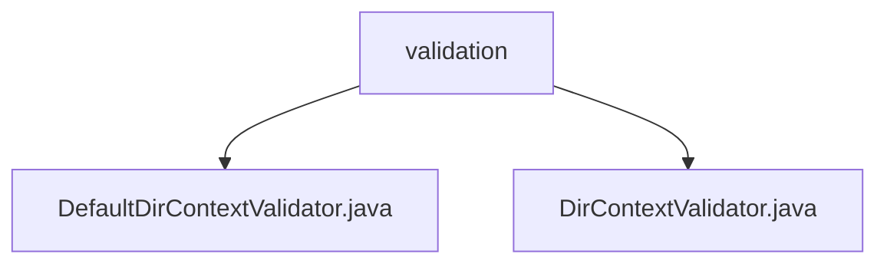

# 基础信息

|      |      |
|------|------|
| 名称 | validation |
| 编码语言 | .java |
| 代码路径 | spring-ldap/core/src/main/java/org/springframework/ldap/pool2/validation |
| 包名 | spring-ldap.core.src.main.java.org.springframework.ldap.pool2.validation |
| 概述说明 | DefaultDirContextValidator类验证目录上下文，支持设置路径和过滤器，确保合法有效。 |

# 说明

## 概述

该代码模块主要涉及对LDAP（轻量级目录访问协议）目录上下文的验证功能。核心类包括 `DefaultDirContextValidator` 和 `DirContextValidator`。`DefaultDirContextValidator` 实现了 `DirContextValidator` 接口，负责验证目录上下文的合法性和有效性。它提供了默认的过滤器和搜索控制参数，并允许用户自定义基础路径和过滤器，以确保目录上下文符合预设条件。

## 主要业务场景

1. **目录上下文验证**：`DefaultDirContextValidator` 类用于验证LDAP目录上下文，确保其符合预设的过滤器和搜索控制参数。
2. **自定义配置**：用户可以通过设置基础路径和过滤器来定制验证逻辑，以适应不同的业务需求。
3. **合法性检查**：通过验证方法，确保目录上下文的合法性和有效性，防止无效或不安全的目录上下文被使用。

### 包内部结构视图

该流程图展示了`spring-ldap`项目中`validation`文件夹下的文件结构。`validation`文件夹包含两个文件：`DefaultDirContextValidator.java`和`DirContextValidator.java`。这两个文件分别实现了不同的验证功能，用于`DirContext`的验证操作。

# 文件列表 File List

| 名称   | 类型  | 说明 |
|-------|------|-------------|
| [DirContextValidator.java](DirContextValidator.md) | file | 信息为空，无法生成概要描述。 |
| [DefaultDirContextValidator.java](DefaultDirContextValidator.md) | file | DefaultDirContextValidator类验证目录上下文，支持设置路径和过滤器，检查条件。 |

