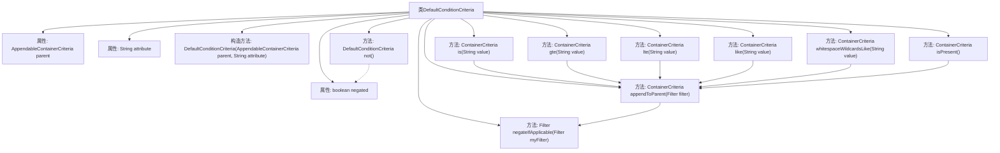

# 基础信息

|      |      |
|------|------|
| 名称 | DefaultConditionCriteria |
| 编码语言 | .java |
| 代码路径 | spring-ldap/core/src/main/java/org/springframework/ldap/query/DefaultConditionCriteria.java |
| 包名 | org.springframework.ldap.query |
| 依赖项 | ['org.springframework.ldap.filter.EqualsFilter', 'org.springframework.ldap.filter.Filter', 'org.springframework.ldap.filter.GreaterThanOrEqualsFilter', 'org.springframework.ldap.filter.LessThanOrEqualsFilter', 'org.springframework.ldap.filter.LikeFilter', 'org.springframework.ldap.filter.NotFilter', 'org.springframework.ldap.filter.PresentFilter', 'org.springframework.ldap.filter.WhitespaceWildcardsFilter'] |
| 概述说明 | DefaultConditionCriteria支持多种条件筛选及结果否定操作。 |

# 说明

DefaultConditionCriteria是一个用于实现条件筛选的功能模块，支持多种操作符，包括等于、大于等于、小于等于和模糊匹配。此外，该模块还允许用户对筛选结果进行否定操作，从而灵活地满足不同的筛选需求。

# 类列表 Class Summary

| 名称   | 类型  | 说明 |
|-------|------|-------------|
| DefaultConditionCriteria | class | DefaultConditionCriteria实现条件筛选，支持等于、大于等于、小于等于、模糊匹配等操作，并可否定筛选结果。 |

## 类 DefaultConditionCriteria

|      |      |
|------|------|
| 访问范围 | None |
| 类型 | class |
| 名称 | DefaultConditionCriteria |
| 说明 | DefaultConditionCriteria实现条件筛选，支持等于、大于等于、小于等于、模糊匹配等操作，并可否定筛选结果。 |

### UML类图

```mermaid
classDiagram
    class DefaultConditionCriteria {
        -AppendableContainerCriteria parent
        -String attribute
        -boolean negated
        +DefaultConditionCriteria(AppendableContainerCriteria parent, String attribute)
        +ContainerCriteria is(String value)
        +ContainerCriteria gte(String value)
        +ContainerCriteria lte(String value)
        +ContainerCriteria like(String value)
        +ContainerCriteria whitespaceWildcardsLike(String value)
        +ContainerCriteria isPresent()
        -ContainerCriteria appendToParent(Filter filter)
        -Filter negateIfApplicable(Filter myFilter)
        +DefaultConditionCriteria not()
    }

    class AppendableContainerCriteria {
        <<Interface>>
        +ContainerCriteria append(Filter filter)
    }

    class ContainerCriteria {
        <<Interface>>
    }

    class Filter {
        <<Interface>>
    }

    class EqualsFilter {
        +EqualsFilter(String attribute, String value)
    }

    class GreaterThanOrEqualsFilter {
        +GreaterThanOrEqualsFilter(String attribute, String value)
    }

    class LessThanOrEqualsFilter {
        +LessThanOrEqualsFilter(String attribute, String value)
    }

    class LikeFilter {
        +LikeFilter(String attribute, String value)
    }

    class WhitespaceWildcardsFilter {
        +WhitespaceWildcardsFilter(String attribute, String value)
    }

    class PresentFilter {
        +PresentFilter(String attribute)
    }

    class NotFilter {
        +NotFilter(Filter filter)
    }

    DefaultConditionCriteria --> AppendableContainerCriteria : 依赖
    DefaultConditionCriteria --> Filter : 依赖
    EqualsFilter --> Filter : 实现
    GreaterThanOrEqualsFilter --> Filter : 实现
    LessThanOrEqualsFilter --> Filter : 实现
    LikeFilter --> Filter : 实现
    WhitespaceWildcardsFilter --> Filter : 实现
    PresentFilter --> Filter : 实现
    NotFilter --> Filter : 实现
```

这段代码定义了一个 `DefaultConditionCriteria` 类，该类实现了 `ConditionCriteria` 接口，并提供了多种过滤条件的方法，如 `is`、`gte`、`lte` 等。每个方法都会创建一个特定的过滤器（如 `EqualsFilter`、`GreaterThanOrEqualsFilter` 等），并将其附加到父容器中。`DefaultConditionCriteria` 还支持否定操作，通过 `not` 方法切换过滤器的否定状态。类图展示了 `DefaultConditionCriteria` 与其他类之间的关系，特别是它与 `AppendableContainerCriteria` 和 `Filter` 接口的依赖关系，以及各种过滤器类的实现关系。

### 内部方法调用关系图

这段代码描述了一个名为 `DefaultConditionCriteria` 的类，该类实现了 `ConditionCriteria` 接口。它包含多个方法用于构建不同类型的过滤器，如 `is`、`gte`、`lte` 等，这些方法最终都会调用 `appendToParent` 方法将过滤器添加到父容器中。`appendToParent` 方法会根据 `negated` 属性的值决定是否对过滤器进行取反操作。`not` 方法用于切换 `negated` 属性的状态。

### 字段列表 Field List

| 名称  | 类型  | 说明 |
|-------|-------|------|
| parent | AppendableContainerCriteria | 私有不可变的父容器条件对象。 |
| attribute | String | 定义了一个私有的不可变字符串属性。 |
| negated = false | boolean | 定义了一个私有布尔变量negated，初始值为false。 |

### 方法列表 Method List

| 名称  | 类型  | 说明 |
|-------|-------|------|
| negateIfApplicable | Filter | 私有方法根据条件返回原过滤器或其否定形式。 |
| whitespaceWildcardsLike | ContainerCriteria | 方法用于添加空白通配符过滤条件。 |
| like | ContainerCriteria | 重写like方法，添加LikeFilter到父容器。 |
| gte | ContainerCriteria | 该方法实现大于等于条件过滤，返回父容器。 |
| is | ContainerCriteria | 重写方法`is`，返回包含等于过滤器的容器条件。 |
| isPresent | ContainerCriteria | 重写方法isPresent，返回包含PresentFilter的ContainerCriteria。 |
| lte | ContainerCriteria | 该方法实现小于等于条件过滤，将结果附加到父容器。 |
| appendToParent | ContainerCriteria | 将过滤器附加到父容器并返回结果。 |
| not | DefaultConditionCriteria | 重写方法not()，反转negated标志并返回当前对象。 |

