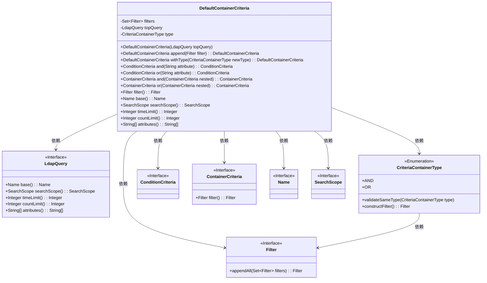

# 基础信息

|      |      |
|------|------|
| 名称 | DefaultContainerCriteria |
| 编码语言 | .java |
| 代码路径 | spring-ldap/core/src/main/java/org/springframework/ldap/query/DefaultContainerCriteria.java |
| 包名 | org.springframework.ldap.query |
| 依赖项 | ['java.util.LinkedHashSet', 'java.util.Set', 'javax.naming.Name', 'org.springframework.ldap.filter.Filter'] |
| 概述说明 | DefaultContainerCriteria实现容器条件，支持AND/OR逻辑操作，管理过滤器和查询属性。 |

# 说明

DefaultContainerCriteria实现了容器条件的管理功能，支持AND和OR逻辑操作，能够灵活组合多个条件。该功能还包括过滤器和查询属性的管理，确保用户能够根据特定需求进行精确筛选和查询。通过这一实现，用户可以高效地定义和应用复杂的条件逻辑，提升系统的灵活性和查询效率。

# 类列表 Class Summary

| 名称   | 类型  | 说明 |
|-------|------|-------------|
| DefaultContainerCriteria | class | DefaultContainerCriteria实现容器条件，支持AND/OR逻辑操作，管理过滤器和查询属性。 |

## 类 DefaultContainerCriteria

|      |      |
|------|------|
| 访问范围 | None |
| 类型 | class |
| 名称 | DefaultContainerCriteria |
| 说明 | DefaultContainerCriteria实现容器条件，支持AND/OR逻辑操作，管理过滤器和查询属性。 |

### UML类图

**描述**：`DefaultContainerCriteria`类实现了`AppendableContainerCriteria`接口，用于管理和组合LDAP查询中的过滤条件。它包含一个`Set<Filter>`集合来存储过滤器，并通过`LdapQuery`接口获取查询的基础信息。类中的方法允许用户通过`and`和`or`操作符组合多个过滤器，并最终生成一个`Filter`对象。`CriteriaContainerType`枚举用于标识过滤器的组合类型，如`AND`或`OR`。

### 内部方法调用关系图

```mermaid
graph TD
    A["类DefaultContainerCriteria"]
    B["属性: Set<Filter> filters"]
    C["属性: LdapQuery topQuery"]
    D["属性: CriteriaContainerType type"]
    E["构造方法: DefaultContainerCriteria(LdapQuery topQuery)"]
    F["方法: DefaultContainerCriteria append(Filter filter)"]
    G["方法: DefaultContainerCriteria withType(CriteriaContainerType newType)"]
    H["方法: ConditionCriteria and(String attribute)"]
    I["方法: ConditionCriteria or(String attribute)"]
    J["方法: ContainerCriteria and(ContainerCriteria nested)"]
    K["方法: ContainerCriteria or(ContainerCriteria nested)"]
    L["方法: Filter filter()"]
    M["方法: Name base()"]
    N["方法: SearchScope searchScope()"]
    O["方法: Integer timeLimit()"]
    P["方法: Integer countLimit()"]
    Q["方法: String[] attributes()"]

    A --> B
    A --> C
    A --> D
    A --> E
    A --> F
    A --> G
    A --> H
    A --> I
    A --> J
    A --> K
    A --> L
    A --> M
    A --> N
    A --> O
    A --> P
    A --> Q
```

这段代码定义了一个名为 `DefaultContainerCriteria` 的类，该类实现了 `AppendableContainerCriteria` 接口。类中包含多个方法，用于处理与LDAP查询相关的过滤器和条件。类的主要功能包括添加过滤器、设置条件类型、构建查询条件以及获取查询的基本信息。通过 `and` 和 `or` 方法，可以组合多个条件，最终生成一个过滤器。流程图展示了类的属性、构造方法以及各个方法之间的调用关系。

### 字段列表 Field List

| 名称  | 类型  | 说明 |
|-------|-------|------|
| type | CriteriaContainerType | 私有成员变量，类型为CriteriaContainerType。 |
| filters = new LinkedHashSet<>() | Set<Filter> | 私有最终集合 filters 使用 LinkedHashSet 初始化。 |
| topQuery | LdapQuery | 私有且不可变的LdapQuery对象topQuery。 |

### 方法列表 Method List

| 名称  | 类型  | 说明 |
|-------|-------|------|
| base | Name | 重写base方法，返回topQuery的base结果。 |
| withType | DefaultContainerCriteria | 该方法将容器类型设置为新类型并返回当前对象。 |
| attributes | String[] | 重写方法返回查询属性数组。 |
| append | DefaultContainerCriteria | 重写方法，添加过滤器并返回当前对象。 |
| countLimit | Integer | 重写countLimit方法，返回topQuery的countLimit值。 |
| timeLimit | Integer | 重写方法返回顶层查询的时间限制。 |
| and | ConditionCriteria | 方法`and`验证并设置条件类型为AND，返回新的条件标准。 |
| searchScope | SearchScope | 重写searchScope方法，返回topQuery的searchScope结果。 |
| or | ConditionCriteria | 重写or方法，验证类型并返回新条件标准。 |
| or | ContainerCriteria | 方法实现OR逻辑，根据类型决定是否新建容器或修改现有容器。 |
| filter | Filter | 方法返回单个条件或组合条件的过滤器。 |
| and | ContainerCriteria | 方法根据条件类型进行AND操作，返回新的或更新现有容器条件。 |

