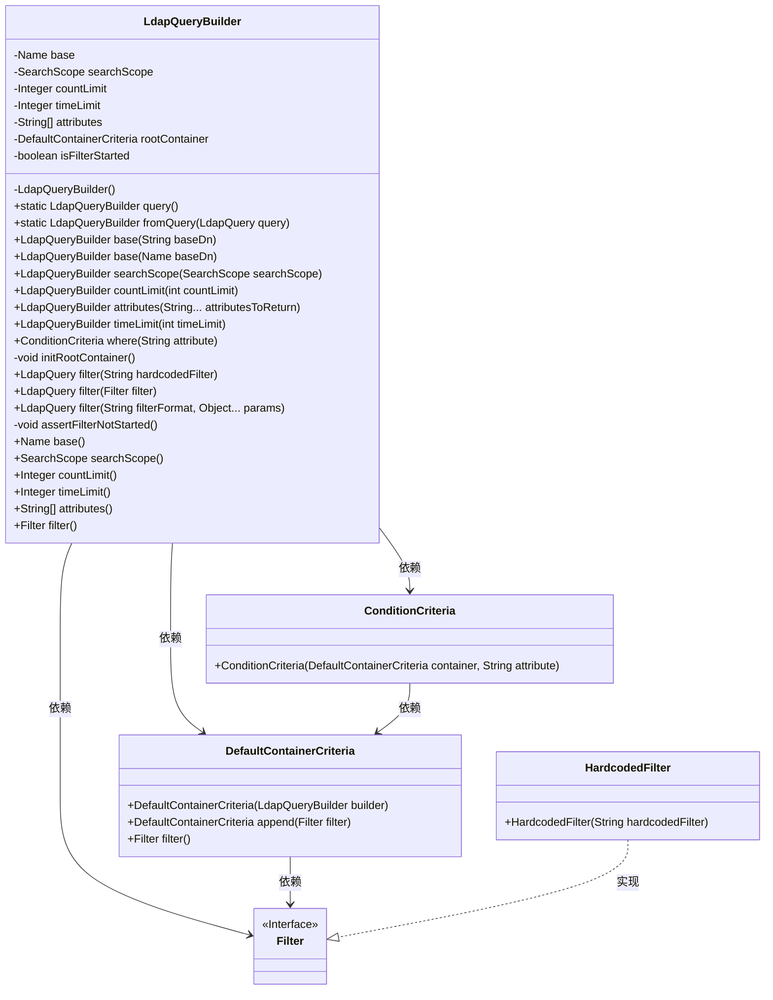

# 基础信息

|      |      |
|------|------|
| 名称 | LdapQueryBuilder |
| 编码语言 | .java |
| 代码路径 | spring-ldap/core/src/main/java/org/springframework/ldap/query/LdapQueryBuilder.java |
| 包名 | org.springframework.ldap.query |
| 依赖项 | ['java.text.MessageFormat', 'javax.naming.Name', 'org.springframework.ldap.filter.Filter', 'org.springframework.ldap.filter.HardcodedFilter', 'org.springframework.ldap.support.LdapEncoder', 'org.springframework.ldap.support.LdapUtils', 'org.springframework.util.Assert'] |
| 概述说明 | LdapQueryBuilder类用于构建LDAP查询，支持设置路径、范围、限制和过滤条件。 |

# 说明

LdapQueryBuilder类是一个用于构建LDAP查询的工具，它允许用户设置搜索路径、搜索范围、结果数量限制以及过滤条件。通过这些功能，用户可以灵活地定制LDAP查询，以满足不同的搜索需求。该类简化了LDAP查询的构建过程，提高了查询的效率和准确性。

# 类列表 Class Summary

| 名称   | 类型  | 说明 |
|-------|------|-------------|
| LdapQueryBuilder | class | LdapQueryBuilder类用于构建LDAP查询，支持设置搜索路径、范围、限制和过滤条件。 |

## 类 LdapQueryBuilder

|      |      |
|------|------|
| 访问范围 | public final |
| 类型 | class |
| 名称 | LdapQueryBuilder |
| 说明 | LdapQueryBuilder类用于构建LDAP查询，支持设置搜索路径、范围、限制和过滤条件。 |

### UML类图

这段代码定义了一个`LdapQueryBuilder`类，用于构建LDAP查询。该类包含多个私有字段用于存储查询的各个部分，如基础路径、搜索范围、计数限制等。`LdapQueryBuilder`提供了多种方法来设置这些字段，并且支持从现有的`LdapQuery`对象初始化。`DefaultContainerCriteria`和`ConditionCriteria`类用于构建查询的过滤条件，而`Filter`接口及其实现类`HardcodedFilter`用于表示过滤条件。整个设计允许通过链式调用来构建复杂的LDAP查询。

### 内部方法调用关系图

```mermaid
graph TD
    A["类LdapQueryBuilder"]
    B["属性: Name base"]
    C["属性: SearchScope searchScope"]
    D["属性: Integer countLimit"]
    E["属性: Integer timeLimit"]
    F["属性: String[] attributes"]
    G["属性: DefaultContainerCriteria rootContainer"]
    H["属性: boolean isFilterStarted"]
    I["构造方法: LdapQueryBuilder()"]
    J["静态方法: query()"]
    K["静态方法: fromQuery(LdapQuery query)"]
    L["方法: base(String baseDn)"]
    M["方法: base(Name baseDn)"]
    N["方法: searchScope(SearchScope searchScope)"]
    O["方法: countLimit(int countLimit)"]
    P["方法: attributes(String... attributesToReturn)"]
    Q["方法: timeLimit(int timeLimit)"]
    R["方法: where(String attribute)"]
    S["方法: initRootContainer()"]
    T["方法: filter(String hardcodedFilter)"]
    U["方法: filter(Filter filter)"]
    V["方法: filter(String filterFormat, Object... params)"]
    W["方法: assertFilterNotStarted()"]
    X["方法: base()"]
    Y["方法: searchScope()"]
    Z["方法: countLimit()"]
    AA["方法: timeLimit()"]
    AB["方法: attributes()"]
    AC["方法: filter()"]

    A --> B
    A --> C
    A --> D
    A --> E
    A --> F
    A --> G
    A --> H
    A --> I
    A --> J
    A --> K
    A --> L
    A --> M
    A --> N
    A --> O
    A --> P
    A --> Q
    A --> R
    A --> S
    A --> T
    A --> U
    A --> V
    A --> W
    A --> X
    A --> Y
    A --> Z
    A --> AA
    A --> AB
    A --> AC
```

该流程图展示了`LdapQueryBuilder`类的结构，包括其属性、构造方法、静态方法和实例方法。通过该图可以清晰地看到各个方法之间的关系，以及它们如何操作类中的属性。`LdapQueryBuilder`类主要用于构建LDAP查询，提供了设置查询基础路径、搜索范围、计数限制、时间限制、返回属性等功能。该图帮助开发者理解类的内部逻辑，便于调试和扩展。

### 字段列表 Field List

| 名称  | 类型  | 说明 |
|-------|-------|------|
| searchScope = null | SearchScope | 私有变量searchScope初始化为null。 |
| attributes = null | String[] | 定义私有字符串数组属性，初始值为空。 |
| rootContainer = null | DefaultContainerCriteria | 默认容器标准根容器初始化为空。 |
| countLimit = null | Integer | 私有整型变量countLimit初始化为null。 |
| base = LdapUtils.emptyLdapName() | Name | 初始化私有变量base为空LDAP名称。 |
| timeLimit = null | Integer | 定义私有整型变量timeLimit，初始值为null。 |
| isFilterStarted = false | boolean | 私有布尔变量isFilterStarted初始值为false。 |

### 方法列表 Method List

| 名称  | 类型  | 说明 |
|-------|-------|------|
| assertFilterNotStarted | void | 断言过滤器未启动，防止重复操作。 |
| base | LdapQueryBuilder | LDAP查询构建器设置基础DN并返回自身。 |
| timeLimit | Integer | 重写timeLimit方法，返回当前对象的timeLimit值。 |
| base | LdapQueryBuilder | LDAP查询构建器方法，设置基础DN并返回自身实例。 |
| searchScope | LdapQueryBuilder | LdapQueryBuilder设置搜索范围并返回自身实例。 |
| attributes | String[] | 重写attributes方法，返回当前对象的attributes数组。 |
| where | ConditionCriteria | 创建条件查询方法，初始化根容器并返回默认条件标准。 |
| base | Name | 重写base方法，返回当前对象的base属性。 |
| filter | LdapQuery | LDAP查询方法，初始化根容器并添加硬编码过滤器。 |
| countLimit | Integer | 重写countLimit方法，返回当前计数限制值。 |
| timeLimit | LdapQueryBuilder | LDAP查询构建器方法，设置时间限制并返回自身。 |
| query | LdapQueryBuilder | 静态方法返回新的LdapQueryBuilder实例。 |
| filter | LdapQuery | LDAP查询方法，初始化根容器并添加过滤器。 |
| filter | LdapQuery | LDAP查询方法，编码参数并格式化过滤器。 |
| searchScope | SearchScope | 重写searchScope方法，返回当前搜索范围。 |
| initRootContainer | void | 初始化根容器，确保过滤器未启动，设置根容器并标记过滤器已启动。 |
| filter | Filter | 方法检查根容器为空时抛出异常，否则返回根容器的过滤器。 |
| countLimit | LdapQueryBuilder | LdapQueryBuilder方法设置查询结果数量限制并返回自身。 |
| attributes | LdapQueryBuilder | LdapQueryBuilder方法设置返回属性并返回自身实例。 |
| fromQuery | LdapQueryBuilder | 静态方法从LdapQuery构建LdapQueryBuilder，包含过滤、属性、基数、计数限制、搜索范围和时间限制。 |

