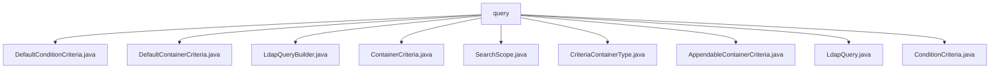

# 基础信息

|      |      |
|------|------|
| 名称 | query |
| 编码语言 | .java |
| 代码路径 | spring-ldap/core/src/main/java/org/springframework/ldap/query |
| 包名 | spring-ldap.core.src.main.java.org.springframework.ldap.query |
| 概述说明 | DefaultConditionCriteria支持多种操作符和否定操作，DefaultContainerCriteria管理AND/OR逻辑，LdapQueryBuilder定制LDAP查询。 |

# 说明

## 概述
该代码模块主要围绕LDAP（轻量级目录访问协议）查询的构建和管理展开，提供了丰富的功能来支持灵活的条件筛选、逻辑组合以及查询定制。核心类包括`DefaultConditionCriteria`、`DefaultContainerCriteria`和`LdapQueryBuilder`，分别负责条件筛选、逻辑容器管理以及查询构建。通过这些类，用户可以高效地定义复杂的查询逻辑，提升系统在LDAP查询场景下的灵活性和效率。

## 主要业务场景
1. **条件筛选**：通过`DefaultConditionCriteria`，用户可以使用多种操作符（如等于、大于等于、小于等于、模糊匹配）进行条件筛选，并支持否定操作，满足多样化的筛选需求。
2. **逻辑组合**：`DefaultContainerCriteria`支持AND和OR逻辑操作，允许用户灵活组合多个条件，同时管理过滤器和查询属性，确保精确筛选和查询。
3. **查询构建**：`LdapQueryBuilder`提供了设置搜索路径、搜索范围、结果数量限制以及过滤条件的功能，简化了LDAP查询的构建过程，提高了查询的效率和准确性。
4. **复杂查询管理**：通过`ContainerCriteria`及其相关实现，用户可以高效地定义和应用复杂的条件逻辑，适用于需要多层次条件组合的业务场景。

该模块适用于需要与LDAP目录进行交互的应用场景，如用户身份验证、权限管理、目录信息查询等，能够显著提升查询的灵活性和效率。

### 包内部结构视图

该流程图展示了`spring-ldap`项目中`query`目录下的文件层级关系。所有文件都直接位于`query`目录下，包括`DefaultConditionCriteria.java`、`DefaultContainerCriteria.java`、`LdapQueryBuilder.java`等。这些文件共同构成了`query`模块的核心功能，用于构建和处理LDAP查询条件。

# 文件列表 File List

| 名称   | 类型  | 说明 |
|-------|------|-------------|
| [ConditionCriteria.java](ConditionCriteria.md) | file | 信息为空，无法生成概要描述。 |
| [LdapQuery.java](LdapQuery.md) | file | 信息为空，无法生成概要描述。 |
| [AppendableContainerCriteria.java](AppendableContainerCriteria.md) | file | 信息为空，无法生成概要描述。 |
| [SearchScope.java](SearchScope.md) | file | 信息为空，无法生成概要描述。 |
| [DefaultConditionCriteria.java](DefaultConditionCriteria.md) | file | DefaultConditionCriteria支持多种条件筛选及结果否定操作。 |
| [CriteriaContainerType.java](CriteriaContainerType.md) | file | 输入内容为空，请提供具体信息以便生成概要描述。 |
| [ContainerCriteria.java](ContainerCriteria.md) | file | 信息为空，无法生成概要描述。 |
| [LdapQueryBuilder.java](LdapQueryBuilder.md) | file | LdapQueryBuilder类用于构建LDAP查询，支持设置路径、范围、限制和过滤条件。 |
| [DefaultContainerCriteria.java](DefaultContainerCriteria.md) | file | DefaultContainerCriteria实现容器条件，支持AND/OR逻辑操作，管理过滤器和查询属性。 |

