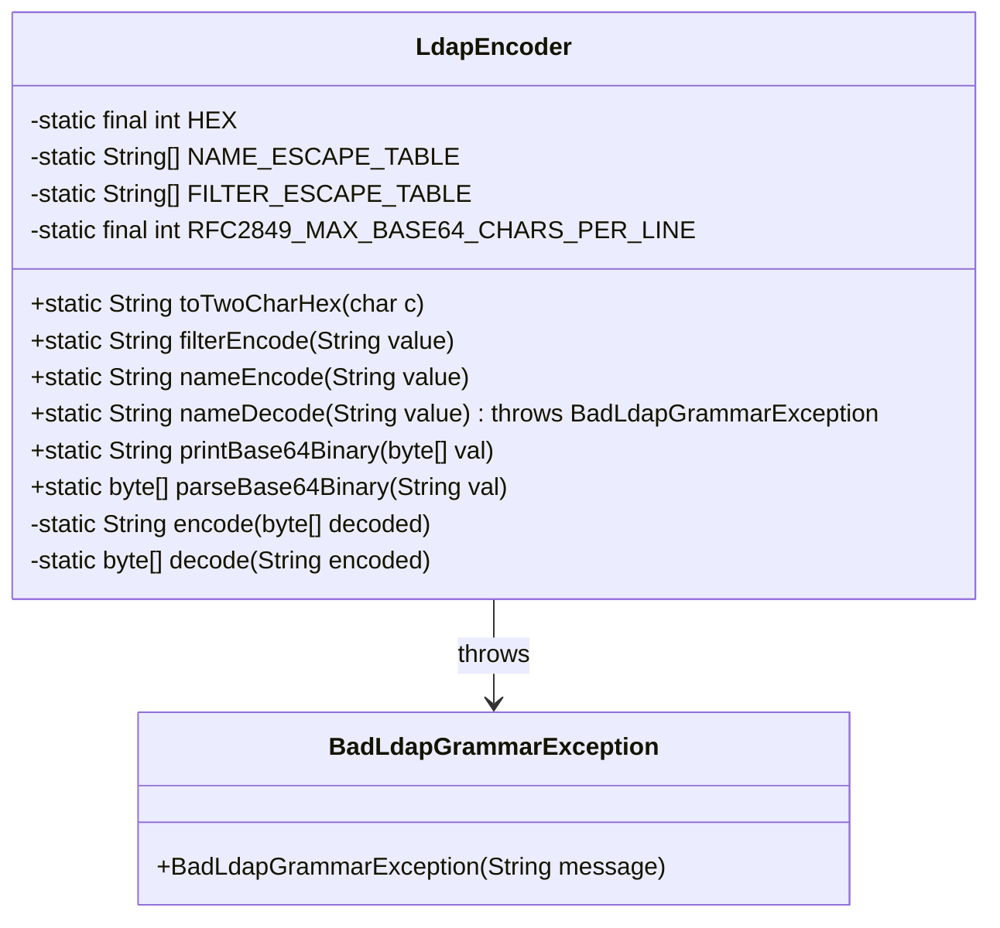

# 基础信息

|      |      |
|------|------|
| 名称 | LdapEncoder |
| 编码语言 | .java |
| 代码路径 | spring-ldap/core/src/main/java/org/springframework/ldap/support/LdapEncoder.java |
| 包名 | org.springframework.ldap.support |
| 依赖项 | ['java.util.Base64', 'java.util.Locale', 'org.springframework.ldap.BadLdapGrammarException', 'org.springframework.util.Assert'] |
| 概述说明 | LdapEncoder类处理LDAP编码解码，支持Base64和特殊字符处理。 |

# 说明

LdapEncoder类专门用于LDAP编码和解码操作，提供了名称和过滤器的转义表，支持Base64转换功能，并能够处理特殊字符，确保数据在LDAP环境中的安全传输和正确解析。

# 类列表 Class Summary

| 名称   | 类型  | 说明 |
|-------|------|-------------|
| LdapEncoder | class | LdapEncoder类用于LDAP编码和解码，包含名称和过滤器转义表，支持Base64转换和特殊字符处理。 |

## 类 LdapEncoder

|      |      |
|------|------|
| 访问范围 | public final |
| 类型 | class |
| 名称 | LdapEncoder |
| 说明 | LdapEncoder类用于LDAP编码和解码，包含名称和过滤器转义表，支持Base64转换和特殊字符处理。 |

### UML类图

### 描述
`LdapEncoder` 类是一个用于处理LDAP编码和解码的工具类，提供了多种静态方法用于编码和解码LDAP相关的字符串和二进制数据。类中包含两个静态数组 `NAME_ESCAPE_TABLE` 和 `FILTER_ESCAPE_TABLE`，用于存储需要转义的字符及其对应的转义序列。类中的方法包括 `filterEncode`、`nameEncode`、`nameDecode` 等，分别用于过滤编码、名称编码和名称解码。此外，还提供了 `printBase64Binary` 和 `parseBase64Binary` 方法用于Base64编码和解码。`BadLdapGrammarException` 是一个自定义异常类，用于处理LDAP语法错误。

### 内部方法调用关系图

```mermaid
graph TD
    A["类LdapEncoder"]
    B["静态变量: int HEX"]
    C["静态变量: String[] NAME_ESCAPE_TABLE"]
    D["静态变量: String[] FILTER_ESCAPE_TABLE"]
    E["静态变量: int RFC2849_MAX_BASE64_CHARS_PER_LINE"]
    F["静态初始化块: 初始化NAME_ESCAPE_TABLE和FILTER_ESCAPE_TABLE"]
    G["私有构造方法: LdapEncoder()"]
    H["静态方法: String toTwoCharHex(char c)"]
    I["静态方法: String filterEncode(String value)"]
    J["静态方法: String nameEncode(String value)"]
    K["静态方法: String nameDecode(String value)"]
    L["静态方法: String printBase64Binary(byte[] val)"]
    M["静态方法: byte[] parseBase64Binary(String val)"]
    N["私有静态方法: String encode(byte[] decoded)"]
    O["私有静态方法: byte[] decode(String encoded)"]

    A --> B
    A --> C
    A --> D
    A --> E
    A --> F
    A --> G
    A --> H
    A --> I
    A --> J
    A --> K
    A --> L
    A --> M
    A --> N
    A --> O
```

这段代码定义了一个名为 `LdapEncoder` 的类，主要用于处理LDAP（轻量级目录访问协议）中的编码和解码操作。类中包含多个静态方法，用于处理不同的编码需求，如 `filterEncode` 用于过滤编码，`nameEncode` 用于名称编码，`nameDecode` 用于名称解码，`printBase64Binary` 和 `parseBase64Binary` 用于Base64编码和解码。类中还定义了两个静态数组 `NAME_ESCAPE_TABLE` 和 `FILTER_ESCAPE_TABLE`，用于存储字符的转义规则。这些方法通过静态初始化块进行初始化，确保在类加载时完成必要的准备工作。

### 字段列表 Field List

| 名称  | 类型  | 说明 |
|-------|-------|------|
| HEX = 16 | int | 定义了一个私有的静态整型常量HEX，值为16。 |
| NAME_ESCAPE_TABLE = new String[96] | String[] | 定义长度为96的字符串数组NAME_ESCAPE_TABLE。 |
| FILTER_ESCAPE_TABLE = new String['\\' + 1] | String[] | 定义静态字符串数组用于转义过滤表。 |
| RFC2849_MAX_BASE64_CHARS_PER_LINE = 76 | int | RFC2849规定的每行Base64编码最大字符数为76。 |

### 方法列表 Method List

| 名称  | 类型  | 说明 |
|-------|-------|------|
| decode | byte[] | 解码Base64编码字符串为字节数组。 |
| toTwoCharHex | String | 将字符转换为两位十六进制字符串，不足两位前补零。 |
| nameDecode | String | 解码LDAP字符串，处理转义字符和十六进制值，异常处理。 |
| printBase64Binary | String | 将字节数组转换为Base64编码字符串，并按指定长度换行。 |
| nameEncode | String | 静态方法对字符串首尾空格转义，其他字符根据转义表处理。 |
| parseBase64Binary | byte[] | 解析Base64字符串，去除换行符并解码为字节数组。 |
| filterEncode | String | 静态方法过滤编码字符串，处理空值，遍历字符并替换转义表内字符，返回编码结果。 |
| encode | String | 私有静态方法将字节数组编码为Base64字符串。 |

