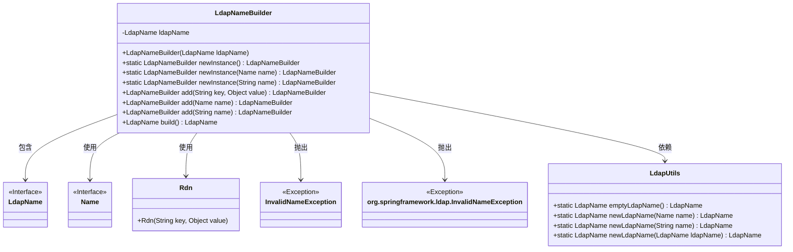
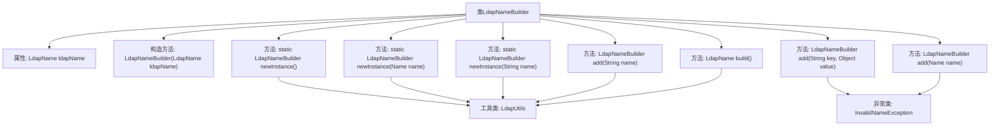

# 基础信息

|      |      |
|------|------|
| 名称 | LdapNameBuilder |
| 编码语言 | .java |
| 代码路径 | spring-ldap/core/src/main/java/org/springframework/ldap/support/LdapNameBuilder.java |
| 包名 | org.springframework.ldap.support |
| 依赖项 | ['javax.naming.InvalidNameException', 'javax.naming.Name', 'javax.naming.ldap.LdapName', 'javax.naming.ldap.Rdn', 'org.springframework.util.Assert'] |
| 概述说明 | LdapNameBuilder类用于构建LdapName实例，支持多种初始化方式，提供添加方法。 |

# 说明

LdapNameBuilder类用于构建LdapName实例，支持从空、Name对象或字符串进行初始化。该类提供了添加Rdn、Name或字符串的方法，通过这些方法可以逐步构建LdapName实例，最终生成所需的LdapName对象。

# 类列表 Class Summary

| 名称   | 类型  | 说明 |
|-------|------|-------------|
| LdapNameBuilder | class | LdapNameBuilder类用于构建LdapName实例，支持从空、Name对象或字符串初始化，并提供了添加Rdn、Name或字符串的方法，最终生成LdapName实例。 |

## 类 LdapNameBuilder

|      |      |
|------|------|
| 访问范围 | public final |
| 类型 | class |
| 名称 | LdapNameBuilder |
| 说明 | LdapNameBuilder类用于构建LdapName实例，支持从空、Name对象或字符串初始化，并提供了添加Rdn、Name或字符串的方法，最终生成LdapName实例。 |

### UML类图

这段代码定义了一个`LdapNameBuilder`类，用于构建`LdapName`对象。`LdapNameBuilder`提供了多种静态工厂方法来创建实例，并允许通过添加`Rdn`、`Name`或字符串来构建`LdapName`。`LdapUtils`类提供了工具方法来创建和操作`LdapName`对象。`LdapNameBuilder`类依赖于`LdapName`、`Name`、`Rdn`、`InvalidNameException`和`org.springframework.ldap.InvalidNameException`等类。整个设计模式类似于构建者模式，允许逐步构建复杂的`LdapName`对象。

### 内部方法调用关系图

该流程图描述了`LdapNameBuilder`类的结构和主要方法调用关系。`LdapNameBuilder`类用于构建`LdapName`实例，提供了多种静态工厂方法`newInstance`来初始化构建器，并通过`add`方法添加不同的名称组件，最后通过`build`方法生成最终的`LdapName`实例。整个流程涉及到`LdapUtils`工具类和`InvalidNameException`异常类的调用和处理。

### 字段列表 Field List

| 名称  | 类型  | 说明 |
|-------|-------|------|
| ldapName | LdapName | 私有不可变的LdapName类型变量ldapName。 |

### 方法列表 Method List

| 名称  | 类型  | 说明 |
|-------|-------|------|
| newInstance | LdapNameBuilder | 静态方法newInstance返回新的LdapNameBuilder实例，初始化时使用空LdapName。 |
| newInstance | LdapNameBuilder | 静态方法创建LdapNameBuilder实例，参数为Name对象。 |
| add | LdapNameBuilder | LdapNameBuilder方法添加Name对象，处理无效名称异常。 |
| build | LdapName | 该方法返回由LdapUtils创建的LdapName对象。 |
| newInstance | LdapNameBuilder | 静态方法创建LdapNameBuilder实例，传入名称参数。 |
| add | LdapNameBuilder | LdapNameBuilder方法add，添加非空name，返回LdapNameBuilder实例。 |
| add | LdapNameBuilder | LdapNameBuilder添加键值对，验证非空，处理异常。 |

