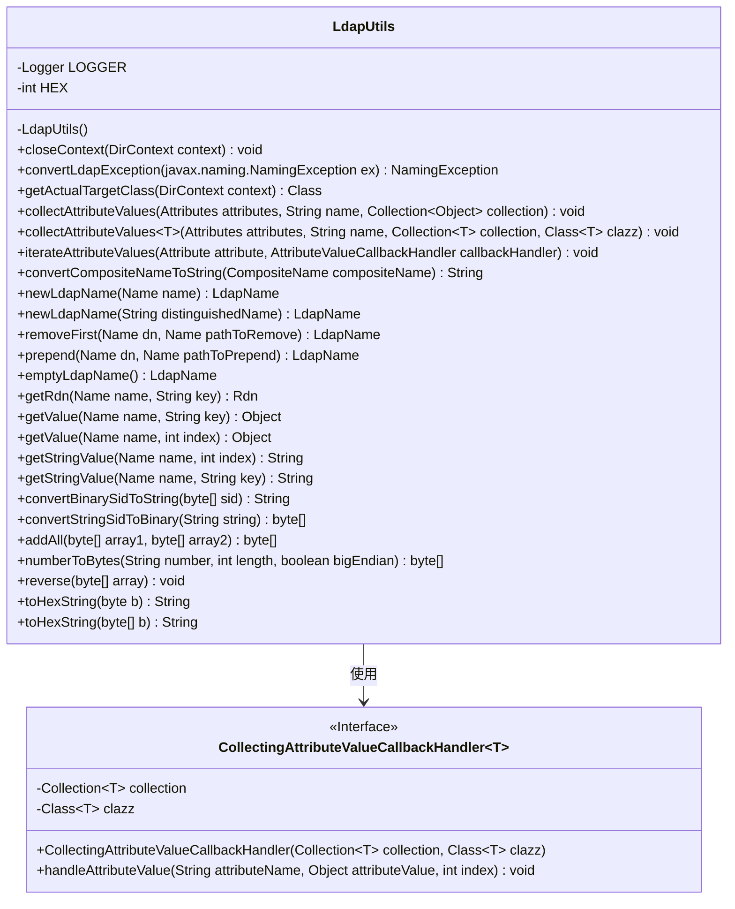

# 基础信息

|      |      |
|------|------|
| 名称 | LdapUtils |
| 编码语言 | .java |
| 代码路径 | spring-ldap/core/src/main/java/org/springframework/ldap/support/LdapUtils.java |
| 包名 | org.springframework.ldap.support |
| 依赖项 | ['java.math.BigInteger', 'java.util.Arrays', 'java.util.Collection', 'java.util.List', 'java.util.NoSuchElementException', 'javax.naming.CompositeName', 'javax.naming.InvalidNameException', 'javax.naming.Name', 'javax.naming.NamingEnumeration', 'javax.naming.directory.Attribute', 'javax.naming.directory.Attributes', 'javax.naming.directory.DirContext', 'javax.naming.ldap.LdapContext', 'javax.naming.ldap.LdapName', 'javax.naming.ldap.Rdn', 'org.slf4j.Logger', 'org.slf4j.LoggerFactory', 'org.springframework.ldap.NamingException', 'org.springframework.ldap.NoSuchAttributeException', 'org.springframework.util.Assert'] |
| 概述说明 | LdapUtils类提供LDAP操作工具，涵盖上下文关闭、异常转换、属性收集及SID转换等功能。 |

# 说明

LdapUtils类是一个用于LDAP操作的工具类，提供了多种实用功能。其主要功能包括关闭LDAP上下文、将异常转换为特定格式、收集LDAP属性值以及进行SID转换。这些功能帮助开发者在处理LDAP相关操作时更加高效和便捷。

# 类列表 Class Summary

| 名称   | 类型  | 说明 |
|-------|------|-------------|
| LdapUtils | class | LdapUtils类提供LDAP操作工具，包括关闭上下文、异常转换、属性值收集和SID转换等功能。 |

## 类 LdapUtils

|      |      |
|------|------|
| 访问范围 | public final |
| 类型 | class |
| 名称 | LdapUtils |
| 说明 | LdapUtils类提供LDAP操作工具，包括关闭上下文、异常转换、属性值收集和SID转换等功能。 |

### UML类图

### 描述
`LdapUtils` 是一个工具类，提供了与 LDAP 相关的实用方法，包括关闭上下文、转换异常、处理属性值、转换名称格式等。`CollectingAttributeValueCallbackHandler` 是一个内部类，用于收集属性值并将其存储在指定的集合中。`LdapUtils` 类依赖于 `CollectingAttributeValueCallbackHandler` 来处理属性值的迭代和收集。

### 内部方法调用关系图

```mermaid
graph TD
    A["类LdapUtils"]
    B["私有静态常量: Logger LOGGER"]
    C["私有静态常量: int HEX"]
    D["私有构造方法: LdapUtils()"]
    E["静态方法: closeContext(DirContext context)"]
    F["静态方法: convertLdapException(javax.naming.NamingException ex)"]
    G["静态方法: getActualTargetClass(DirContext context)"]
    H["静态方法: collectAttributeValues(Attributes attributes, String name, Collection<Object> collection)"]
    I["静态方法: collectAttributeValues(Attributes attributes, String name, Collection<T> collection, Class<T> clazz)"]
    J["静态方法: iterateAttributeValues(Attribute attribute, AttributeValueCallbackHandler callbackHandler)"]
    K["私有静态方法: handleAttributeValue(String attributeID, Object value, int i, AttributeValueCallbackHandler callbackHandler)"]
    L["静态方法: convertCompositeNameToString(CompositeName compositeName)"]
    M["静态方法: newLdapName(Name name)"]
    N["静态方法: newLdapName(String distinguishedName)"]
    O["私有静态方法: returnOrConstructLdapNameFromName(Name name)"]
    P["静态方法: removeFirst(Name dn, Name pathToRemove)"]
    Q["静态方法: prepend(Name dn, Name pathToPrepend)"]
    R["静态方法: emptyLdapName()"]
    S["静态方法: getRdn(Name name, String key)"]
    T["静态方法: getValue(Name name, String key)"]
    U["静态方法: getValue(Name name, int index)"]
    V["静态方法: getStringValue(Name name, int index)"]
    W["静态方法: getStringValue(Name name, String key)"]
    X["静态方法: convertBinarySidToString(byte[] sid)"]
    Y["静态方法: convertStringSidToBinary(String string)"]
    Z["私有静态方法: addAll(byte[] array1, byte[] array2)"]
    AA["私有静态方法: numberToBytes(String number, int length, boolean bigEndian)"]
    AB["私有静态方法: reverse(byte[] array)"]
    AC["私有静态方法: toHexString(final byte b)"]
    AD["私有静态方法: toHexString(final byte[] b)"]
    AE["内部类: CollectingAttributeValueCallbackHandler<T>"]

    A --> B
    A --> C
    A --> D
    A --> E
    A --> F
    A --> G
    A --> H
    A --> I
    A --> J
    A --> K
    A --> L
    A --> M
    A --> N
    A --> O
    A --> P
    A --> Q
    A --> R
    A --> S
    A --> T
    A --> U
    A --> V
    A --> W
    A --> X
    A --> Y
    A --> Z
    A --> AA
    A --> AB
    A --> AC
    A --> AD
    A --> AE
```

该流程图展示了 `LdapUtils` 类的结构及其内部方法之间的调用关系。`LdapUtils` 类主要提供了与 LDAP 操作相关的工具方法，包括关闭上下文、转换异常、处理属性值、构建和操作 LDAP 名称等。每个方法都有明确的功能，并且部分方法之间存在调用关系，如 `convertLdapException` 方法在多个地方被调用以处理异常。内部类 `CollectingAttributeValueCallbackHandler` 用于处理属性值的收集。整体流程清晰，便于理解各个方法的作用及其相互关系。

### 字段列表 Field List

| 名称  | 类型  | 说明 |
|-------|-------|------|
| LOGGER = LoggerFactory.getLogger(LdapUtils.class) | Logger | 定义私有静态日志记录器，用于LdapUtils类的日志输出。 |
| HEX = 16 | int | 定义了一个私有的静态常量HEX，其值为16。 |

### 方法列表 Method List

| 名称  | 类型  | 说明 |
|-------|-------|------|
| collectAttributeValues | void | 收集指定属性的值到集合中。 |
| handleAttributeValue | void | 处理属性值并调用回调方法。 |
| getStringValue | String | 静态方法返回指定索引处的字符串值。 |
| closeContext | void | 关闭DirContext并处理异常，确保资源释放。 |
| removeFirst | LdapName | 从LDAP名称中移除指定路径前缀。 |
| convertLdapException | NamingException | 将LDAP异常转换为Spring LDAP异常。 |
| getActualTargetClass | Class | 静态方法根据上下文返回LdapContext或DirContext类。 |
| toHexString | String | 将字节数组转换为十六进制字符串并格式化输出。 |
| reverse | void | 该方法反转字节数组，通过交换首尾元素实现。 |
| convertBinarySidToString | String | 将二进制SID转换为字符串，包含版本、权威和子权威信息。 |
| getRdn | Rdn | 根据名称和键获取Rdn，若未找到抛出异常。 |
| addAll | byte[] | 合并两个字节数组，返回新数组。 |
| toHexString | String | 将字节转换为16进制字符串，不足两位补零。 |
| collectAttributeValues | void | 静态方法收集属性值，验证参数并处理异常。 |
| newLdapName | LdapName | 创建LdapName实例，处理不同Name类型并处理异常。 |
| convertStringSidToBinary | byte[] | 将字符串SID转换为二进制格式。 |
| iterateAttributeValues | void | 遍历属性值并处理，支持可迭代和普通属性。 |
| prepend | LdapName | 静态方法在LDAP名称前添加路径，确保输入非空并处理异常。 |
| getValue | Object | 静态方法getValue通过Name对象和索引获取Rdn值，并检查是否为多值。 |
| getValue | Object | 通过名称和键获取属性值，匹配后返回，异常时转换并抛出。 |
| numberToBytes | byte[] | 将字符串数字转换为指定长度的字节数组，支持大端序和小端序。 |
| newLdapName | LdapName | 静态方法创建LdapName对象，检查非空并处理异常。 |
| returnOrConstructLdapNameFromName | LdapName | 方法返回或构造LdapName对象，若输入为LdapName则直接返回，否则新建。 |
| emptyLdapName | LdapName | 静态方法返回空LdapName对象。 |
| getStringValue | String | 静态方法getStringValue返回指定名称和键的字符串值。 |
| convertCompositeNameToString | String | 将CompositeName转换为字符串，若非空返回首元素，否则返回空字符串。 |

