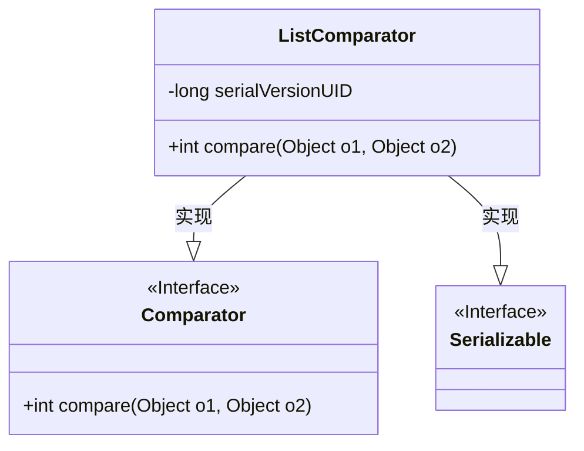
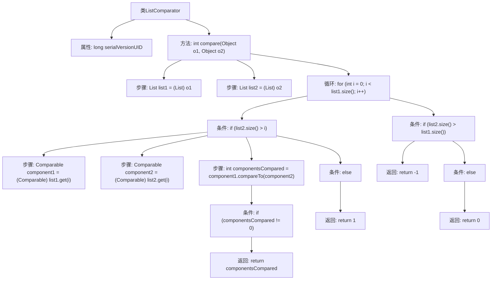

# 基础信息

|      |      |
|------|------|
| 名称 | ListComparator |
| 编码语言 | .java |
| 代码路径 | spring-ldap/core/src/main/java/org/springframework/ldap/support/ListComparator.java |
| 包名 | org.springframework.ldap.support |
| 依赖项 | ['java.io.Serializable', 'java.util.Comparator', 'java.util.List'] |
| 概述说明 | ListComparator类实现Comparator接口，用于比较两个可比较对象的列表。 |

# 说明

ListComparator类实现了Comparator接口，专门用于比较两个可比较对象的列表。通过实现该接口，ListComparator类能够定义列表之间的比较逻辑，从而对列表进行排序或其他基于比较的操作。这种设计使得列表的比较更加灵活和可扩展，适用于需要处理多个列表并进行比较的场景。

# 类列表 Class Summary

| 名称   | 类型  | 说明 |
|-------|------|-------------|
| ListComparator | class | ListComparator类实现Comparator接口，用于比较两个可比较对象的列表。 |

## 类 ListComparator

|      |      |
|------|------|
| 访问范围 | public |
| 类型 | class |
| 名称 | ListComparator |
| 说明 | ListComparator类实现Comparator接口，用于比较两个可比较对象的列表。 |

### UML类图

类图描述：
`ListComparator` 类实现了 `Comparator` 和 `Serializable` 接口，主要用于比较两个列表中的元素。它包含一个私有字段 `serialVersionUID` 用于序列化，以及一个公有方法 `compare`，该方法接受两个 `Object` 类型的参数并返回一个整数，表示比较结果。该方法逐项比较列表中的元素，并根据元素的大小关系返回相应的值。如果列表长度不一致，较长的列表会被认为更大。

### 内部方法调用关系图

这段代码实现了一个`ListComparator`类，用于比较两个列表对象。`compare`方法通过遍历列表中的元素，逐个比较它们的值。如果某个位置的元素不相等，则返回比较结果；如果列表长度不一致，则根据长度差异返回相应的值。最终，如果所有元素相等且长度相同，则返回0。流程图展示了该方法的详细执行步骤和条件判断。

### 字段列表 Field List

| 名称  | 类型  | 说明 |
|-------|-------|------|
| serialVersionUID = -3068381879731157178L | long | 定义私有静态不可变长整型序列化版本号。 |

### 方法列表 Method List

| 名称  | 类型  | 说明 |
|-------|-------|------|
| compare | int | 比较两个列表的元素，返回大小关系。 |

