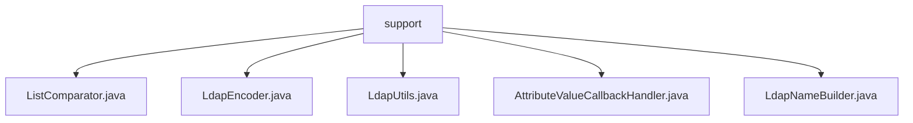

# 基础信息

|      |      |
|------|------|
| 名称 | support |
| 编码语言 | .java |
| 代码路径 | spring-ldap/core/src/main/java/org/springframework/ldap/support |
| 包名 | spring-ldap.core.src.main.java.org.springframework.ldap.support |
| 概述说明 | ListComparator比较列表，LdapEncoder处理LDAP编码，LdapUtils提供LDAP工具，LdapNameBuilder构建LdapName实例。 |

# 说明

## 概述
该代码模块主要围绕LDAP（轻量级目录访问协议）操作提供了一系列工具类和功能实现，旨在简化LDAP相关的开发工作。模块中的类涵盖了LDAP编码解码、名称构建、列表比较、异常处理、属性值收集等多个方面，为开发者提供了高效、安全的LDAP操作支持。

## 主要业务场景
1. **列表比较**：`ListComparator`类实现了`Comparator`接口，专门用于比较两个可比较对象的列表。它适用于需要对多个列表进行排序或其他基于比较操作的场景，提供了灵活且可扩展的比较逻辑。
  
2. **LDAP编码与解码**：`LdapEncoder`类提供了LDAP名称和过滤器的转义表，支持Base64转换功能，并能够处理特殊字符。它确保数据在LDAP环境中的安全传输和正确解析，适用于需要处理LDAP编码和解码的场景。

3. **LDAP工具类**：`LdapUtils`类提供了多种实用功能，包括关闭LDAP上下文、将异常转换为特定格式、收集LDAP属性值以及进行SID转换。这些功能帮助开发者在处理LDAP相关操作时更加高效和便捷，适用于需要频繁进行LDAP操作的场景。

4. **LDAP名称构建**：`LdapNameBuilder`类用于构建`LdapName`实例，支持从空、`Name`对象或字符串进行初始化。它提供了添加`Rdn`、`Name`或字符串的方法，逐步构建`LdapName`实例，适用于需要动态构建LDAP名称的场景。

5. **属性值回调处理**：`AttributeValueCallbackHandler`类虽然未提供具体细节，但通常用于处理LDAP属性值的回调操作，适用于需要对LDAP属性值进行特定处理的场景。

该模块通过这些类的组合，为开发者提供了全面的LDAP操作支持，适用于需要与LDAP服务器进行交互的各种业务场景。

### 包内部结构视图

该流程图展示了 `support` 文件夹下的五个文件之间的层级关系。所有文件都直接位于 `support` 文件夹下，没有进一步的子文件夹嵌套。这些文件包括 `ListComparator.java`、`LdapEncoder.java`、`LdapUtils.java`、`AttributeValueCallbackHandler.java` 和 `LdapNameBuilder.java`，它们都是 `support` 文件夹的直接子文件。

# 文件列表 File List

| 名称   | 类型  | 说明 |
|-------|------|-------------|
| [LdapNameBuilder.java](LdapNameBuilder.md) | file | LdapNameBuilder类用于构建LdapName实例，支持多种初始化方式，提供添加方法。 |
| [AttributeValueCallbackHandler.java](AttributeValueCallbackHandler.md) | file | 信息为空，无法生成概要描述。 |
| [LdapUtils.java](LdapUtils.md) | file | LdapUtils类提供LDAP操作工具，涵盖上下文关闭、异常转换、属性收集及SID转换等功能。 |
| [LdapEncoder.java](LdapEncoder.md) | file | LdapEncoder类处理LDAP编码解码，支持Base64和特殊字符处理。 |
| [ListComparator.java](ListComparator.md) | file | ListComparator类实现Comparator接口，用于比较两个可比较对象的列表。 |

