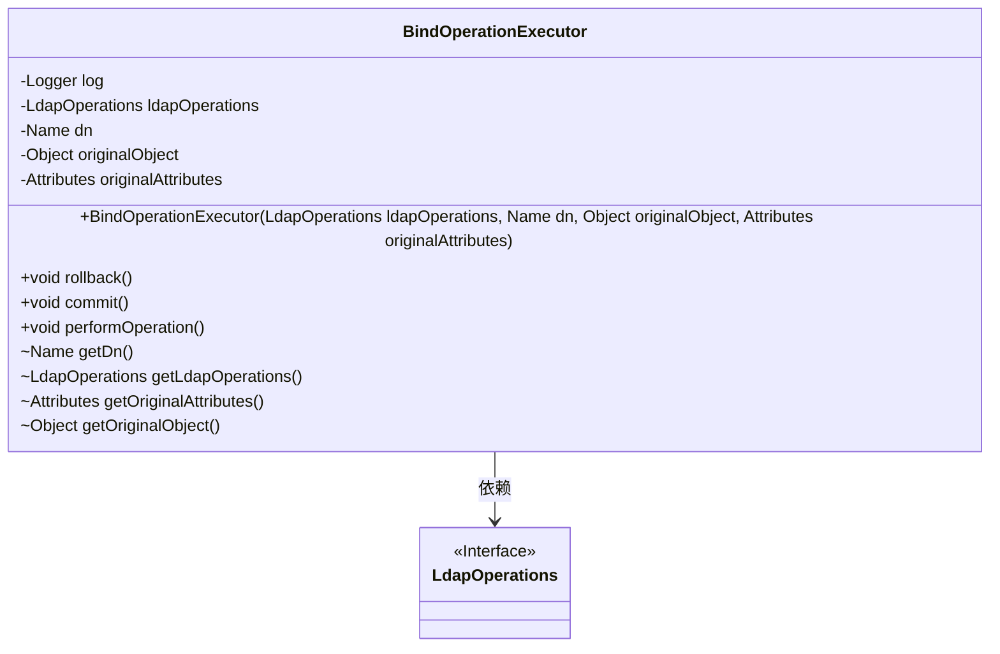

# 基础信息

|      |      |
|------|------|
| 名称 | BindOperationExecutor |
| 编码语言 | .java |
| 代码路径 | spring-ldap/core/src/main/java/org/springframework/ldap/transaction/compensating/BindOperationExecutor.java |
| 包名 | org.springframework.ldap.transaction.compensating |
| 依赖项 | ['javax.naming.Name', 'javax.naming.directory.Attributes', 'org.slf4j.Logger', 'org.slf4j.LoggerFactory', 'org.springframework.ldap.core.LdapOperations', 'org.springframework.transaction.compensating.CompensatingTransactionOperationExecutor'] |
| 概述说明 | BindOperationExecutor类处理LDAP绑定操作，支持回滚、提交和执行功能。 |

# 说明

BindOperationExecutor类专门用于处理LDAP绑定操作，提供了回滚、提交和执行操作的方法。该类确保绑定操作的正确执行，并支持在需要时进行回滚和提交操作，以维护数据的一致性和完整性。

# 类列表 Class Summary

| 名称   | 类型  | 说明 |
|-------|------|-------------|
| BindOperationExecutor | class | BindOperationExecutor类用于LDAP绑定操作，包含回滚、提交和执行操作的方法。 |

## 类 BindOperationExecutor

|      |      |
|------|------|
| 访问范围 | public |
| 类型 | class |
| 名称 | BindOperationExecutor |
| 说明 | BindOperationExecutor类用于LDAP绑定操作，包含回滚、提交和执行操作的方法。 |

### UML类图

**描述：**  
`BindOperationExecutor`类实现了`CompensatingTransactionOperationExecutor`接口，用于执行LDAP绑定操作的补偿事务。它包含四个私有成员变量：`ldapOperations`、`dn`、`originalObject`和`originalAttributes`，分别表示LDAP操作接口、目标DN、原始对象和原始属性。类中提供了`rollback`、`commit`和`performOperation`方法，分别用于回滚、提交和执行绑定操作。此外，还提供了四个包私有的getter方法，用于测试目的。`BindOperationExecutor`依赖于`LdapOperations`接口来执行具体的LDAP操作。

### 内部方法调用关系图

```mermaid
graph TD
    A["类BindOperationExecutor"]
    B["属性: Logger log"]
    C["属性: LdapOperations ldapOperations"]
    D["属性: Name dn"]
    E["属性: Object originalObject"]
    F["属性: Attributes originalAttributes"]
    G["构造方法: BindOperationExecutor(LdapOperations ldapOperations, Name dn, Object originalObject, Attributes originalAttributes)"]
    H["方法: void rollback()"]
    I["方法: void commit()"]
    J["方法: void performOperation()"]
    K["方法: Name getDn()"]
    L["方法: LdapOperations getLdapOperations()"]
    M["方法: Attributes getOriginalAttributes()"]
    N["方法: Object getOriginalObject()"]
    O["调用: this.ldapOperations.unbind(this.dn)"]
    P["调用: log.warn('Failed to rollback, dn:' + this.dn.toString(), ex)"]
    Q["调用: log.debug('Nothing to do in commit for bind operation')"]
    R["调用: log.debug('Performing bind operation')"]
    S["调用: this.ldapOperations.bind(this.dn, this.originalObject, this.originalAttributes)"]

    A --> B
    A --> C
    A --> D
    A --> E
    A --> F
    A --> G
    A --> H
    A --> I
    A --> J
    A --> K
    A --> L
    A --> M
    A --> N
    H --> O
    H --> P
    I --> Q
    J --> R
    J --> S
```

这段代码定义了一个名为 `BindOperationExecutor` 的类，用于处理LDAP绑定操作的执行、回滚和提交。类中包含多个属性和方法，主要用于管理LDAP操作的状态和执行逻辑。`rollback` 方法用于回滚操作，`commit` 方法用于提交操作，`performOperation` 方法用于执行绑定操作。代码还包含多个getter方法，用于获取内部属性的值。流程图展示了类内部各个方法之间的调用关系。

### 字段列表 Field List

| 名称  | 类型  | 说明 |
|-------|-------|------|
| log = LoggerFactory.getLogger(BindOperationExecutor.class) | Logger | BindOperationExecutor类中初始化了日志记录器。 |
| ldapOperations | LdapOperations | 私有变量ldapOperations用于Ldap操作。 |
| originalObject | Object | 私有变量originalObject声明。 |
| dn | Name | 定义私有变量dn，类型为Name。 |
| originalAttributes | Attributes | 私有属性存储原始数据。 |

### 方法列表 Method List

| 名称  | 类型  | 说明 |
|-------|-------|------|
| getOriginalAttributes | Attributes | 获取原始属性的方法。 |
| getDn | Name | 该方法返回对象的dn属性值。 |
| getLdapOperations | LdapOperations | 获取当前LDAP操作实例。 |
| performOperation | void | 执行LDAP绑定操作，记录调试信息。 |
| commit | void | 提交操作中绑定无任务执行。 |
| getOriginalObject | Object | 返回原始对象的获取方法。 |
| rollback | void | rollback方法尝试解绑LDAP操作，失败时记录警告日志。 |

