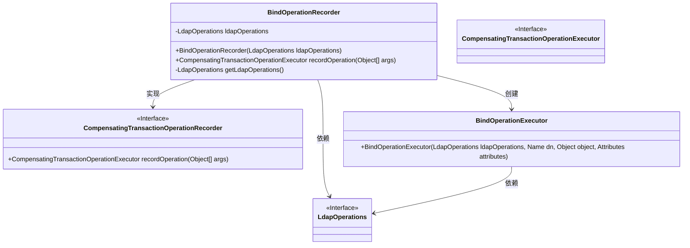
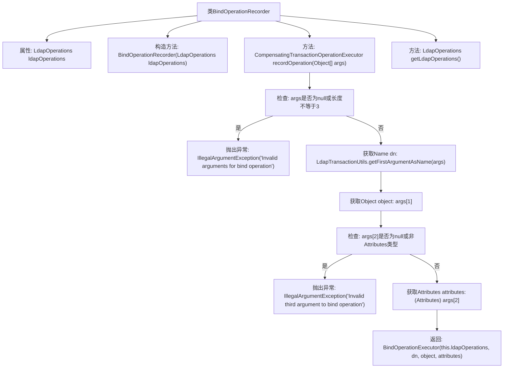

# 基础信息

|      |      |
|------|------|
| 名称 | BindOperationRecorder |
| 编码语言 | .java |
| 代码路径 | spring-ldap/core/src/main/java/org/springframework/ldap/transaction/compensating/BindOperationRecorder.java |
| 包名 | org.springframework.ldap.transaction.compensating |
| 依赖项 | ['javax.naming.Name', 'javax.naming.directory.Attributes', 'org.springframework.ldap.core.LdapOperations', 'org.springframework.transaction.compensating.CompensatingTransactionOperationExecutor', 'org.springframework.transaction.compensating.CompensatingTransactionOperationRecorder'] |
| 概述说明 | BindOperationRecorder类记录LDAP绑定操作并生成补偿事务执行器。 |

# 说明

BindOperationRecorder类的主要功能是记录LDAP绑定操作，并生成相应的补偿事务执行器。该类通过捕捉和存储绑定操作的详细信息，确保在需要时能够执行补偿操作，以恢复或撤销之前的绑定操作。这种机制在处理LDAP事务时尤为重要，能够提高系统的可靠性和一致性。

# 类列表 Class Summary

| 名称   | 类型  | 说明 |
|-------|------|-------------|
| BindOperationRecorder | class | BindOperationRecorder类记录LDAP绑定操作并生成补偿事务执行器。 |

## 类 BindOperationRecorder

|      |      |
|------|------|
| 访问范围 | public |
| 类型 | class |
| 名称 | BindOperationRecorder |
| 说明 | BindOperationRecorder类记录LDAP绑定操作并生成补偿事务执行器。 |

### UML类图

### 描述
`BindOperationRecorder` 类实现了 `CompensatingTransactionOperationRecorder` 接口，用于记录绑定操作并生成相应的补偿事务操作执行器。它依赖于 `LdapOperations` 接口来执行LDAP操作，并在 `recordOperation` 方法中验证输入参数后创建 `BindOperationExecutor` 实例。`BindOperationExecutor` 类负责执行具体的绑定操作，并依赖于 `LdapOperations` 接口。整个设计通过接口和类的组合，实现了事务操作的记录与执行。

### 内部方法调用关系图

这段代码定义了一个`BindOperationRecorder`类，用于记录LDAP绑定操作。类中包含一个构造方法、两个成员方法以及一个属性。`recordOperation`方法用于验证传入的参数，并根据参数创建并返回一个`BindOperationExecutor`对象。如果参数不符合要求，则会抛出`IllegalArgumentException`异常。`getLdapOperations`方法用于获取`ldapOperations`属性，主要用于测试目的。

### 字段列表 Field List

| 名称  | 类型  | 说明 |
|-------|-------|------|
| ldapOperations | LdapOperations | 私有变量ldapOperations用于LDAP操作。 |

### 方法列表 Method List

| 名称  | 类型  | 说明 |
|-------|-------|------|
| getLdapOperations | LdapOperations | 返回当前LdapOperations实例。 |
| recordOperation | CompensatingTransactionOperationExecutor | 方法验证参数并创建绑定操作执行器。 |

