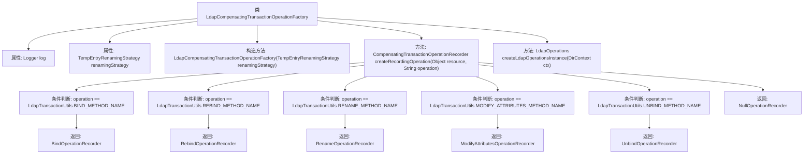

# 基础信息

|      |      |
|------|------|
| 名称 | LdapCompensatingTransactionOperationFactory |
| 编码语言 | .java |
| 代码路径 | spring-ldap/core/src/main/java/org/springframework/ldap/transaction/compensating/LdapCompensatingTransactionOperationFactory.java |
| 包名 | org.springframework.ldap.transaction.compensating |
| 依赖项 | ['javax.naming.directory.DirContext', 'org.slf4j.Logger', 'org.slf4j.LoggerFactory', 'org.springframework.ldap.core.LdapOperations', 'org.springframework.ldap.core.LdapTemplate', 'org.springframework.ldap.core.support.SingleContextSource', 'org.springframework.transaction.compensating.CompensatingTransactionOperationFactory', 'org.springframework.transaction.compensating.CompensatingTransactionOperationRecorder', 'org.springframework.util.ObjectUtils'] |
| 概述说明 | LdapCompensatingTransactionOperationFactory类实现LDAP操作记录的补偿事务工厂。 |

# 说明

LdapCompensatingTransactionOperationFactory类是一个用于实现补偿事务操作的工厂类，专门支持多种LDAP操作记录。该工厂类的主要功能是生成和管理补偿事务操作，确保在LDAP操作过程中出现异常或错误时能够进行有效的补偿和恢复。通过支持多种LDAP操作记录，该工厂类能够灵活处理不同类型的LDAP操作，确保系统的稳定性和数据的一致性。

# 类列表 Class Summary

| 名称   | 类型  | 说明 |
|-------|------|-------------|
| LdapCompensatingTransactionOperationFactory | class | LdapCompensatingTransactionOperationFactory类实现补偿事务操作工厂，支持多种LDAP操作记录。 |


## 类 LdapCompensatingTransactionOperationFactory

|      |      |
|------|------|
| 访问范围 | public |
| 类型 | class |
| 名称 | LdapCompensatingTransactionOperationFactory |
| 说明 | LdapCompensatingTransactionOperationFactory类实现补偿事务操作工厂，支持多种LDAP操作记录。 |


### UML类图

```mermaid
classDiagram
   class LdapCompensatingTransactionOperationFactory {
        -Logger log
        -TempEntryRenamingStrategy renamingStrategy
        +LdapCompensatingTransactionOperationFactory(TempEntryRenamingStrategy renamingStrategy)
        +CompensatingTransactionOperationRecorder createRecordingOperation(Object resource, String operation)
        -LdapOperations createLdapOperationsInstance(DirContext ctx)
    }

   interface CompensatingTransactionOperationFactory {
        <<Interface>>
        +CompensatingTransactionOperationRecorder createRecordingOperation(Object resource, String operation)
    }

   LdapCompensatingTransactionOperationFactory --> CompensatingTransactionOperationFactory : 实现
```

**描述：**  
`LdapCompensatingTransactionOperationFactory` 类实现了 `CompensatingTransactionOperationFactory` 接口，用于创建不同类型的 `CompensatingTransactionOperationRecorder` 实例。该类通过 `createRecordingOperation` 方法根据传入的操作类型（如 `BIND_METHOD_NAME`、`REBIND_METHOD_NAME` 等）返回相应的操作记录器。`TempEntryRenamingStrategy` 用于策略模式的实现，`createLdapOperationsInstance` 方法则用于创建 `LdapOperations` 实例。


### 内部方法调用关系图



这段代码展示了`LdapCompensatingTransactionOperationFactory`类的结构及其主要方法`createRecordingOperation`的流程。该类用于根据不同的LDAP操作类型创建相应的补偿事务操作记录器。通过一系列条件判断，代码选择并返回合适的操作记录器，如`BindOperationRecorder`、`RebindOperationRecorder`等。如果操作类型不匹配任何已知类型，则返回`NullOperationRecorder`。整个流程清晰地展示了类的构造和方法的执行路径。

### 字段列表 Field List

| 名称  | 类型  | 说明 |
|-------|-------|------|
| log = LoggerFactory.getLogger(LdapCompensatingTransactionOperationFactory.class) | Logger | LDAP补偿事务工厂类的日志实例化。 |
| renamingStrategy | TempEntryRenamingStrategy | 私有变量renamingStrategy，类型为TempEntryRenamingStrategy。 |

### 方法列表 Method List

| 名称  | 类型  | 说明 |
|-------|-------|------|
| createLdapOperationsInstance | LdapOperations | 创建LDAP操作实例，使用DirContext初始化LdapTemplate。 |
| createRecordingOperation | CompensatingTransactionOperationRecorder | 根据操作类型创建相应的LDAP事务操作记录器。 |


