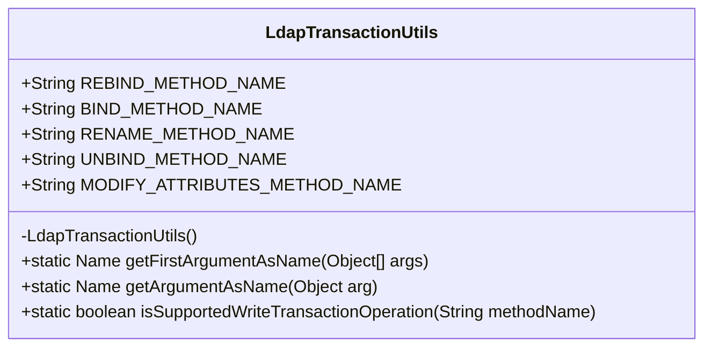
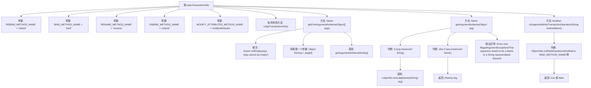

# 基础信息

|      |      |
|------|------|
| 名称 | LdapTransactionUtils |
| 编码语言 | .java |
| 代码路径 | spring-ldap/core/src/main/java/org/springframework/ldap/transaction/compensating/LdapTransactionUtils.java |
| 包名 | org.springframework.ldap.transaction.compensating |
| 依赖项 | ['javax.naming.Name', 'org.springframework.ldap.support.LdapUtils', 'org.springframework.util.Assert', 'org.springframework.util.ObjectUtils'] |
| 概述说明 | LdapTransactionUtils类支持LDAP事务操作，包含常量、参数转换和验证功能。 |

# 说明

LdapTransactionUtils类是一个专门用于支持LDAP事务操作的工具类。它包含了多个方法名常量，用于标识不同的LDAP操作。此外，该类还提供了参数转换功能，能够将输入参数转换为LDAP事务所需的格式。同时，LdapTransactionUtils还具备事务操作验证功能，确保事务在执行前符合预期的条件和规范。这些功能共同确保了LDAP事务的顺利进行和正确性。

# 类列表 Class Summary

| 名称   | 类型  | 说明 |
|-------|------|-------------|
| LdapTransactionUtils | class | LdapTransactionUtils类提供LDAP事务操作支持，包含方法名常量、参数转换及事务操作验证功能。 |

## 类 LdapTransactionUtils

|      |      |
|------|------|
| 访问范围 | public final |
| 类型 | class |
| 名称 | LdapTransactionUtils |
| 说明 | LdapTransactionUtils类提供LDAP事务操作支持，包含方法名常量、参数转换及事务操作验证功能。 |

### UML类图

这段代码定义了一个名为 `LdapTransactionUtils` 的工具类，用于处理与LDAP事务相关的操作。该类包含多个常量字符串，用于标识不同的LDAP操作方法。类中提供了三个静态方法：`getFirstArgumentAsName` 用于从参数数组中获取第一个参数并将其转换为 `Name` 类型；`getArgumentAsName` 用于将单个参数转换为 `Name` 类型；`isSupportedWriteTransactionOperation` 用于检查给定的方法名是否属于支持的写事务操作。该类是 `final` 的，并且构造函数是私有的，确保它不能被实例化。

### 内部方法调用关系图

这段代码定义了一个名为`LdapTransactionUtils`的工具类，主要用于处理LDAP事务操作。类中包含多个常量定义，用于标识不同的LDAP操作方法。此外，类提供了三个静态方法：`getFirstArgumentAsName`用于获取参数列表中的第一个参数并将其转换为`Name`类型；`getArgumentAsName`用于将单个参数转换为`Name`类型；`isSupportedWriteTransactionOperation`用于检查给定的方法名是否为支持的LDAP写操作。通过这些方法，代码能够有效地处理LDAP事务中的参数转换和操作验证。

### 字段列表 Field List

| 名称  | 类型  | 说明 |
|-------|-------|------|
| RENAME_METHOD_NAME = "rename" | String | 定义常量RENAME_METHOD_NAME，值为"rename"。 |
| UNBIND_METHOD_NAME = "unbind" | String | 定义常量UNBIND_METHOD_NAME，值为"unbind"。 |
| MODIFY_ATTRIBUTES_METHOD_NAME = "modifyAttributes" | String | 定义了常量字符串MODIFY_ATTRIBUTES_METHOD_NAME，值为"modifyAttributes"。 |
| REBIND_METHOD_NAME = "rebind" | String | 定义了名为REBIND_METHOD_NAME的静态常量字符串，值为"rebind"。 |
| BIND_METHOD_NAME = "bind" | String | 定义静态常量字符串变量BIND_METHOD_NAME，值为"bind"。 |

### 方法列表 Method List

| 名称  | 类型  | 说明 |
|-------|-------|------|
| isSupportedWriteTransactionOperation | boolean | 判断方法名是否支持写事务操作。 |
| getArgumentAsName | Name | 方法将对象转换为Name类型，支持String或Name输入，否则抛出异常。 |
| getFirstArgumentAsName | Name | 方法获取数组首个元素并转换为Name对象。 |

