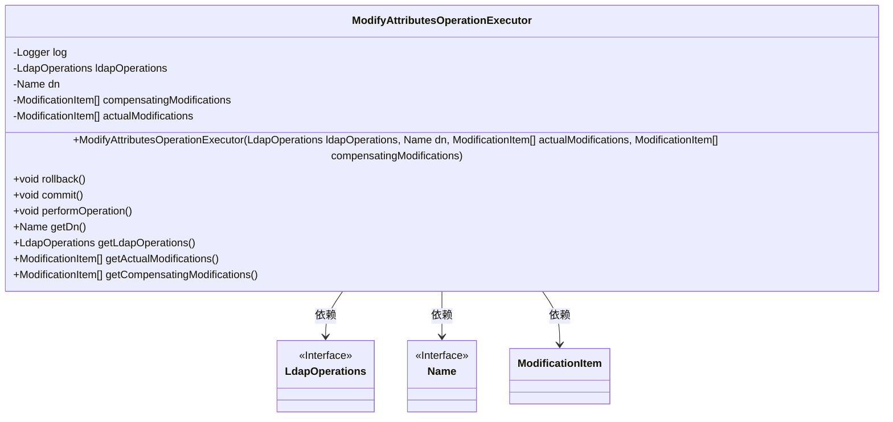

# 基础信息

|      |      |
|------|------|
| 名称 | ModifyAttributesOperationExecutor |
| 编码语言 | .java |
| 代码路径 | spring-ldap/core/src/main/java/org/springframework/ldap/transaction/compensating/ModifyAttributesOperationExecutor.java |
| 包名 | org.springframework.ldap.transaction.compensating |
| 依赖项 | ['javax.naming.Name', 'javax.naming.directory.ModificationItem', 'org.slf4j.Logger', 'org.slf4j.LoggerFactory', 'org.springframework.ldap.core.LdapOperations', 'org.springframework.transaction.compensating.CompensatingTransactionOperationExecutor'] |
| 概述说明 | 实现LDAP属性修改的事务回滚与提交功能。 |

# 说明

实现LDAP属性修改操作的事务回滚与提交功能，主要涉及在LDAP目录服务中对属性进行修改时，确保操作的原子性和一致性。该功能通过事务管理机制，确保在修改过程中如果发生错误或异常，能够回滚到修改前的状态，避免数据不一致。同时，在操作成功时，能够提交修改，确保数据更新到LDAP目录中。此功能增强了系统的可靠性和数据完整性，适用于需要高可用性和数据一致性的LDAP应用场景。

# 类列表 Class Summary

| 名称   | 类型  | 说明 |
|-------|------|-------------|
| ModifyAttributesOperationExecutor | class | 实现LDAP属性修改操作的事务回滚与提交功能。 |

## 类 ModifyAttributesOperationExecutor

|      |      |
|------|------|
| 访问范围 | public |
| 类型 | class |
| 名称 | ModifyAttributesOperationExecutor |
| 说明 | 实现LDAP属性修改操作的事务回滚与提交功能。 |

### UML类图

### 描述
`ModifyAttributesOperationExecutor`类实现了`CompensatingTransactionOperationExecutor`接口，用于执行和回滚LDAP属性修改操作。它依赖于`LdapOperations`接口进行LDAP操作，`Name`接口表示目标条目的DN，`ModificationItem`类表示修改项。该类提供了`rollback`、`commit`和`performOperation`方法，分别用于回滚、提交和执行修改操作，并提供了获取内部状态的getter方法。

### 内部方法调用关系图

```mermaid
graph TD
    A["类ModifyAttributesOperationExecutor"]
    B["属性: Logger log"]
    C["属性: LdapOperations ldapOperations"]
    D["属性: Name dn"]
    E["属性: ModificationItem[] compensatingModifications"]
    F["属性: ModificationItem[] actualModifications"]
    G["构造方法: ModifyAttributesOperationExecutor(LdapOperations ldapOperations, Name dn, ModificationItem[] actualModifications, ModificationItem[] compensatingModifications)"]
    H["方法: void rollback()"]
    I["方法: void commit()"]
    J["方法: void performOperation()"]
    K["方法: Name getDn()"]
    L["方法: LdapOperations getLdapOperations()"]
    M["方法: ModificationItem[] getActualModifications()"]
    N["方法: ModificationItem[] getCompensatingModifications()"]

    A --> B
    A --> C
    A --> D
    A --> E
    A --> F
    A --> G
    A --> H
    A --> I
    A --> J
    A --> K
    A --> L
    A --> M
    A --> N
```

这段代码定义了一个`ModifyAttributesOperationExecutor`类，用于管理和执行LDAP属性修改操作。该类包含构造方法、回滚操作、提交操作、执行操作以及获取属性值的方法。构造方法初始化了LDAP操作、目标DN、实际修改项和补偿修改项。`rollback`方法用于回滚修改操作，`commit`方法用于提交操作，`performOperation`方法用于执行实际的LDAP属性修改操作。其他方法用于获取类的属性值。

### 字段列表 Field List

| 名称  | 类型  | 说明 |
|-------|-------|------|
| compensatingModifications | ModificationItem[] | 私有补偿修改项数组。 |
| dn | Name | 定义私有成员变量dn。 |
| ldapOperations | LdapOperations | 私有LDAP操作实例变量。 |
| log = LoggerFactory.getLogger(ModifyAttributesOperationExecutor.class) | Logger | 定义私有静态日志记录器，用于记录类ModifyAttributesOperationExecutor的日志。 |
| actualModifications | ModificationItem[] | 私有修饰符声明的ModificationItem数组变量actualModifications。 |

### 方法列表 Method List

| 名称  | 类型  | 说明 |
|-------|-------|------|
| getLdapOperations | LdapOperations | 返回当前LdapOperations实例。 |
| getActualModifications | ModificationItem[] | 获取实际修改项的列表。 |
| performOperation | void | 执行修改属性操作并记录日志。 |
| getCompensatingModifications | ModificationItem[] | 获取补偿修改项的方法。 |
| commit | void | 空提交方法，仅记录调试信息。 |
| getDn | Name | 该方法返回当前对象的dn属性值。 |
| rollback | void | rollback方法尝试回滚LDAP属性修改，失败时记录警告。 |

