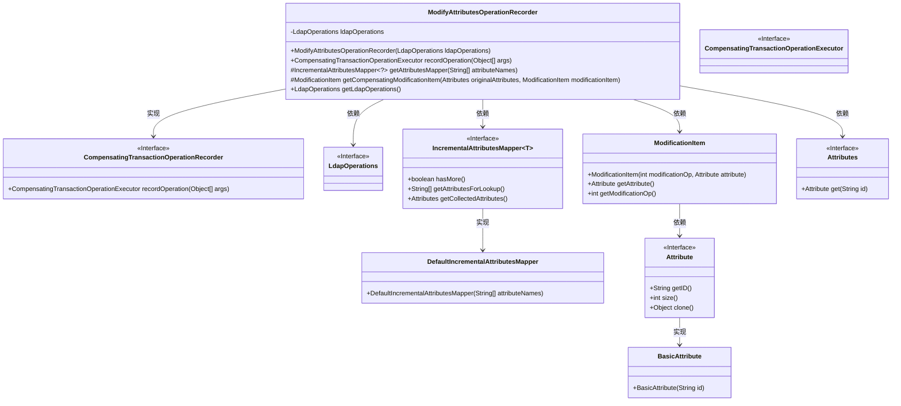
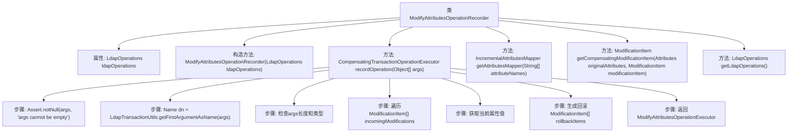
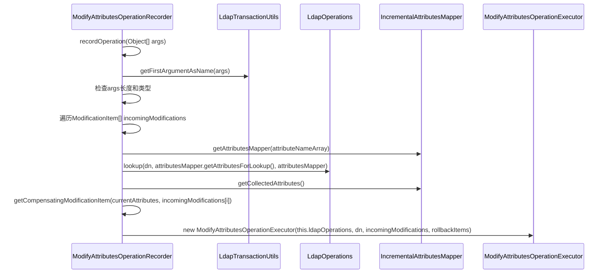

# 基础信息

|      |      |
|------|------|
| 名称 | ModifyAttributesOperationRecorder |
| 编码语言 | .java |
| 代码路径 | spring-ldap/core/src/main/java/org/springframework/ldap/transaction/compensating/ModifyAttributesOperationRecorder.java |
| 包名 | org.springframework.ldap.transaction.compensating |
| 依赖项 | ['java.util.HashSet', 'java.util.Set', 'javax.naming.Name', 'javax.naming.directory.Attribute', 'javax.naming.directory.Attributes', 'javax.naming.directory.BasicAttribute', 'javax.naming.directory.DirContext', 'javax.naming.directory.ModificationItem', 'org.springframework.ldap.core.AttributesMapper', 'org.springframework.ldap.core.IncrementalAttributesMapper', 'org.springframework.ldap.core.LdapOperations', 'org.springframework.ldap.core.support.DefaultIncrementalAttributesMapper', 'org.springframework.transaction.compensating.CompensatingTransactionOperationExecutor', 'org.springframework.transaction.compensating.CompensatingTransactionOperationRecorder', 'org.springframework.util.Assert'] |
| 概述说明 | ModifyAttributesOperationRecorder类记录LDAP属性修改并生成回滚项。 |

# 说明

ModifyAttributesOperationRecorder类的主要功能是记录LDAP（轻量级目录访问协议）属性修改操作，并生成相应的回滚项。该类通过捕获属性修改的详细信息，确保在需要时能够撤销或回滚这些操作，从而提供数据的一致性和可恢复性。这一机制在维护LDAP目录的完整性和可靠性方面起到了关键作用。

# 类列表 Class Summary

| 名称   | 类型  | 说明 |
|-------|------|-------------|
| ModifyAttributesOperationRecorder | class | ModifyAttributesOperationRecorder类用于记录LDAP属性修改操作并生成回滚项。 |

## 类 ModifyAttributesOperationRecorder

|      |      |
|------|------|
| 访问范围 | public |
| 类型 | class |
| 名称 | ModifyAttributesOperationRecorder |
| 说明 | ModifyAttributesOperationRecorder类用于记录LDAP属性修改操作并生成回滚项。 |

### UML类图

### 描述
`ModifyAttributesOperationRecorder`类实现了`CompensatingTransactionOperationRecorder`接口，用于记录LDAP属性修改操作并生成回滚操作。它依赖于`LdapOperations`接口执行LDAP操作，并使用`IncrementalAttributesMapper`接口来管理属性映射。`ModificationItem`类用于表示单个属性修改操作，而`Attributes`和`Attribute`接口则用于处理LDAP属性。`DefaultIncrementalAttributesMapper`是`IncrementalAttributesMapper`接口的具体实现，用于增量地获取属性。

### 内部方法调用关系图

这段代码定义了一个`ModifyAttributesOperationRecorder`类，用于记录LDAP属性修改操作并生成回滚操作。代码首先验证输入参数，然后遍历传入的修改项，获取当前属性值，并生成相应的回滚修改项。最后，返回一个`ModifyAttributesOperationExecutor`实例，用于执行和回滚操作。流程图展示了类结构和方法调用关系，时序图则详细描述了`recordOperation`方法的执行过程。

### 字段列表 Field List

| 名称  | 类型  | 说明 |
|-------|-------|------|
| ldapOperations | LdapOperations | 私有LDAP操作实例变量。 |

### 方法列表 Method List

| 名称  | 类型  | 说明 |
|-------|-------|------|
| getLdapOperations | LdapOperations | 获取当前LDAP操作实例。 |
| recordOperation | CompensatingTransactionOperationExecutor | 记录LDAP属性修改操作，生成补偿事务回滚项。 |
| getAttributesMapper | IncrementalAttributesMapper<?> | 获取属性映射器，根据属性名生成默认增量属性映射器。 |
| getCompensatingModificationItem | ModificationItem | 方法生成回滚修改项，根据操作类型和原始属性返回相应的修改项。 |

