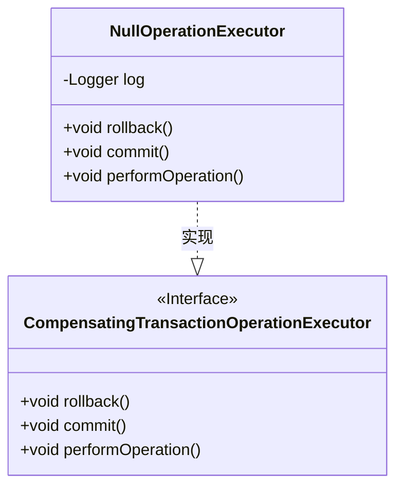
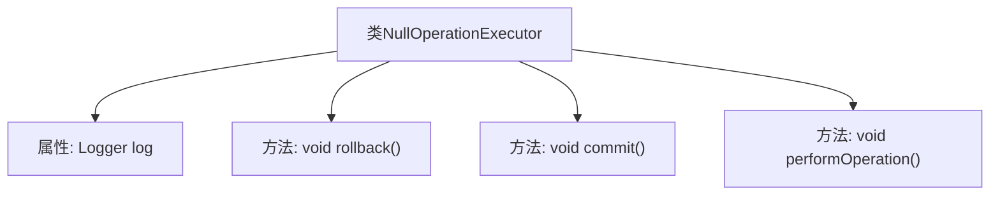

# 基础信息

|      |      |
|------|------|
| 名称 | NullOperationExecutor |
| 编码语言 | .java |
| 代码路径 | spring-ldap/core/src/main/java/org/springframework/ldap/transaction/compensating/NullOperationExecutor.java |
| 包名 | org.springframework.ldap.transaction.compensating |
| 依赖项 | ['org.slf4j.Logger', 'org.slf4j.LoggerFactory', 'org.springframework.transaction.compensating.CompensatingTransactionOperationExecutor'] |
| 概述说明 | NullOperationExecutor处理事务回滚、提交、执行及日志记录。 |

# 说明

NullOperationExecutor负责处理事务的回滚、提交以及操作执行，并在执行过程中记录相关的日志信息。该实现确保事务的完整性和可追溯性，通过日志记录提供操作的详细历史，便于问题排查和审计。

# 类列表 Class Summary

| 名称   | 类型  | 说明 |
|-------|------|-------------|
| NullOperationExecutor | class | NullOperationExecutor实现事务回滚、提交和操作执行，记录日志信息。 |

## 类 NullOperationExecutor

|      |      |
|------|------|
| 访问范围 | public |
| 类型 | class |
| 名称 | NullOperationExecutor |
| 说明 | NullOperationExecutor实现事务回滚、提交和操作执行，记录日志信息。 |

### UML类图

这段代码定义了一个名为 `NullOperationExecutor` 的类，该类实现了 `CompensatingTransactionOperationExecutor` 接口。`NullOperationExecutor` 类包含三个公有方法：`rollback()`、`commit()` 和 `performOperation()`，这些方法分别用于记录回滚、提交和执行空操作的日志信息。该类通过实现接口 `CompensatingTransactionOperationExecutor` 来确保其行为符合接口的规范。

### 内部方法调用关系图

该流程图描述了`NullOperationExecutor`类的结构及其方法。`NullOperationExecutor`类实现了`CompensatingTransactionOperationExecutor`接口，包含一个静态的`Logger`属性`log`，以及三个方法：`rollback()`、`commit()`和`performOperation()`。每个方法在执行时都会通过`log`记录相应的操作信息，用于跟踪事务的回滚、提交和执行过程。

### 字段列表 Field List

| 名称  | 类型  | 说明 |
|-------|-------|------|
| log = LoggerFactory.getLogger(NullOperationExecutor.class) | Logger | 私有静态日志记录器用于NullOperationExecutor类。 |

### 方法列表 Method List

| 名称  | 类型  | 说明 |
|-------|-------|------|
| commit | void | 提交空操作日志信息。 |
| rollback | void | 空操作回滚方法记录日志信息。 |
| performOperation | void | 方法`performOperation`执行空操作并记录日志。 |

