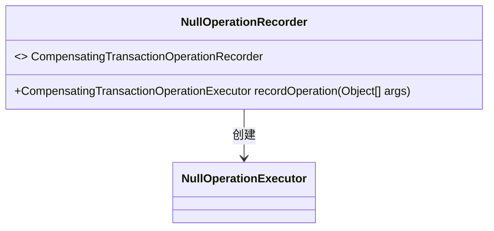
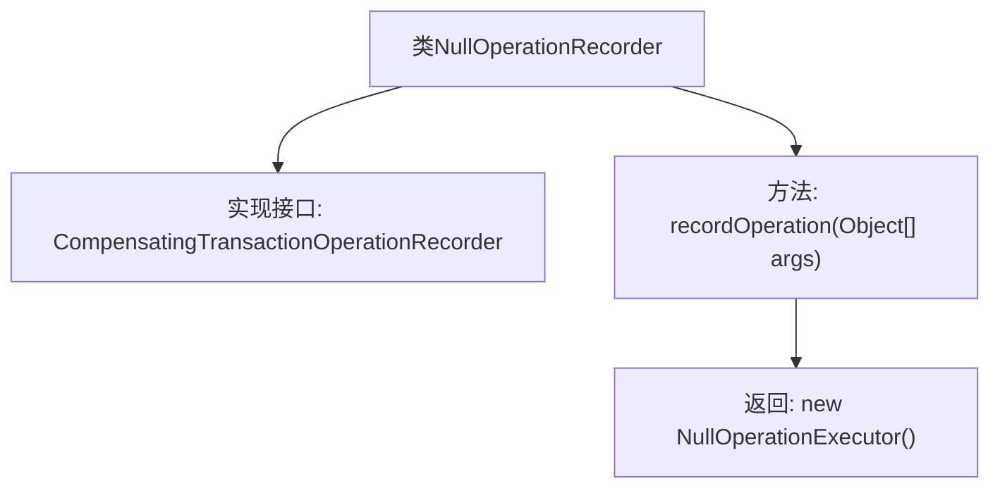

# 基础信息

|      |      |
|------|------|
| 名称 | NullOperationRecorder |
| 编码语言 | .java |
| 代码路径 | spring-ldap/core/src/main/java/org/springframework/ldap/transaction/compensating/NullOperationRecorder.java |
| 包名 | org.springframework.ldap.transaction.compensating |
| 依赖项 | ['org.springframework.transaction.compensating.CompensatingTransactionOperationExecutor', 'org.springframework.transaction.compensating.CompensatingTransactionOperationManager', 'org.springframework.transaction.compensating.CompensatingTransactionOperationRecorder'] |
| 概述说明 | NullOperationRecorder类实现接口，记录操作并返回NullOperationExecutor实例。 |

# 说明

NullOperationRecorder类实现了CompensatingTransactionOperationRecorder接口，主要用于记录操作，并返回NullOperationExecutor实例。该类的核心功能是确保操作的记录与补偿事务的执行相关联，通过返回NullOperationExecutor实例来管理这些操作。

# 类列表 Class Summary

| 名称   | 类型  | 说明 |
|-------|------|-------------|
| NullOperationRecorder | class | NullOperationRecorder类实现CompensatingTransactionOperationRecorder接口，记录操作并返回NullOperationExecutor实例。 |

## 类 NullOperationRecorder

|      |      |
|------|------|
| 访问范围 | public |
| 类型 | class |
| 名称 | NullOperationRecorder |
| 说明 | NullOperationRecorder类实现CompensatingTransactionOperationRecorder接口，记录操作并返回NullOperationExecutor实例。 |

### UML类图

**描述：**  
`NullOperationRecorder` 类实现了 `CompensatingTransactionOperationRecorder` 接口，并提供了 `recordOperation` 方法。该方法接收一个 `Object[]` 类型的参数，并返回一个 `NullOperationExecutor` 对象。`NullOperationRecorder` 类依赖于 `NullOperationExecutor` 类来执行操作。整体设计简洁，主要用于记录事务操作并返回一个执行器实例。

### 内部方法调用关系图

这段代码定义了一个名为 `NullOperationRecorder` 的类，该类实现了 `CompensatingTransactionOperationRecorder` 接口。类中包含一个 `recordOperation` 方法，该方法接收一个 `Object` 数组作为参数，并返回一个 `NullOperationExecutor` 的实例。该类的设计意图可能是用于记录事务操作，并在需要时返回一个不执行任何操作的执行器。

### 字段列表 Field List

| 名称  | 类型  | 说明 |
|-------|-------|------|

### 方法列表 Method List

| 名称  | 类型  | 说明 |
|-------|-------|------|
| recordOperation | CompensatingTransactionOperationExecutor | 记录操作返回空执行器实例。 |

