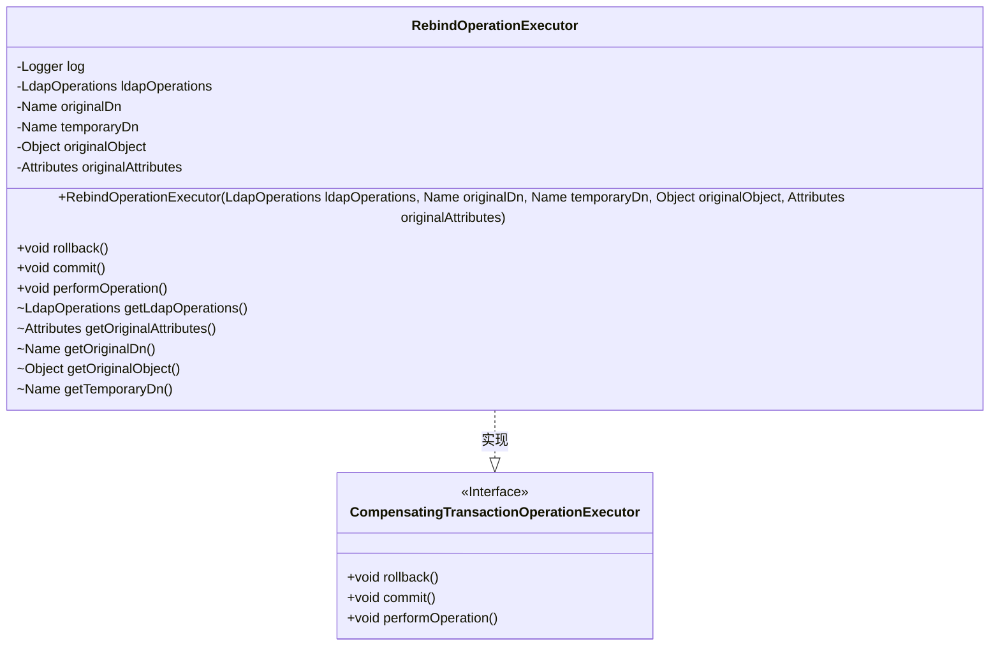

# 基础信息

|      |      |
|------|------|
| 名称 | RebindOperationExecutor |
| 编码语言 | .java |
| 代码路径 | spring-ldap/core/src/main/java/org/springframework/ldap/transaction/compensating/RebindOperationExecutor.java |
| 包名 | org.springframework.ldap.transaction.compensating |
| 依赖项 | ['javax.naming.Name', 'javax.naming.directory.Attributes', 'org.slf4j.Logger', 'org.slf4j.LoggerFactory', 'org.springframework.ldap.core.LdapOperations', 'org.springframework.transaction.compensating.CompensatingTransactionOperationExecutor'] |
| 概述说明 | RebindOperationExecutor类执行LDAP重绑定操作，支持回滚、提交和操作执行。 |

# 说明

RebindOperationExecutor类专门用于执行LDAP重绑定操作，具备回滚、提交和操作执行等核心功能。该类的主要职责是确保在LDAP环境中进行重绑定操作时，能够有效管理操作的执行过程，包括在需要时进行回滚以确保数据一致性，以及在操作完成后进行提交以确认更改。通过集成这些功能，RebindOperationExecutor类为LDAP重绑定操作提供了全面的支持和控制。

# 类列表 Class Summary

| 名称   | 类型  | 说明 |
|-------|------|-------------|
| RebindOperationExecutor | class | RebindOperationExecutor类用于执行LDAP重绑定操作，包含回滚、提交和操作执行功能。 |

## 类 RebindOperationExecutor

|      |      |
|------|------|
| 访问范围 | public |
| 类型 | class |
| 名称 | RebindOperationExecutor |
| 说明 | RebindOperationExecutor类用于执行LDAP重绑定操作，包含回滚、提交和操作执行功能。 |

### UML类图

**描述：**
`RebindOperationExecutor` 类实现了 `CompensatingTransactionOperationExecutor` 接口，用于执行LDAP操作的补偿事务。它通过 `rollback()`、`commit()` 和 `performOperation()` 方法来管理LDAP条目的重命名和绑定操作。类中包含了多个私有属性，如 `ldapOperations`、`originalDn` 等，用于存储操作所需的数据。该类还提供了多个包级私有的 getter 方法，用于测试和内部访问。

### 内部方法调用关系图

```mermaid
graph TD
    A["类RebindOperationExecutor"]
    B["属性: Logger log"]
    C["属性: LdapOperations ldapOperations"]
    D["属性: Name originalDn"]
    E["属性: Name temporaryDn"]
    F["属性: Object originalObject"]
    G["属性: Attributes originalAttributes"]
    H["构造方法: RebindOperationExecutor(LdapOperations ldapOperations, Name originalDn, Name temporaryDn, Object originalObject, Attributes originalAttributes)"]
    I["方法: LdapOperations getLdapOperations()"]
    J["方法: void rollback()"]
    K["方法: void commit()"]
    L["方法: void performOperation()"]
    M["方法: Attributes getOriginalAttributes()"]
    N["方法: Name getOriginalDn()"]
    O["方法: Object getOriginalObject()"]
    P["方法: Name getTemporaryDn()"]
    Q["日志输出: log.debug('Rolling back rebind operation')"]
    R["操作: this.ldapOperations.unbind(this.originalDn)"]
    S["操作: this.ldapOperations.rename(this.temporaryDn, this.originalDn)"]
    T["日志输出: log.warn('Failed to rollback operation, dn: ' + this.originalDn + '; temporary DN:this. ' + this.temporaryDn, ex)"]
    U["日志输出: log.debug('Committing rebind operation')"]
    V["操作: this.ldapOperations.unbind(this.temporaryDn)"]
    W["日志输出: log.debug('Performing rebind operation - renaming original entry and binding new contents to entry.')"]
    X["操作: this.ldapOperations.rename(this.originalDn, this.temporaryDn)"]
    Y["操作: this.ldapOperations.bind(this.originalDn, this.originalObject, this.originalAttributes)"]

    A --> B
    A --> C
    A --> D
    A --> E
    A --> F
    A --> G
    A --> H
    A --> I
    A --> J
    A --> K
    A --> L
    A --> M
    A --> N
    A --> O
    A --> P
    J --> Q
    J --> R
    J --> S
    J --> T
    K --> U
    K --> V
    L --> W
    L --> X
    L --> Y
```

这段代码描述了一个名为 `RebindOperationExecutor` 的类，该类实现了 `CompensatingTransactionOperationExecutor` 接口，用于处理LDAP操作的回滚、提交和执行。类中包含多个属性用于存储LDAP操作的相关信息，如原始DN、临时DN、原始对象和原始属性等。类中定义了多个方法，包括构造方法、获取属性的方法以及执行操作、回滚和提交的方法。这些方法通过调用 `LdapOperations` 的接口来实现具体的LDAP操作，并在操作过程中记录日志信息。

### 字段列表 Field List

| 名称  | 类型  | 说明 |
|-------|-------|------|
| temporaryDn | Name | 私有变量temporaryDn声明。 |
| originalAttributes | Attributes | 私有属性存储原始数据。 |
| originalObject | Object | 原始对象声明为私有变量。 |
| log = LoggerFactory.getLogger(RebindOperationExecutor.class) | Logger | RebindOperationExecutor类中创建了日志记录器实例。 |
| ldapOperations | LdapOperations | 私有变量ldapOperations用于LDAP操作。 |
| originalDn | Name | 私有变量originalDn存储原始域名。 |

### 方法列表 Method List

| 名称  | 类型  | 说明 |
|-------|-------|------|
| getLdapOperations | LdapOperations | 获取LDAP操作实例。 |
| getOriginalAttributes | Attributes | 获取原始属性的方法。 |
| commit | void | 提交操作，记录调试信息并解绑临时DN。 |
| performOperation | void | 执行LDAP重命名和绑定操作。 |
| getTemporaryDn | Name | 方法getTemporaryDn返回当前对象的temporaryDn属性。 |
| getOriginalObject | Object | 该方法返回当前对象的原始对象实例。 |
| getOriginalDn | Name | 获取原始DN的方法，返回this.originalDn。 |
| rollback | void | 回滚操作：解绑原始DN并重命名临时DN，失败时记录警告。 |

