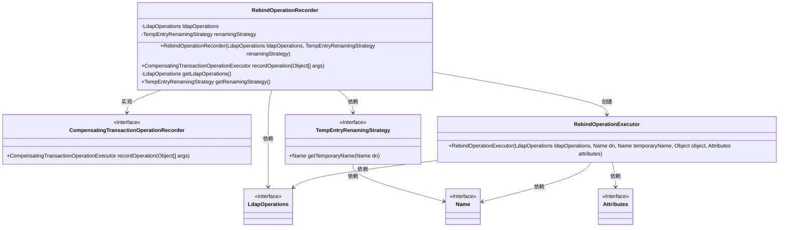
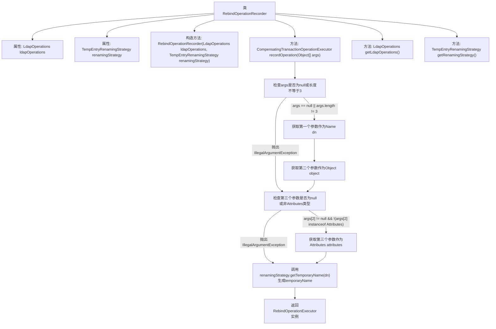

# 基础信息

|      |      |
|------|------|
| 名称 | RebindOperationRecorder |
| 编码语言 | .java |
| 代码路径 | spring-ldap/core/src/main/java/org/springframework/ldap/transaction/compensating/RebindOperationRecorder.java |
| 包名 | org.springframework.ldap.transaction.compensating |
| 依赖项 | ['javax.naming.Name', 'javax.naming.directory.Attributes', 'org.springframework.ldap.core.LdapOperations', 'org.springframework.transaction.compensating.CompensatingTransactionOperationExecutor', 'org.springframework.transaction.compensating.CompensatingTransactionOperationRecorder'] |
| 概述说明 | RebindOperationRecorder类记录LDAP重绑定操作，生成临时名称并返回执行器。 |

# 说明

RebindOperationRecorder类的主要功能是记录LDAP重绑定操作。它负责生成临时名称，并返回执行器以便进行后续操作。该类在LDAP重绑定过程中起到关键作用，确保操作被准确记录和执行。

# 类列表 Class Summary

| 名称   | 类型  | 说明 |
|-------|------|-------------|
| RebindOperationRecorder | class | RebindOperationRecorder类用于记录LDAP重绑定操作，生成临时名称并返回执行器。 |

## 类 RebindOperationRecorder

|      |      |
|------|------|
| 访问范围 | public |
| 类型 | class |
| 名称 | RebindOperationRecorder |
| 说明 | RebindOperationRecorder类用于记录LDAP重绑定操作，生成临时名称并返回执行器。 |

### UML类图

**描述：**  
`RebindOperationRecorder`类实现了`CompensatingTransactionOperationRecorder`接口，用于记录LDAP事务中的重绑定操作。它依赖于`LdapOperations`和`TempEntryRenamingStrategy`接口，并通过`recordOperation`方法创建`RebindOperationExecutor`对象。`TempEntryRenamingStrategy`接口用于生成临时名称，而`RebindOperationExecutor`则负责执行具体的重绑定操作。

### 内部方法调用关系图

这段代码定义了一个`RebindOperationRecorder`类，用于记录LDAP重绑定操作。它包含两个属性`ldapOperations`和`renamingStrategy`，并通过构造方法进行初始化。`recordOperation`方法接收一个参数数组`args`，验证其有效性后，生成临时名称并返回一个`RebindOperationExecutor`实例。此外，还提供了获取`ldapOperations`和`renamingStrategy`的方法。该类的核心功能是确保LDAP操作的参数有效，并生成相应的执行器以处理重绑定操作。

### 字段列表 Field List

| 名称  | 类型  | 说明 |
|-------|-------|------|
| ldapOperations | LdapOperations | 私有变量ldapOperations用于LDAP操作。 |
| renamingStrategy | TempEntryRenamingStrategy | 私有变量renamingStrategy用于临时条目重命名策略。 |

### 方法列表 Method List

| 名称  | 类型  | 说明 |
|-------|-------|------|
| getRenamingStrategy | TempEntryRenamingStrategy | 获取重命名策略的方法。 |
| getLdapOperations | LdapOperations | 获取LdapOperations实例的方法。 |
| recordOperation | CompensatingTransactionOperationExecutor | 方法验证参数并生成LDAP重绑定操作执行器。 |

