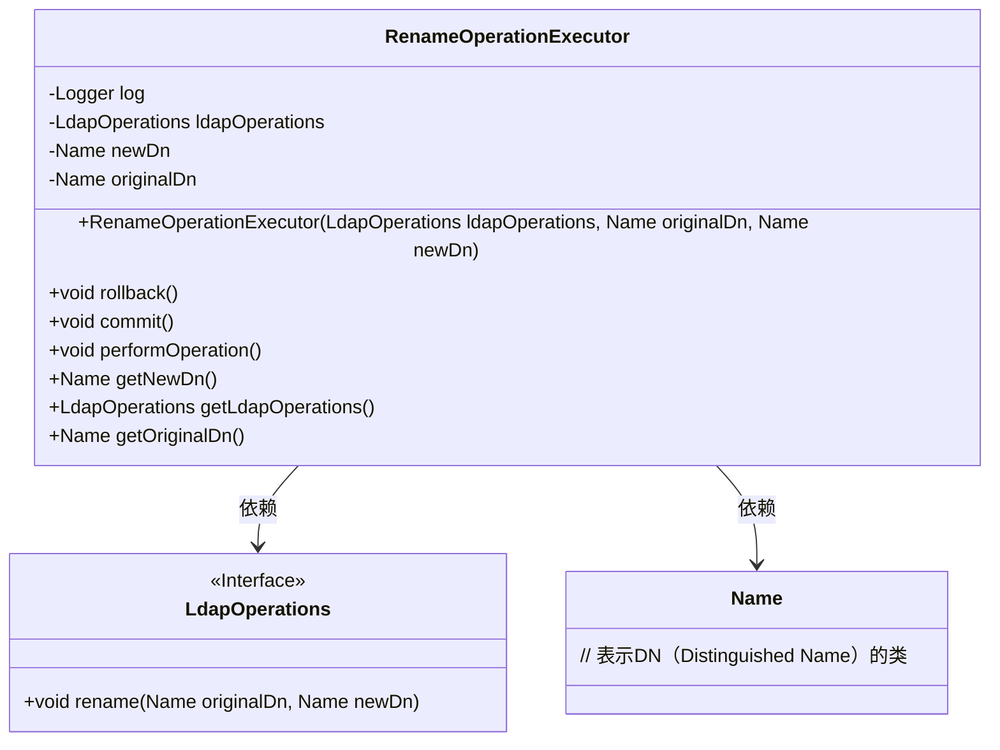
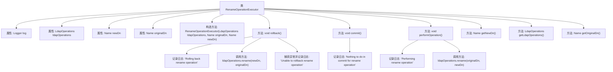

# 基础信息

|      |      |
|------|------|
| 名称 | RenameOperationExecutor |
| 编码语言 | .java |
| 代码路径 | spring-ldap/core/src/main/java/org/springframework/ldap/transaction/compensating/RenameOperationExecutor.java |
| 包名 | org.springframework.ldap.transaction.compensating |
| 依赖项 | ['javax.naming.Name', 'org.slf4j.Logger', 'org.slf4j.LoggerFactory', 'org.springframework.ldap.core.LdapOperations', 'org.springframework.transaction.compensating.CompensatingTransactionOperationExecutor'] |
| 概述说明 | 实现LDAP重命名操作，具备回滚和提交功能。 |

# 说明

该功能实现了LDAP（轻量目录访问协议）的重命名操作，并提供了回滚和提交功能。重命名操作允许用户修改LDAP目录中的条目名称，而回滚功能确保在操作过程中出现错误时能够恢复到之前的状态，提交功能则用于确认并保存更改。这一设计增强了操作的可靠性和数据的一致性，适用于需要高安全性和稳定性的LDAP管理场景。

# 类列表 Class Summary

| 名称   | 类型  | 说明 |
|-------|------|-------------|
| RenameOperationExecutor | class | 实现LDAP重命名操作，支持回滚和提交功能。 |

## 类 RenameOperationExecutor

|      |      |
|------|------|
| 访问范围 | public |
| 类型 | class |
| 名称 | RenameOperationExecutor |
| 说明 | 实现LDAP重命名操作，支持回滚和提交功能。 |

### UML类图

**描述：**
`RenameOperationExecutor` 类实现了 `CompensatingTransactionOperationExecutor` 接口，用于执行和回滚LDAP目录中的重命名操作。该类依赖于 `LdapOperations` 接口来执行具体的LDAP操作，并使用 `Name` 类来表示目录项的DN（Distinguished Name）。主要方法包括 `rollback()` 用于回滚操作，`commit()` 用于提交操作，以及 `performOperation()` 用于执行重命名操作。

### 内部方法调用关系图

这段代码定义了一个`RenameOperationExecutor`类，用于执行LDAP重命名操作的回滚、提交和实际操作。类中包含日志记录、LDAP操作对象以及新旧DN（Distinguished Name）属性。`rollback`方法用于回滚重命名操作，`commit`方法用于提交操作（此处无实际动作），`performOperation`方法用于执行重命名操作。代码通过日志记录操作状态，并在异常情况下记录警告信息。

### 字段列表 Field List

| 名称  | 类型  | 说明 |
|-------|-------|------|
| newDn | Name | 定义私有变量newDn。 |
| ldapOperations | LdapOperations | 私有变量ldapOperations用于LDAP操作。 |
| log = LoggerFactory.getLogger(RenameOperationExecutor.class) | Logger | RenameOperationExecutor类中创建了静态日志实例。 |
| originalDn | Name | 私有变量originalDn存储原始数据名称。 |

### 方法列表 Method List

| 名称  | 类型  | 说明 |
|-------|-------|------|
| getOriginalDn | Name | 方法getOriginalDn返回当前对象的originalDn属性。 |
| commit | void | 提交操作中重命名无需执行任何操作。 |
| performOperation | void | 执行重命名操作，记录日志并调用LDAP方法。 |
| rollback | void | 回滚重命名操作，尝试恢复原DN，失败则记录警告。 |
| getNewDn | Name | 方法getNewDn返回对象属性newDn的值。 |
| getLdapOperations | LdapOperations | 获取LDAP操作实例的方法。 |

