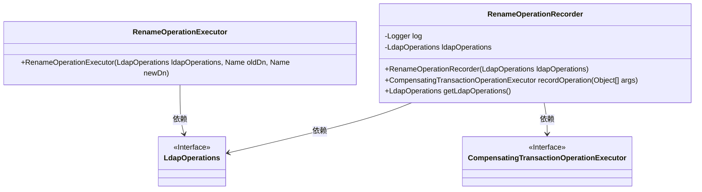
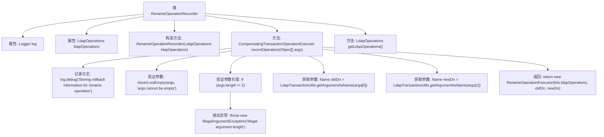

# 基础信息

|      |      |
|------|------|
| 名称 | RenameOperationRecorder |
| 编码语言 | .java |
| 代码路径 | spring-ldap/core/src/main/java/org/springframework/ldap/transaction/compensating/RenameOperationRecorder.java |
| 包名 | org.springframework.ldap.transaction.compensating |
| 依赖项 | ['javax.naming.Name', 'org.slf4j.Logger', 'org.slf4j.LoggerFactory', 'org.springframework.ldap.core.LdapOperations', 'org.springframework.transaction.compensating.CompensatingTransactionOperationExecutor', 'org.springframework.transaction.compensating.CompensatingTransactionOperationRecorder', 'org.springframework.util.Assert'] |
| 概述说明 | RenameOperationRecorder类记录LDAP重命名操作，生成回滚信息并验证参数。 |

# 说明

RenameOperationRecorder类的主要功能是记录LDAP（轻量目录访问协议）中的重命名操作。该类在操作过程中生成回滚信息，以便在需要时能够撤销或恢复操作。此外，该类还负责验证传入的参数，确保其符合预期要求和规范，从而保证操作的准确性和安全性。通过这一系列步骤，RenameOperationRecorder类确保了LDAP重命名操作的可靠性和可追溯性。

# 类列表 Class Summary

| 名称   | 类型  | 说明 |
|-------|------|-------------|
| RenameOperationRecorder | class | RenameOperationRecorder类记录LDAP重命名操作，生成回滚信息并验证参数。 |

## 类 RenameOperationRecorder

|      |      |
|------|------|
| 访问范围 | public |
| 类型 | class |
| 名称 | RenameOperationRecorder |
| 说明 | RenameOperationRecorder类记录LDAP重命名操作，生成回滚信息并验证参数。 |

### UML类图

这段代码定义了一个`RenameOperationRecorder`类，用于记录LDAP重命名操作的回滚信息。该类依赖于`LdapOperations`接口来执行LDAP操作，并生成`RenameOperationExecutor`对象来处理具体的重命名操作。`RenameOperationRecorder`类通过`recordOperation`方法接收参数并验证其合法性，最终返回一个`CompensatingTransactionOperationExecutor`对象。`RenameOperationExecutor`类则负责实际的LDAP重命名操作。整体设计符合事务补偿机制，确保在操作失败时能够正确回滚。

### 内部方法调用关系图

这段代码定义了一个名为 `RenameOperationRecorder` 的类，用于记录LDAP重命名操作的回滚信息。类中包含两个属性：`log` 用于记录日志，`ldapOperations` 用于执行LDAP操作。构造方法接收 `LdapOperations` 对象并初始化属性。`recordOperation` 方法接收参数数组，验证参数的有效性后，提取旧的和新的DN（Distinguished Name），并返回一个 `RenameOperationExecutor` 对象。`getLdapOperations` 方法用于获取 `ldapOperations` 属性。

### 字段列表 Field List

| 名称  | 类型  | 说明 |
|-------|-------|------|
| log = LoggerFactory.getLogger(RenameOperationRecorder.class) | Logger | RenameOperationRecorder类初始化日志记录器实例。 |
| ldapOperations | LdapOperations | 私有变量ldapOperations用于LDAP操作。 |

### 方法列表 Method List

| 名称  | 类型  | 说明 |
|-------|-------|------|
| getLdapOperations | LdapOperations | 返回当前对象的ldapOperations属性值。 |
| recordOperation | CompensatingTransactionOperationExecutor | 记录重命名操作的回滚信息，验证参数并返回重命名操作执行器。 |

