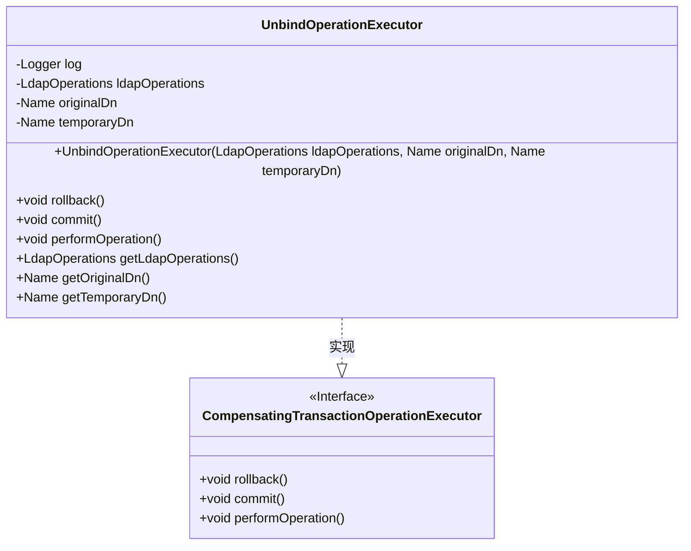
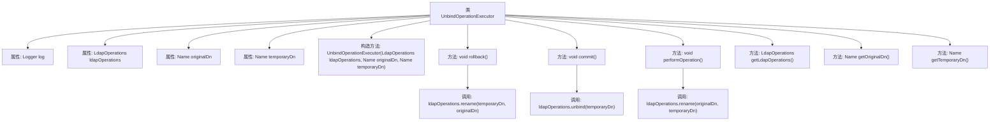

# 基础信息

|      |      |
|------|------|
| 名称 | UnbindOperationExecutor |
| 编码语言 | .java |
| 代码路径 | spring-ldap/core/src/main/java/org/springframework/ldap/transaction/compensating/UnbindOperationExecutor.java |
| 包名 | org.springframework.ldap.transaction.compensating |
| 依赖项 | ['javax.naming.Name', 'org.slf4j.Logger', 'org.slf4j.LoggerFactory', 'org.springframework.ldap.core.LdapOperations', 'org.springframework.transaction.compensating.CompensatingTransactionOperationExecutor'] |
| 概述说明 | UnbindOperationExecutor类处理LDAP事务，支持回滚、提交和解绑操作。 |

# 说明

UnbindOperationExecutor类专门用于处理LDAP事务操作，具备回滚、提交和执行解绑操作的功能。该类的设计旨在确保事务的完整性和一致性，通过回滚机制在操作失败时恢复系统状态，通过提交机制确认操作成功，并通过解绑操作执行特定的LDAP事务处理。

# 类列表 Class Summary

| 名称   | 类型  | 说明 |
|-------|------|-------------|
| UnbindOperationExecutor | class | UnbindOperationExecutor类用于LDAP事务操作，支持回滚、提交和执行解绑操作。 |

## 类 UnbindOperationExecutor

|      |      |
|------|------|
| 访问范围 | public |
| 类型 | class |
| 名称 | UnbindOperationExecutor |
| 说明 | UnbindOperationExecutor类用于LDAP事务操作，支持回滚、提交和执行解绑操作。 |

### UML类图

**描述：**  
`UnbindOperationExecutor` 类实现了 `CompensatingTransactionOperationExecutor` 接口，用于执行LDAP事务中的解绑操作。它包含三个私有成员变量：`ldapOperations`、`originalDn` 和 `temporaryDn`，分别用于存储LDAP操作、原始DN和临时DN。类中提供了 `rollback()`、`commit()` 和 `performOperation()` 方法，分别用于回滚、提交和执行解绑操作。此外，还提供了获取 `ldapOperations`、`originalDn` 和 `temporaryDn` 的getter方法。

### 内部方法调用关系图

这段代码定义了一个名为 `UnbindOperationExecutor` 的类，主要用于处理LDAP（轻量级目录访问协议）中的解绑操作。该类包含了构造方法、`rollback`、`commit`、`performOperation` 等核心方法，分别用于回滚操作、提交操作和执行解绑操作。代码通过 `LdapOperations` 接口与LDAP服务器进行交互，并在操作过程中记录日志。流程图展示了类的结构及其内部方法的调用关系，清晰地反映了各个方法之间的逻辑流程。

### 字段列表 Field List

| 名称  | 类型  | 说明 |
|-------|-------|------|
| temporaryDn | Name | 定义私有变量temporaryDn。 |
| ldapOperations | LdapOperations | 私有变量ldapOperations用于LDAP操作。 |
| originalDn | Name | 定义私有变量originalDn。 |
| log = LoggerFactory.getLogger(UnbindOperationExecutor.class) | Logger | 定义私有静态日志记录器，用于UnbindOperationExecutor类。 |

### 方法列表 Method List

| 名称  | 类型  | 说明 |
|-------|-------|------|
| getOriginalDn | Name | 该方法返回对象的原始域名。 |
| commit | void | 提交操作，解除临时条目绑定。 |
| getTemporaryDn | Name | 获取临时DN的getTemporaryDn方法。 |
| rollback | void | LDAP回滚操作，失败时记录警告信息。 |
| getLdapOperations | LdapOperations | 返回当前对象的ldapOperations属性。 |
| performOperation | void | 执行操作：重命名原始DN为临时DN并记录日志。 |

