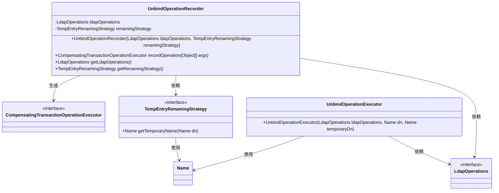
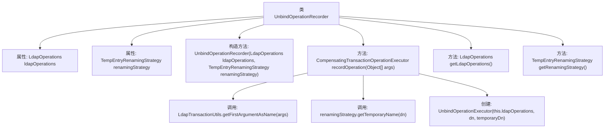

# 基础信息

|      |      |
|------|------|
| 名称 | UnbindOperationRecorder |
| 编码语言 | .java |
| 代码路径 | spring-ldap/core/src/main/java/org/springframework/ldap/transaction/compensating/UnbindOperationRecorder.java |
| 包名 | org.springframework.ldap.transaction.compensating |
| 依赖项 | ['javax.naming.Name', 'org.springframework.ldap.core.LdapOperations', 'org.springframework.transaction.compensating.CompensatingTransactionOperationExecutor', 'org.springframework.transaction.compensating.CompensatingTransactionOperationRecorder'] |
| 概述说明 | UnbindOperationRecorder类记录LDAP解绑操作，支持事务回滚和临时条目重命名。 |

# 说明

UnbindOperationRecorder类专门用于记录LDAP解绑操作，具备事务回滚功能，能够在操作失败时恢复至先前状态。此外，该类还支持临时条目的重命名，确保在解绑过程中对条目进行临时修改时，能够有效管理和恢复条目名称。该类设计旨在提供高效、可靠的解绑操作记录和管理机制，适用于需要精确控制LDAP解绑操作及其相关事务的场景。

# 类列表 Class Summary

| 名称   | 类型  | 说明 |
|-------|------|-------------|
| UnbindOperationRecorder | class | UnbindOperationRecorder类用于记录LDAP解绑操作，支持事务回滚和临时条目重命名。 |

## 类 UnbindOperationRecorder

|      |      |
|------|------|
| 访问范围 | public |
| 类型 | class |
| 名称 | UnbindOperationRecorder |
| 说明 | UnbindOperationRecorder类用于记录LDAP解绑操作，支持事务回滚和临时条目重命名。 |

### UML类图

### 描述
`UnbindOperationRecorder`类用于记录解绑操作，并生成相应的补偿事务操作执行器。它依赖于`LdapOperations`接口来获取数据，并使用`TempEntryRenamingStrategy`接口生成临时条目的DN。`recordOperation`方法根据传入的参数生成一个`UnbindOperationExecutor`实例，用于执行解绑操作和回滚。该类与其他接口和类之间存在依赖关系，确保解绑操作的记录和执行能够顺利进行。

### 内部方法调用关系图

这段代码定义了一个名为 `UnbindOperationRecorder` 的类，该类用于记录和回滚 LDAP 解绑操作。类中包含两个属性 `ldapOperations` 和 `renamingStrategy`，分别用于操作 LDAP 和生成临时条目名称。类中的 `recordOperation` 方法通过调用 `LdapTransactionUtils.getFirstArgumentAsName` 和 `renamingStrategy.getTemporaryName` 来生成临时名称，并返回一个 `UnbindOperationExecutor` 实例，用于执行解绑操作。流程图展示了类的结构及其方法的调用关系。

### 字段列表 Field List

| 名称  | 类型  | 说明 |
|-------|-------|------|
| ldapOperations | LdapOperations | 私有LDAP操作对象ldapOperations。 |
| renamingStrategy | TempEntryRenamingStrategy | 私有变量renamingStrategy用于临时条目重命名策略。 |

### 方法列表 Method List

| 名称  | 类型  | 说明 |
|-------|-------|------|
| getLdapOperations | LdapOperations | 返回当前LDAP操作实例。 |
| getRenamingStrategy | TempEntryRenamingStrategy | 获取当前重命名策略实例的方法。 |
| recordOperation | CompensatingTransactionOperationExecutor | 记录操作生成补偿事务执行器，使用临时名称处理LDAP操作。 |

