# 基础信息

|      |      |
|------|------|
| 名称 | compensating |
| 编码语言 | .java |
| 代码路径 | spring-ldap/core/src/main/java/org/springframework/ldap/transaction/compensating |
| 包名 | spring-ldap.core.src.main.java.org.springframework.ldap.transaction.compensating |
| 概述说明 | LDAP事务管理模块，确保操作一致性、完整性和可靠性，支持回滚、提交和补偿操作。 |

# 说明

## 概述
该代码模块主要围绕LDAP（轻量级目录访问协议）事务管理展开，提供了多种类和工具来确保LDAP操作在事务中的一致性、完整性和可靠性。模块的核心设计采用了委托模式，将具体的事务操作逻辑委托给其他类执行，从而简化了核心事务管理器的复杂性，并提高了代码的可维护性和扩展性。模块中的类涵盖了事务管理器的实现、事务感知的上下文代理、事务处理器、以及上下文资源的管理等功能。此外，模块中还包含了一些已弃用的类，这些类主要用于集成LDAP与其他技术（如Hibernate和数据源）的事务管理，但由于技术演进或架构调整，这些集成方案不再推荐使用。

## 主要业务场景
1. **LDAP事务管理**：通过`ContextSourceTransactionManager`和`ContextSourceTransactionManagerDelegate`等类，模块提供了对LDAP事务的管理功能，确保在LDAP操作中事务的一致性和完整性，特别是在需要回滚或补偿时，能够有效管理和恢复上下文资源。
2. **事务感知的上下文管理**：`TransactionAwareContextSourceProxy`和`TransactionAwareDirContextInvocationHandler`等类用于实现事务感知的LDAP上下文管理，确保在事务处理过程中，LDAP上下文的管理与事务状态保持一致，从而保证数据的一致性和完整性。
3. **上下文资源管理**：`DirContextHolder`类负责管理事务中的`DirContext`对象，提供了设置和获取`DirContext`的方法，确保在事务处理过程中对`DirContext`的有效管理和访问。
4. **已弃用的集成方案**：模块中包含了一些已弃用的类，如`ContextSourceAndDataSourceTransactionManager`和`ContextSourceAndHibernateTransactionManager`，这些类主要用于集成LDAP与其他技术（如数据源和Hibernate）的事务管理，但由于技术演进或架构调整，这些集成方案不再推荐使用。
5. **LDAP操作记录与补偿**：模块中的多个类（如`BindOperationRecorder`、`ModifyAttributesOperationRecorder`、`UnbindOperationRecorder`等）负责记录LDAP操作并生成相应的补偿事务执行器，确保在操作失败时能够回滚或恢复系统状态。
6. **临时条目重命名策略**：模块提供了两种不同的重命名策略，确保临时条目在重命名时具有唯一性和可识别性，便于系统管理和区分。这些策略通过结合子树节点信息和序列号来生成唯一的名称，从而避免命名冲突，并提高系统的可管理性和可追溯性。
7. **LDAP事务工具支持**：`LdapTransactionUtils`类提供了参数转换和事务操作验证功能，确保事务在执行前符合预期的条件和规范，从而保证LDAP事务的顺利进行和正确性。
8. **空操作处理**：`NullOperationExecutor`和`NullOperationRecorder`类用于处理不需要实际执行的操作，确保事务的完整性和可追溯性，通过日志记录提供操作的详细历史，便于问题排查和审计。

### 包内部结构视图

```mermaid
graph TD
    compensating --> BindOperationRecorder.java
    compensating --> LdapCompensatingTransactionOperationFactory.java
    compensating --> ModifyAttributesOperationRecorder.java
    compensating --> UnbindOperationExecutor.java
    compensating --> manager
    compensating --> UnbindOperationRecorder.java
    compensating --> RenameOperationExecutor.java
    compensating --> TempEntryRenamingStrategy.java
    compensating --> RebindOperationRecorder.java
    compensating --> LdapTransactionUtils.java
    compensating --> RebindOperationExecutor.java
    compensating --> RenameOperationRecorder.java
    compensating --> BindOperationExecutor.java
    compensating --> support
    compensating --> NullOperationExecutor.java
    compensating --> NullOperationRecorder.java
    compensating --> ModifyAttributesOperationExecutor.java
    manager --> ContextSourceTransactionManager.java
    manager --> TransactionAwareDirContextInvocationHandler.java
    manager --> DirContextHolder.java
    manager --> ContextSourceAndDataSourceTransactionManager.java
    manager --> ContextSourceTransactionManagerDelegate.java
    manager --> ContextSourceAndHibernateTransactionManager.java
    manager --> TransactionAwareContextSourceProxy.java
    support --> DefaultTempEntryRenamingStrategy.java
    support --> DifferentSubtreeTempEntryRenamingStrategy.java
```

该流程图展示了`compensating`目录下的文件与子目录的层级关系。`compensating`目录下包含多个文件，如`BindOperationRecorder.java`和`LdapCompensatingTransactionOperationFactory.java`，以及两个子目录`manager`和`support`。`manager`目录下包含多个与事务管理相关的文件，而`support`目录下则包含与临时条目重命名策略相关的文件。

# 文件列表 File List

| 名称   | 类型  | 说明 |
|-------|------|-------------|
| [NullOperationRecorder.java](NullOperationRecorder.md) | file | NullOperationRecorder类实现接口，记录操作并返回NullOperationExecutor实例。 |
| [BindOperationExecutor.java](BindOperationExecutor.md) | file | BindOperationExecutor类处理LDAP绑定操作，支持回滚、提交和执行功能。 |
| [RebindOperationRecorder.java](RebindOperationRecorder.md) | file | RebindOperationRecorder类记录LDAP重绑定操作，生成临时名称并返回执行器。 |
| [TempEntryRenamingStrategy.java](TempEntryRenamingStrategy.md) | file | 信息为空，无法生成概要描述。 |
| [ModifyAttributesOperationRecorder.java](ModifyAttributesOperationRecorder.md) | file | ModifyAttributesOperationRecorder类记录LDAP属性修改并生成回滚项。 |
| [LdapTransactionUtils.java](LdapTransactionUtils.md) | file | LdapTransactionUtils类支持LDAP事务操作，包含常量、参数转换和验证功能。 |
| [RenameOperationRecorder.java](RenameOperationRecorder.md) | file | RenameOperationRecorder类记录LDAP重命名操作，生成回滚信息并验证参数。 |
| [BindOperationRecorder.java](BindOperationRecorder.md) | file | BindOperationRecorder类记录LDAP绑定操作并生成补偿事务执行器。 |
| [RebindOperationExecutor.java](RebindOperationExecutor.md) | file | RebindOperationExecutor类执行LDAP重绑定操作，支持回滚、提交和操作执行。 |
| [ModifyAttributesOperationExecutor.java](ModifyAttributesOperationExecutor.md) | file | 实现LDAP属性修改的事务回滚与提交功能。 |
| [NullOperationExecutor.java](NullOperationExecutor.md) | file | NullOperationExecutor处理事务回滚、提交、执行及日志记录。 |
| [RenameOperationExecutor.java](RenameOperationExecutor.md) | file | 实现LDAP重命名操作，具备回滚和提交功能。 |
| [UnbindOperationRecorder.java](UnbindOperationRecorder.md) | file | UnbindOperationRecorder类记录LDAP解绑操作，支持事务回滚和临时条目重命名。 |
| [UnbindOperationExecutor.java](UnbindOperationExecutor.md) | file | UnbindOperationExecutor类处理LDAP事务，支持回滚、提交和解绑操作。 |
| [LdapCompensatingTransactionOperationFactory.java](LdapCompensatingTransactionOperationFactory.md) | file | LdapCompensatingTransactionOperationFactory类实现LDAP操作记录的补偿事务工厂。 |
| [support](support/_module.md) | package | 默认临时条目重命名策略支持自定义后缀，未指定时用"_temp"，确保一致性和可识别性。 |
| [manager](manager/_module.md) | package | ContextSourceTransactionManager通过委托类处理事务，提升灵活性和可维护性。TransactionAwareDirContextInvocationHandler确保DirContext事务完整。DirContextHolder管理事务中的DirContext对象。ContextSourceAndDataSourceTransactionManager已弃用，不支持嵌套事务。ContextSourceTransactionManagerDelegate管理LDAP事务和补偿操作。ContextSourceAndHibernateTransactionManager已弃用，不推荐使用。TransactionAwareContextSourceProxy确保LDAP上下文与事务状态一致。 |

