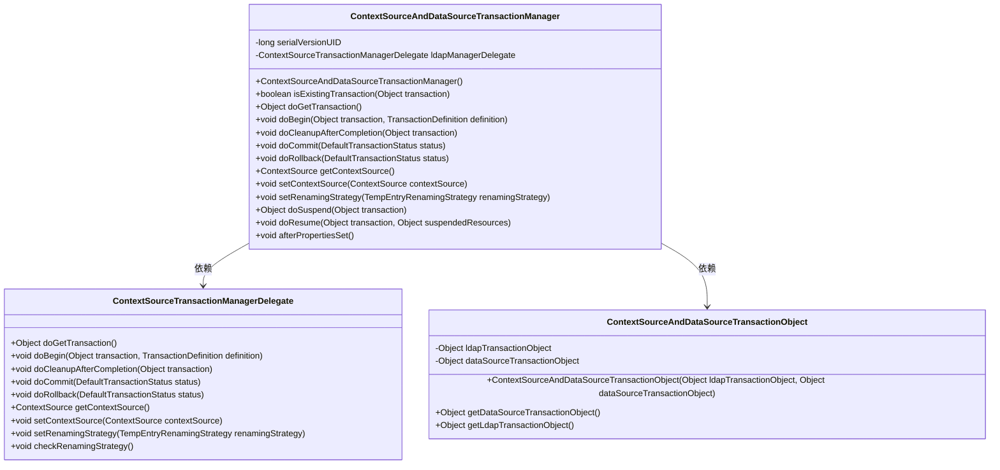

# 基础信息

|      |      |
|------|------|
| 名称 | ContextSourceAndDataSourceTransactionManager |
| 编码语言 | .java |
| 代码路径 | spring-ldap/core/src/main/java/org/springframework/ldap/transaction/compensating/manager/ContextSourceAndDataSourceTransactionManager.java |
| 包名 | org.springframework.ldap.transaction.compensating.manager |
| 依赖项 | ['org.springframework.jdbc.datasource.DataSourceTransactionManager', 'org.springframework.ldap.core.ContextSource', 'org.springframework.ldap.transaction.compensating.TempEntryRenamingStrategy', 'org.springframework.transaction.TransactionDefinition', 'org.springframework.transaction.TransactionException', 'org.springframework.transaction.TransactionSuspensionNotSupportedException', 'org.springframework.transaction.support.DefaultTransactionStatus'] |
| 概述说明 | 已弃用类，管理数据源与LDAP事务，不支持嵌套事务。 |

# 说明

这是一个已弃用的类，主要用于管理数据源和LDAP事务。该类的功能包括处理与数据源相关的操作以及与LDAP（轻量级目录访问协议）事务的管理。需要注意的是，此类不支持嵌套事务，即无法在一个事务内部再开启另一个事务。由于其已被弃用，建议使用其他替代方案来实现类似功能。

# 类列表 Class Summary

| 名称   | 类型  | 说明 |
|-------|------|-------------|
| ContextSourceAndDataSourceTransactionManager | class | 已弃用的类，管理数据源和LDAP事务，不支持嵌套事务。 |

## 类 ContextSourceAndDataSourceTransactionManager

|      |      |
|------|------|
| 访问范围 | @Deprecated;public |
| 类型 | class |
| 名称 | ContextSourceAndDataSourceTransactionManager |
| 说明 | 已弃用的类，管理数据源和LDAP事务，不支持嵌套事务。 |

### UML类图

这段代码描述了一个事务管理器类 `ContextSourceAndDataSourceTransactionManager`，它继承自 `DataSourceTransactionManager`，并委托 `ContextSourceTransactionManagerDelegate` 来处理LDAP事务。该类通过 `ContextSourceAndDataSourceTransactionObject` 来管理数据源和LDAP事务对象，确保事务的开始、提交、回滚和清理操作正确执行。代码还包含了事务挂起和恢复的异常处理，以及属性设置后的检查逻辑。

### 内部方法调用关系图

```mermaid
graph TD
    A["类ContextSourceAndDataSourceTransactionManager"]
    B["属性: ContextSourceTransactionManagerDelegate ldapManagerDelegate"]
    C["构造方法: ContextSourceAndDataSourceTransactionManager()"]
    D["方法: boolean isExistingTransaction(Object transaction)"]
    E["方法: Object doGetTransaction()"]
    F["方法: void doBegin(Object transaction, TransactionDefinition definition)"]
    G["方法: void doCleanupAfterCompletion(Object transaction)"]
    H["方法: void doCommit(DefaultTransactionStatus status)"]
    I["方法: void doRollback(DefaultTransactionStatus status)"]
    J["方法: ContextSource getContextSource()"]
    K["方法: void setContextSource(ContextSource contextSource)"]
    L["方法: void setRenamingStrategy(TempEntryRenamingStrategy renamingStrategy)"]
    M["方法: Object doSuspend(Object transaction)"]
    N["方法: void doResume(Object transaction, Object suspendedResources)"]
    O["方法: void afterPropertiesSet()"]
    P["内部类: ContextSourceAndDataSourceTransactionObject"]
    Q["属性: Object ldapTransactionObject"]
    R["属性: Object dataSourceTransactionObject"]
    S["构造方法: ContextSourceAndDataSourceTransactionObject(Object ldapTransactionObject, Object dataSourceTransactionObject)"]
    T["方法: Object getDataSourceTransactionObject()"]
    U["方法: Object getLdapTransactionObject()"]

    A --> B
    A --> C
    A --> D
    A --> E
    A --> F
    A --> G
    A --> H
    A --> I
    A --> J
    A --> K
    A --> L
    A --> M
    A --> N
    A --> O
    A --> P
    P --> Q
    P --> R
    P --> S
    P --> T
    P --> U
```

**描述：**
`ContextSourceAndDataSourceTransactionManager` 是一个扩展自 `DataSourceTransactionManager` 的类，用于管理数据源和LDAP上下文的事务。它通过 `ldapManagerDelegate` 处理LDAP事务，并与数据源事务进行协调。类中包含了事务的获取、开始、清理、提交、回滚等核心方法，并通过内部类 `ContextSourceAndDataSourceTransactionObject` 封装了LDAP和数据源事务对象。该类不支持事务的挂起和恢复操作，并在属性设置后进行检查以确保策略的正确性。

### 字段列表 Field List

| 名称  | 类型  | 说明 |
|-------|-------|------|
| serialVersionUID = 6832868697460384648L | long | 私有静态长整型常量serialVersionUID值为6832868697460384648L。 |
| ldapManagerDelegate = new ContextSourceTransactionManagerDelegate() | ContextSourceTransactionManagerDelegate | 创建了名为ldapManagerDelegate的ContextSourceTransactionManagerDelegate实例。 |

### 方法列表 Method List

| 名称  | 类型  | 说明 |
|-------|-------|------|
| setContextSource | void | 设置LDAP管理器的上下文源。 |
| doGetTransaction | Object | 重写方法获取事务对象并返回组合事务对象。 |
| afterPropertiesSet | void | 方法调用父类并检查重命名策略。 |
| doSuspend | Object | 方法抛出异常，提示事务管理器不支持事务挂起。 |
| doRollback | void | 在事务回滚时，分别处理数据源和LDAP事务对象。 |
| doCleanupAfterCompletion | void | 方法执行事务完成后的清理操作，分别处理数据源和LDAP事务对象。 |
| doResume | void | 该方法抛出异常，表示事务管理器不支持事务挂起操作。 |
| getContextSource | ContextSource | 方法返回ldapManagerDelegate的ContextSource对象。 |
| doBegin | void | 方法doBegin处理事务开始，先调用父类方法，再尝试LDAP事务，失败时清理数据源事务。 |
| setRenamingStrategy | void | 设置重命名策略方法，调用ldapManagerDelegate的setRenamingStrategy。 |
| doCommit | void | 提交事务时，若数据库提交失败且需回滚则抛出异常，否则继续提交LDAP资源。 |
| isExistingTransaction | boolean | 该方法不支持嵌套事务，始终返回false。 |

