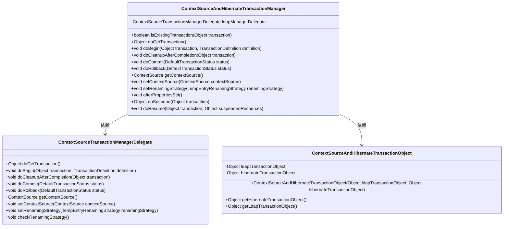

# 基础信息

|      |      |
|------|------|
| 名称 | ContextSourceAndHibernateTransactionManager |
| 编码语言 | .java |
| 代码路径 | spring-ldap/core/src/main/java/org/springframework/ldap/transaction/compensating/manager/ContextSourceAndHibernateTransactionManager.java |
| 包名 | org.springframework.ldap.transaction.compensating.manager |
| 依赖项 | ['org.springframework.ldap.core.ContextSource', 'org.springframework.ldap.transaction.compensating.TempEntryRenamingStrategy', 'org.springframework.orm.hibernate5.HibernateTransactionManager', 'org.springframework.transaction.TransactionDefinition', 'org.springframework.transaction.TransactionException', 'org.springframework.transaction.TransactionSuspensionNotSupportedException', 'org.springframework.transaction.support.DefaultTransactionStatus'] |
| 概述说明 | Hibernate与LDAP事务管理器类已弃用，用于集成两种事务处理。 |

# 说明

Hibernate与LDAP事务管理器类已被弃用，该类主要用于集成Hibernate和LDAP两种不同的事务处理机制。通过此类，开发者能够在同一应用中协调和管理Hibernate的数据库事务与LDAP的目录服务事务，确保数据一致性和事务完整性。然而，由于技术演进或架构调整，该集成方案不再推荐使用，开发者应考虑其他更现代或更合适的事务管理方案。

# 类列表 Class Summary

| 名称   | 类型  | 说明 |
|-------|------|-------------|
| ContextSourceAndHibernateTransactionManager | class | 已弃用的Hibernate与LDAP事务管理器类，集成两种事务处理。 |

## 类 ContextSourceAndHibernateTransactionManager

|      |      |
|------|------|
| 访问范围 | @Deprecated;public |
| 类型 | class |
| 名称 | ContextSourceAndHibernateTransactionManager |
| 说明 | 已弃用的Hibernate与LDAP事务管理器类，集成两种事务处理。 |

### UML类图

这段代码定义了一个 `ContextSourceAndHibernateTransactionManager` 类，它继承自 `HibernateTransactionManager`，并管理 Hibernate 和 LDAP 事务。该类通过 `ContextSourceTransactionManagerDelegate` 委托处理 LDAP 事务，并使用 `ContextSourceAndHibernateTransactionObject` 来封装 Hibernate 和 LDAP 事务对象。代码实现了事务的开始、提交、回滚、清理等操作，并处理了事务挂起和恢复的异常情况。

### 内部方法调用关系图

```mermaid
graph TD
    A["类ContextSourceAndHibernateTransactionManager"]
    B["属性: ContextSourceTransactionManagerDelegate ldapManagerDelegate"]
    C["方法: boolean isExistingTransaction(Object transaction)"]
    D["方法: Object doGetTransaction()"]
    E["方法: void doBegin(Object transaction, TransactionDefinition definition)"]
    F["方法: void doCleanupAfterCompletion(Object transaction)"]
    G["方法: void doCommit(DefaultTransactionStatus status)"]
    H["方法: void doRollback(DefaultTransactionStatus status)"]
    I["方法: ContextSource getContextSource()"]
    J["方法: void setContextSource(ContextSource contextSource)"]
    K["方法: void setRenamingStrategy(TempEntryRenamingStrategy renamingStrategy)"]
    L["方法: Object doSuspend(Object transaction)"]
    M["方法: void doResume(Object transaction, Object suspendedResources)"]
    N["方法: void afterPropertiesSet()"]
    O["内部类: ContextSourceAndHibernateTransactionObject"]
    P["属性: Object ldapTransactionObject"]
    Q["属性: Object hibernateTransactionObject"]
    R["构造方法: ContextSourceAndHibernateTransactionObject(Object ldapTransactionObject, Object hibernateTransactionObject)"]
    S["方法: Object getHibernateTransactionObject()"]
    T["方法: Object getLdapTransactionObject()"]

    A --> B
    A --> C
    A --> D
    A --> E
    A --> F
    A --> G
    A --> H
    A --> I
    A --> J
    A --> K
    A --> L
    A --> M
    A --> N
    A --> O
    O --> P
    O --> Q
    O --> R
    O --> S
    O --> T
```

该流程图展示了`ContextSourceAndHibernateTransactionManager`类的结构及其内部类`ContextSourceAndHibernateTransactionObject`的关系。`ContextSourceAndHibernateTransactionManager`继承自`HibernateTransactionManager`，并包含多个重写的方法用于处理事务管理，如`doBegin`、`doCommit`、`doRollback`等。此外，该类还包含一个内部类`ContextSourceAndHibernateTransactionObject`，用于封装LDAP和Hibernate事务对象。整个流程清晰地展示了类的属性和方法之间的调用关系。

### 字段列表 Field List

| 名称  | 类型  | 说明 |
|-------|-------|------|
| serialVersionUID = 1L | long | 定义了一个私有的静态常量serialVersionUID，值为1L。 |
| ldapManagerDelegate = new ContextSourceTransactionManagerDelegate() | ContextSourceTransactionManagerDelegate | 创建了LDAP管理委托实例ldapManagerDelegate。 |

### 方法列表 Method List

| 名称  | 类型  | 说明 |
|-------|-------|------|
| isExistingTransaction | boolean | 检查Hibernate事务对象是否存在。 |
| getContextSource | ContextSource | 获取LDAP管理委托的上下文源。 |
| doResume | void | 该方法不支持事务挂起，抛出异常。 |
| afterPropertiesSet | void | 重写方法，调用父类并检查LDAP重命名策略。 |
| doCleanupAfterCompletion | void | 清理事务完成后的资源，包括Hibernate和LDAP事务对象。 |
| doRollback | void | 重写doRollback方法，分别处理Hibernate和LDAP事务回滚。 |
| doGetTransaction | Object | 重写doGetTransaction方法，返回合并的ContextSource和Hibernate事务对象。 |
| doSuspend | Object | 该方法抛出异常，表示当前事务管理器不支持事务挂起操作。 |
| setContextSource | void | 该方法用于设置上下文源，通过调用ldapManagerDelegate的setContextSource方法实现。 |
| doBegin | void | 方法处理事务开始，调用父类及LDAP管理器，异常时清理Hibernate事务。 |
| doCommit | void | 提交事务时处理Hibernate和LDAP资源，失败时根据配置决定是否回滚。 |
| setRenamingStrategy | void | 设置重命名策略的方法，调用ldapManagerDelegate的setRenamingStrategy方法。 |

