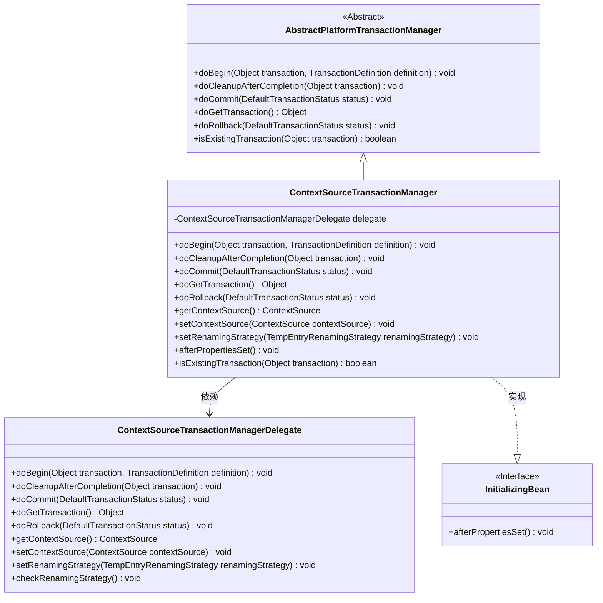

# 基础信息

|      |      |
|------|------|
| 名称 | ContextSourceTransactionManager |
| 编码语言 | .java |
| 代码路径 | spring-ldap/core/src/main/java/org/springframework/ldap/transaction/compensating/manager/ContextSourceTransactionManager.java |
| 包名 | org.springframework.ldap.transaction.compensating.manager |
| 依赖项 | ['org.springframework.beans.factory.InitializingBean', 'org.springframework.ldap.core.ContextSource', 'org.springframework.ldap.transaction.compensating.TempEntryRenamingStrategy', 'org.springframework.ldap.transaction.compensating.UnbindOperationExecutor', 'org.springframework.ldap.transaction.compensating.support.DefaultTempEntryRenamingStrategy', 'org.springframework.transaction.TransactionDefinition', 'org.springframework.transaction.TransactionException', 'org.springframework.transaction.compensating.CompensatingTransactionOperationExecutor', 'org.springframework.transaction.compensating.CompensatingTransactionOperationRecorder', 'org.springframework.transaction.compensating.support.CompensatingTransactionObject', 'org.springframework.transaction.compensating.support.DefaultCompensatingTransactionOperationManager', 'org.springframework.transaction.support.AbstractPlatformTransactionManager', 'org.springframework.transaction.support.DefaultTransactionStatus'] |
| 概述说明 | ContextSourceTransactionManager继承AbstractPlatformTransactionManager，委托处理事务操作。 |

# 说明

ContextSourceTransactionManager继承自AbstractPlatformTransactionManager，其主要功能是通过委托类来处理事务操作。这种设计模式使得事务管理的实现更加灵活和模块化，允许将具体的事务操作逻辑委托给其他类来执行，从而简化了核心事务管理器的复杂性，并提高了代码的可维护性和扩展性。

# 类列表 Class Summary

| 名称   | 类型  | 说明 |
|-------|------|-------------|
| ContextSourceTransactionManager | class | ContextSourceTransactionManager继承AbstractPlatformTransactionManager，通过委托类处理事务操作。 |

## 类 ContextSourceTransactionManager

|      |      |
|------|------|
| 访问范围 | public |
| 类型 | class |
| 名称 | ContextSourceTransactionManager |
| 说明 | ContextSourceTransactionManager继承AbstractPlatformTransactionManager，通过委托类处理事务操作。 |

### UML类图

### 描述
`ContextSourceTransactionManager` 是一个继承自 `AbstractPlatformTransactionManager` 的类，并实现了 `InitializingBean` 接口。它通过 `ContextSourceTransactionManagerDelegate` 类来处理事务管理相关的操作，如事务的开始、提交、回滚等。`ContextSourceTransactionManager` 依赖于 `ContextSourceTransactionManagerDelegate` 来执行具体的事务逻辑，并通过 `InitializingBean` 接口在属性设置完成后执行必要的检查。

### 内部方法调用关系图

```mermaid
graph TD
    A["类ContextSourceTransactionManager"]
    B["属性: ContextSourceTransactionManagerDelegate delegate"]
    C["方法: doBegin(Object transaction, TransactionDefinition definition)"]
    D["方法: doCleanupAfterCompletion(Object transaction)"]
    E["方法: doCommit(DefaultTransactionStatus status)"]
    F["方法: doGetTransaction()"]
    G["方法: doRollback(DefaultTransactionStatus status)"]
    H["方法: getContextSource()"]
    I["方法: setContextSource(ContextSource contextSource)"]
    J["方法: setRenamingStrategy(TempEntryRenamingStrategy renamingStrategy)"]
    K["方法: afterPropertiesSet()"]
    L["方法: isExistingTransaction(Object transaction)"]

    A --> B
    A --> C
    A --> D
    A --> E
    A --> F
    A --> G
    A --> H
    A --> I
    A --> J
    A --> K
    A --> L

    C --> M["delegate.doBegin(transaction, definition)"]
    D --> N["delegate.doCleanupAfterCompletion(transaction)"]
    E --> O["delegate.doCommit(status)"]
    F --> P["delegate.doGetTransaction()"]
    G --> Q["delegate.doRollback(status)"]
    H --> R["delegate.getContextSource()"]
    I --> S["delegate.setContextSource(contextSource)"]
    J --> T["delegate.setRenamingStrategy(renamingStrategy)"]
    K --> U["delegate.checkRenamingStrategy()"]
```

这段代码定义了一个`ContextSourceTransactionManager`类，它继承自`AbstractPlatformTransactionManager`并实现了`InitializingBean`接口。该类通过`ContextSourceTransactionManagerDelegate`代理对象来处理事务的开始、提交、回滚、清理等操作。此外，它还提供了获取和设置`ContextSource`、设置重命名策略以及检查重命名策略的方法。每个方法都通过调用`delegate`对象的相应方法来实现具体功能。

### 字段列表 Field List

| 名称  | 类型  | 说明 |
|-------|-------|------|
| delegate = new ContextSourceTransactionManagerDelegate() | ContextSourceTransactionManagerDelegate | 创建私有委托对象ContextSourceTransactionManagerDelegate实例。 |
| serialVersionUID = 7138208218687237856L | long | 声明了一个私有的静态最终长整型序列化版本UID。 |

### 方法列表 Method List

| 名称  | 类型  | 说明 |
|-------|-------|------|
| doCleanupAfterCompletion | void | 清理事务后调用委托方法完成后续处理。 |
| getContextSource | ContextSource | 获取当前上下文源的委托方法。 |
| doGetTransaction | Object | 该方法调用委托对象的doGetTransaction方法并返回结果。 |
| doCommit | void | 该方法委托执行事务提交操作。 |
| isExistingTransaction | boolean | 方法检查事务是否存在，返回事务持有者是否为空。 |
| setContextSource | void | 设置上下文源，委托给内部对象处理。 |
| doRollback | void | 该方法执行事务回滚，调用委托对象的doRollback方法。 |
| setRenamingStrategy | void | 设置重命名策略方法，调用委托对象的方法进行策略设置。 |
| afterPropertiesSet | void | 方法afterPropertiesSet调用delegate的checkRenamingStrategy。 |
| doBegin | void | 方法doBegin调用委托对象的doBegin方法处理事务开始。 |

