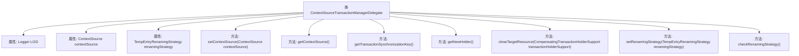

# 基础信息

|      |      |
|------|------|
| 名称 | ContextSourceTransactionManagerDelegate |
| 编码语言 | .java |
| 代码路径 | spring-ldap/core/src/main/java/org/springframework/ldap/transaction/compensating/manager/ContextSourceTransactionManagerDelegate.java |
| 包名 | org.springframework.ldap.transaction.compensating.manager |
| 依赖项 | ['javax.naming.NamingException', 'javax.naming.directory.DirContext', 'org.slf4j.Logger', 'org.slf4j.LoggerFactory', 'org.springframework.ldap.core.ContextSource', 'org.springframework.ldap.core.support.AbstractContextSource', 'org.springframework.ldap.transaction.compensating.LdapCompensatingTransactionOperationFactory', 'org.springframework.ldap.transaction.compensating.TempEntryRenamingStrategy', 'org.springframework.ldap.transaction.compensating.support.DefaultTempEntryRenamingStrategy', 'org.springframework.transaction.compensating.support.AbstractCompensatingTransactionManagerDelegate', 'org.springframework.transaction.compensating.support.CompensatingTransactionHolderSupport', 'org.springframework.transaction.compensating.support.DefaultCompensatingTransactionOperationManager', 'org.springframework.util.Assert'] |
| 概述说明 | ContextSourceTransactionManagerDelegate类管理LDAP事务和上下文资源，支持补偿操作。 |

# 说明

ContextSourceTransactionManagerDelegate类负责处理LDAP事务，主要功能包括管理上下文资源以及支持补偿事务操作。该类确保在LDAP操作中事务的一致性和完整性，特别是在需要回滚或补偿时，能够有效管理和恢复上下文资源，从而保障系统的稳定性和数据的一致性。

# 类列表 Class Summary

| 名称   | 类型  | 说明 |
|-------|------|-------------|
| ContextSourceTransactionManagerDelegate | class | ContextSourceTransactionManagerDelegate类处理LDAP事务，管理上下文资源，支持补偿事务操作。 |

## 类 ContextSourceTransactionManagerDelegate

|      |      |
|------|------|
| 访问范围 | public |
| 类型 | class |
| 名称 | ContextSourceTransactionManagerDelegate |
| 说明 | ContextSourceTransactionManagerDelegate类处理LDAP事务，管理上下文资源，支持补偿事务操作。 |

### UML类图

```mermaid
classDiagram
    class ContextSourceTransactionManagerDelegate {
        -Logger LOG
        -ContextSource contextSource
        -TempEntryRenamingStrategy renamingStrategy
        +void setContextSource(ContextSource contextSource)
        +ContextSource getContextSource()
        #Object getTransactionSynchronizationKey()
        #CompensatingTransactionHolderSupport getNewHolder()
        #void closeTargetResource(CompensatingTransactionHolderSupport transactionHolderSupport)
        +void setRenamingStrategy(TempEntryRenamingStrategy renamingStrategy)
        -void checkRenamingStrategy()
    }

    class AbstractCompensatingTransactionManagerDelegate {
        <<Abstract>>
    }

    class ContextSource {
        <<Interface>>
    }

    class TempEntryRenamingStrategy {
        <<Interface>>
    }

    class TransactionAwareContextSourceProxy {
        +ContextSource getTarget()
    }

    class AbstractContextSource {
        +boolean isAnonymousReadOnly()
    }

    class CompensatingTransactionHolderSupport {
        <<Abstract>>
    }

    class DirContextHolder {
        +DirContext getCtx()
    }

    class DirContext {
        <<Interface>>
        +void close()
    }

    class DefaultCompensatingTransactionOperationManager {
        +DefaultCompensatingTransactionOperationManager(LdapCompensatingTransactionOperationFactory factory)
    }

    class LdapCompensatingTransactionOperationFactory {
        +LdapCompensatingTransactionOperationFactory(TempEntryRenamingStrategy renamingStrategy)
    }

    class DefaultTempEntryRenamingStrategy {
    }

    ContextSourceTransactionManagerDelegate --> AbstractCompensatingTransactionManagerDelegate : 继承
    ContextSourceTransactionManagerDelegate --> ContextSource : 依赖
    ContextSourceTransactionManagerDelegate --> TempEntryRenamingStrategy : 依赖
    ContextSourceTransactionManagerDelegate --> TransactionAwareContextSourceProxy : 依赖
    ContextSourceTransactionManagerDelegate --> AbstractContextSource : 依赖
    ContextSourceTransactionManagerDelegate --> CompensatingTransactionHolderSupport : 依赖
    ContextSourceTransactionManagerDelegate --> DirContextHolder : 依赖
    ContextSourceTransactionManagerDelegate --> DirContext : 依赖
    ContextSourceTransactionManagerDelegate --> DefaultCompensatingTransactionOperationManager : 依赖
    ContextSourceTransactionManagerDelegate --> LdapCompensatingTransactionOperationFactory : 依赖
    ContextSourceTransactionManagerDelegate --> DefaultTempEntryRenamingStrategy : 依赖
    TransactionAwareContextSourceProxy --> ContextSource : 依赖
    AbstractContextSource --> ContextSource : 继承
    DirContextHolder --> CompensatingTransactionHolderSupport : 继承
    DirContextHolder --> DirContext : 依赖
    DefaultCompensatingTransactionOperationManager --> LdapCompensatingTransactionOperationFactory : 依赖
    LdapCompensatingTransactionOperationFactory --> TempEntryRenamingStrategy : 依赖
    DefaultTempEntryRenamingStrategy --> TempEntryRenamingStrategy : 继承
```

### 描述
`ContextSourceTransactionManagerDelegate` 是一个继承自 `AbstractCompensatingTransactionManagerDelegate` 的类，负责管理 LDAP 事务的补偿操作。它依赖于多个接口和类，如 `ContextSource`、`TempEntryRenamingStrategy` 和 `TransactionAwareContextSourceProxy`，用于处理上下文源和临时条目的重命名策略。该类通过 `getNewHolder` 方法创建新的 `DirContextHolder` 实例，并在事务结束时通过 `closeTargetResource` 方法关闭目标资源。

### 内部方法调用关系图

这段代码定义了一个名为 `ContextSourceTransactionManagerDelegate` 的类，继承自 `AbstractCompensatingTransactionManagerDelegate`。该类主要用于管理LDAP事务的上下文资源和重命名策略。它包含多个方法，如设置和获取上下文源、获取事务同步键、创建新的事务持有者、关闭目标资源、设置重命名策略以及检查重命名策略是否为空。这些方法共同协作，确保在LDAP事务管理过程中资源的正确分配和释放。

### 字段列表 Field List

| 名称  | 类型  | 说明 |
|-------|-------|------|
| contextSource | ContextSource | 声明一个私有的ContextSource类型变量contextSource。 |
| LOG = LoggerFactory.getLogger(ContextSourceTransactionManagerDelegate.class) | Logger | 定义日志记录器LOG，用于ContextSourceTransactionManagerDelegate类。 |
| renamingStrategy | TempEntryRenamingStrategy | 私有变量renamingStrategy为TempEntryRenamingStrategy类型。 |

### 方法列表 Method List

| 名称  | 类型  | 说明 |
|-------|-------|------|
| setRenamingStrategy | void | 设置重命名策略的方法。 |
| getTransactionSynchronizationKey | Object | 获取事务同步键，返回上下文源对象。 |
| getContextSource | ContextSource | 获取当前上下文源对象。 |
| checkRenamingStrategy | void | 检查重命名策略是否已指定，未指定则抛出异常。 |
| setContextSource | void | 设置上下文源，处理事务代理和匿名只读检查。 |
| closeTargetResource | void | 关闭目标资源，处理异常并记录日志。 |
| getNewHolder | CompensatingTransactionHolderSupport | 创建新的LDAP事务持有者，包含读写上下文和事务操作管理器。 |

