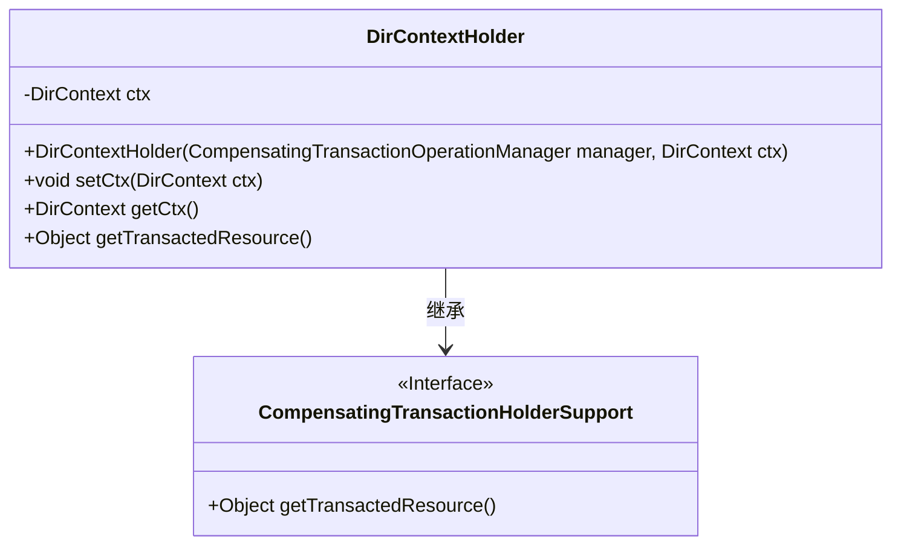
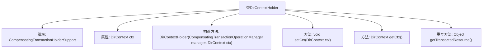

# 基础信息

|      |      |
|------|------|
| 名称 | DirContextHolder |
| 编码语言 | .java |
| 代码路径 | spring-ldap/core/src/main/java/org/springframework/ldap/transaction/compensating/manager/DirContextHolder.java |
| 包名 | org.springframework.ldap.transaction.compensating.manager |
| 依赖项 | ['javax.naming.directory.DirContext', 'org.springframework.transaction.compensating.CompensatingTransactionOperationManager', 'org.springframework.transaction.compensating.support.CompensatingTransactionHolderSupport'] |
| 概述说明 | DirContextHolder类负责管理事务中的DirContext，提供设置和获取功能。 |

# 说明

DirContextHolder类负责管理事务中的DirContext对象，提供了设置和获取DirContext的方法。通过该类，可以确保在事务处理过程中对DirContext的有效管理和访问。

# 类列表 Class Summary

| 名称   | 类型  | 说明 |
|-------|------|-------------|
| DirContextHolder | class | DirContextHolder类管理事务中的DirContext，提供设置和获取方法。 |

## 类 DirContextHolder

|      |      |
|------|------|
| 访问范围 | public |
| 类型 | class |
| 名称 | DirContextHolder |
| 说明 | DirContextHolder类管理事务中的DirContext，提供设置和获取方法。 |

### UML类图

类图描述：`DirContextHolder`类继承自`CompensatingTransactionHolderSupport`接口，并包含一个私有的`DirContext`类型的成员变量`ctx`。该类提供了构造函数、设置和获取`ctx`的方法，并重写了`getTransactedResource`方法以返回`ctx`。`CompensatingTransactionHolderSupport`接口定义了`getTransactedResource`方法，`DirContextHolder`类实现了该方法。

### 内部方法调用关系图

这段代码定义了一个名为 `DirContextHolder` 的类，该类继承自 `CompensatingTransactionHolderSupport`。类中包含一个 `DirContext` 类型的属性 `ctx`，并通过构造方法进行初始化。类提供了设置和获取 `ctx` 的方法 `setCtx` 和 `getCtx`，并重写了父类的 `getTransactedResource` 方法，返回当前事务关联的 `ctx`。该类的设计主要用于管理与事务相关的 `DirContext` 资源。

### 字段列表 Field List

| 名称  | 类型  | 说明 |
|-------|-------|------|
| ctx | DirContext | 私有变量ctx，类型为DirContext。 |

### 方法列表 Method List

| 名称  | 类型  | 说明 |
|-------|-------|------|
| getCtx | DirContext | 方法getCtx返回当前对象的ctx属性。 |
| getTransactedResource | Object | 获取事务处理上下文对象。 |
| setCtx | void | 设置上下文对象ctx的值为传入参数。 |

